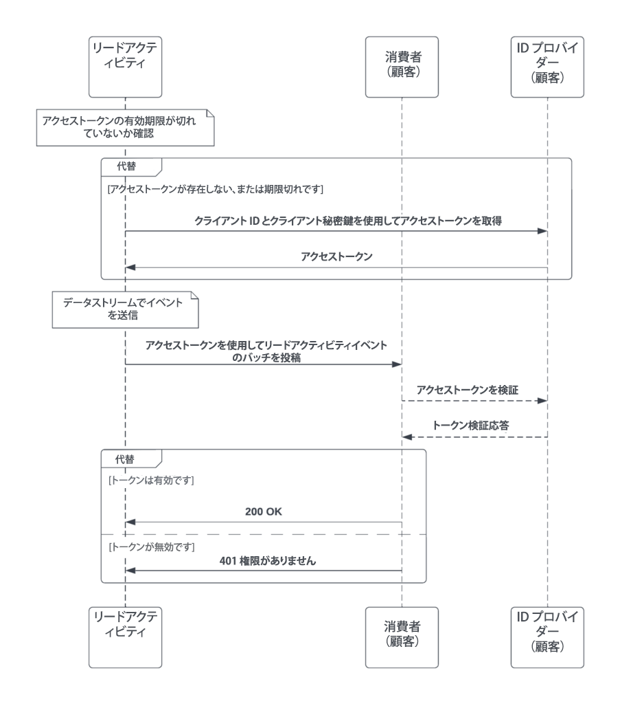

# データストリーム

>[!NOTE]
> データストリームに関する現在の情報は、[&#x200B; データストリームの使用 &#x200B;](https://developer.adobe.com/events/docs/guides/using/marketo/marketo-data-streams/) に記載されています。
>

アドビのお客様のマーケティング組織は、ビジネスで上位の地位を保ち、競争力を維持することを目的に、タイムリーで焦点を当てたマーケティングキャンペーンに依存しています。ペースの速い意思決定をサポートし、戦略的変更を迅速に実行できるようにするには、焦点を当てたターゲットキャンペーンを実現する重要な決定をサポートし、推進するデータを持つことが重要です。また、Marketo Engage 内外の顧客セグメントのレベルでマーケティング活動を行うお客様もいます。これらの様々な取り組みのサポートに、Marketo ではデータストリームを通じてほとんどリアルタイムで大量のデータを取得する機能を作成しました。

ほとんどリアルタイムのデータのメリット以外にも、製品に関連するメリットがあります。

- 代わりにストリーミングが使用されるので、API 制限のボトルネックが軽減されます。
- API 制限のシナリオが削減され、生成されるアラートメッセージが少なくなります。
- データストリーミング機能により、データを抽出する一括書き出しを実行する必要はありません。

データストリームは、[Marketo Engage パフォーマンス階層パッケージ](https://nation.marketo.com/t5/product-documents/marketo-engage-performance-tiers/ta-p/328835)を購入したユーザが使用できます。

## リードアクティビティデータストリームの概要

リードアクティビティデータストリームは、監査トラッキングのリードアクティビティのほとんどリアルタイムのストリーミングを提供し、大量のリードアクティビティをお客様の外部システムに送信できます。ストリームを使用すると、お客様はリード関連のイベントや使用パターンを効果的に監査し、リードの変更に関するビューを提供し、様々なタイプのリードイベントに基づいてプロセスとワークフローをトリガーできます。ストリームを通じてサブスクライブおよび送信できるアクティビティタイプは 144 以上あります。

ストリーミングされるリードデータのタイプ：

1. リード変更 - すべてのフィールドと新しいリードに関するすべての変更
1. リードアクティビティ - ドキュメントに説明されているすべてのリードアクティビティタイプ
1. 削除されたリード
1. リード上のすべてのカスタムオブジェクト（リクエストされた場合）。現時点では、すべてまたは何もない状態です。

リード変更のビューを提供することで、お客様は全体的なマーケティング戦略に関する決定を迅速化し、より焦点を当てたターゲットキャンペーンを作成できます。一般的なユースケースを以下に示します。

- カスタムアラート：条件が一致しない特定のリードが見つかった場合、リストに追加できます。アクティビティストリームでは、これらを取得し、お客様の「リストに追加」アクティビティを任意の後続アクションにプッシュできます。
- ML モデルの強化：一部のお客様は、アクティビティのインサイトを使用してスコアリングモデルを作成し、Marketo にフィードバックしたり、必要に応じて独自の内部スコアリングモデルで使用したりすることを計画しています。リードをスコアリングすることで、お客様は Marketo に顧客を育成キャンペーンに追加するよう通知し、スコアリングを向上させることができます。

ストリーミングされるアクティビティのリスト：

| AchieveGoalInReferral | ClickPredictiveContent | ReceivedForwardToFriendEmail |
|--- |--- |--- |
| AddToList | ClickRTPCallToAction | ReceiveSalesEmail |
| AddToNurture | ClickSalesEmail | ReferToSocialApp |
| AddToOpportunity | ClickSharedLink | RemoveFromList |
| AddToSalesCampaign | ConvertLead | RemoveFromOpportunity |
| CallWebhook | DeleteLead | RequestCampaign |
| ChangeDataValue | DisqualifySweepstakes | SalesEmailBounced |
| ChangeLeadPartition | EarnEntryInSocialApp | SendAlert |
| ChangeNurtureCadence | EmailBounced | SendEmail |
| ChangeNurtureTrack | EmailBouncedSoft | SendSalesEmail |
| ChangeOwner | EmailDelivered | SentForwardToFriendEmail |
| ChangeProgramData | EnrichWithDataDotCom | SFDCActivity |
| ChangeProgramMemberData | EnterSweepstakes | ShareContent |
| ChangeRevenueStage | FillOutFacebookLeadAdsForm | SignUpForReferralOffer |
| ChangeRevenueStageManually | FillOutForm | SyncLeadToMicrosoft |
| ChangeScore | InterestingMoment | SyncLeadToSFDC |
| ChangeSegment | MergeLeads | UnsubscribeEmail |
| ChangeStatusInProgression | NewLead | UpdateOpportunity |
| ChangeStatusInSalesCampaign | OpenEmail | VisitWebPage |
| ClickEmail | OpenSalesEmail | VoteInPoll |
| ClickLink | PushLeadToMarketo | WinSweepstakes |

カスタムオブジェクトをストリーミングする必要がある場合は、リード関連のすべてのカスタムオブジェクトに対して行う必要があります。現時点では、必要なオブジェクトを選択する方法はありません。

## ユーザ監査データストリームの概要

ユーザ監査データストリームでは、ユーザによるアセットの変更のほとんどリアルタイムでの監査トラッキングを提供します。これにより、お客様はアセットイベントを効果的に監査し、ユーザの変更を把握し、様々なタイプの監査イベントに基づいてプロセスやワークフローをトリガーできます。ほとんどリアルタイムのアセットの変更は、Adobe I/O イベントを通じて設定可能なエンドポイントに送信されます。監査イベントはアセットタイプ別に分類され、アセットタイプにとって重要な監査イベントをサブスクライブできます。

このストリームをサブスクライブする良いユースケースを以下に示します。

- 複数のマーケティングシステムを使用する場合の変更のトラッキング：Salesforce のような CRM などの別のシステムで一定レベルのマーケティング活動を実行し、リードを Marketo に渡すお客様もいます。リードは時々更新され、前後に同期されるので、最近の変更を行ったシステムを追跡することが重要です。

ストリーミングされるユーザ監査イベントのリスト：

| コンポーネント | イベントタイプリスト |
|--- |--- |
| デフォルトのプログラム | 複製、作成、削除、チャネルを編集、書き出し、プログラム設定を変更、プログラムトークンを変更、名前変更 |
| メール | 承認、複製、作成、削除、編集、移動、名前変更、未承認 |
| メールのバッチ送信プログラム | 承認、childUpdate、複製、作成、削除、編集、チャネルを編集、プログラムスケジュールを変更、プログラム設定を変更、プログラムトークンを変更、名前変更、未承認 |
| メールテンプレート | 承認、複製、作成、削除、draftCreate、draftDiscard、編集、名前変更、未承認 |
| エンゲージメントプログラム | 複製、作成、削除、チャネルを編集、プログラム設定を変更、プログラムストリームを変更、プログラムトークンを変更、名前変更 |
| イベントプログラム | 複製、作成、削除、チャネルを編集、プログラムスケジュールを変更、プログラム設定を変更、プログラムトークンを変更、名前変更 |
| フォルダー | 作成、削除、編集、名前変更 |
| Form | 承認、複製、作成、削除、draftCreate、編集、移動、名前変更 |
| フォーム／ランディングページフォーム | 作成、複製、編集、削除、承認、名前変更 |
| ランディングページ | 承認、複製、作成、削除、draftDiscard、編集、名前変更、未承認 |
| ランディングページテンプレート | 承認、複製、作成、削除、draftCreate、draftDiscard、編集、名前変更、未承認 |
| スマートリスト | 複製、作成、削除、編集、書き出し、スマートリスト設定を変更、名前変更 |
| マーケティングフォルダー | 作成、編集、削除 |
| 育成プログラム | 複製、作成、削除、チャネルを編集、プログラム設定を変更、プログラムストリームを変更、プログラムトークンを変更、名前変更 |
| セグメント | 作成、削除、編集、名前変更 |
| セグメント化 | 承認、作成、削除、draftCreated、draftDiscarded、名前変更，未承認 |
| スマートキャンペーン | 中止、アクティブ化、複製、作成、非アクティブ化、削除、編集、キャンペーンスケジュールを変更、フローステップアクションを変更、スマートリスト設定を変更、移動、名前変更 |
| スニペット | 承認、ドラフトなしで承認、複製、作成、削除、編集、名前変更、未承認 |
| 管理 UI／Launchpoint／統合 | 作成、削除、編集 |
| 管理 UI／ユーザ | 作成、編集、削除（API のみのユーザも同様） |
| 管理ログイン／ユーザ | ログイン成功、ログイン失敗 |
| プログラム／メールのバッチプログラム | Asset API を編集（選択したメールアドレスの変更用） |
| プログラム／マーケティングプログラム | 作成、複製 |

ユーザ監査イベントの例：

```json
{
    "event_id": "a1b2c3d4-zyxw-9876-9z8y-a1b2c3d4e5f6",
    "event": {
        "specversion": "1.0",
        "id": "b77c743a-8e28-40f2-8aab-9541bbc85e68",
        "type": "com.adobe.platform.marketo.audit.user.email",
        "source": "https://www.marketo.com",
        "time": "2020-05-28T19:20:47.28Z",
        "datacontenttype": "application/json",
        "dataschema": "V1.0",
        "data": {
            "componentId": 232459,
            "componentType": "Email",
            "eventAction": "approve",
            "munchkinId": "123-ABC-456",
            "imsOrgId": "ADOBEORGID@AdobeOrg",
            "user": 253,
            "userId": "example@marketo.com"
        }
    }
}
```

## 通知データストリームの概要

通知データストリームは、Marketo Engage のパフォーマンスレベルのオファーの一部として使用できます。

現在、Marketo の通知センターは、メールアドレスに通知を送信するように設定できます。通知データストリームを使用すると、Adobe I/O イベントを通じて設定可能なエンドポイントに通知を直接送信できます。現在、通知は UI を通じて提供され、画面の右上にあるオレンジ色のベルで参照できます。このストリームはこれらの通知を取得し、ストリームを通じて送信します。

通知イベントのリスト：

| コンポーネント | イベントタイプリスト |
|--- |--- |
| 通知 | キャンペーン中止、キャンペーン失敗、育成（プログラム消費済み）、Salesforce 同期の失敗、テストグループ（A/B テスト結果）、web サービス（毎日の割り当て量） |

通知イベントの例：

```json
{
    "event_id": "a1b2c3d4-zyxw-9876-9z8y-a1b2c3d4e5f6",
    "event": {
        "specversion": "1.0",
        "type": "com.adobe.platform.marketo.notification.campaign_abort",
        "source": "https://www.marketo.com",
        "time": "2021-05-27T10:22:37.489-5:00",
        "datacontenttype": "application/json",
        "dataschema": "V1.0",
        "data": {
            "componentType": "campaign_abort",
            "subType": "user_campaign_abort",
            "eventAction": {
                "campaignId":1234,
                "userId":"example@marketo.com",
            }
            "imsOrgId":"ADOBEORGID@AdobeOrg",
            "munchkinId":"123-ABC-456"
        }
    }
}
```

## 技術的詳細

この節では、各ストリームに対する必要な操作と、ストリーミングデータの接続と受信方法に関するガイドラインを示します。それぞれに対して、あるレベルのコーディングと設定が必要です。

### リードアクティビティデータストリーム

リードアクティビティストリームは、Marketo リードアクティビティイベントのほとんどリアルタイムのストリーミングを提供し、サブスクライブされたアクティビティタイプの変更を設定可能な属性と共に送信します。

- デフォルトでは、データのプッシュ頻度は 2 秒ごとです。
- サブスクリプションごとに 100～500 のバッチです。
- 顧客 REST サービスのタイムアウトは 20 秒で、3 分ごとに 3 回の再試行が行われ、成功すると自動的に有効になります。それ以外の場合は、この時間が経過すると一時停止されます。一時停止されると、手動でプロビジョニング解除しない限り、サービスは 3 分ごとに再試行して再度有効にしようとします。
- キュー内のデータ保持は最大 7 日間です。

リードアクティビティデータストリームを実装するために、お客様が従う手順を以下に示します。

1. パブリックインターネットから JSON 本文を含む POST リクエストを受信できる HTTP エンドポイントを公開します。アクティビティプッシュデータストリームでリクエストが送信されたら、次の手順に進みます。
1. アドビに次を提供します。
   1. サブスクリプションの Marketo Munchkin ID
   1. 手順 1 のエンドポイントの URL
   1. 受信するアクティビティタイプ（上記の完全なリスト）
   1. リクエストが正当であることをお客様が確認できる認証の手段。次のいずれか：
      1. OAuth [クライアント資格情報認証](https://www.oauth.com/oauth2-servers/access-tokens/client-credentials/)用の ID プロバイダー URL、クライアント ID およびクライアント秘密鍵
      1. API トークン。リードアクティビティデータストリームから送信されるリクエストに Authorization http ヘッダーで含めることができます

その後、アドビがデータストリームを有効にし、その時点でお客様はデータの受信を開始します。

一般的なリードアクティビティデータストリーム呼び出しの UML 図：



URL エンドポイントの作成例：

```javascript
/*
Copyright 2022 Adobe
All Rights Reserved.

NOTICE: Adobe permits you to use, modify, and distribute this file in
accordance with the terms of the Adobe license agreement accompanying
it.
*/
constexpress=require('express')
constwinston=require('winston');
constport=3000

constapp=express().use(express.json())

constlogger=winston.createLogger({
  level: 'info',
  format: winston.format.json(),
  defaultMeta: {service: 'activity-stream-consumer-example'},
  transports: [
    // - Write all logs with level `error` and below to `error.log`
    newwinston.transports.File({filename: 'error.log',level: 'error'}),
    // - Write all logs with level `info` and below to `combined.log`
    newwinston.transports.File({filename: 'combined.log'}),
    newwinston.transports.Console({format: winston.format.simple()})
  ],
});

app.get('/',(req,res)=>{
  logger.info(JSON.stringify(req.query))
  res.sendStatus(200)
})

app.post('/',(req,res)=>{
  logger.info(JSON.stringify(req.body))
  res.sendStatus(200)
})

app.listen(port,()=>{
  logger.info(`app listening on port ${port}`)
})
```

Marketo リードアクティビティデータストリームを使用するアプリケーションのコードサンプルについて詳しくは、[こちら](https://github.com/ihgrant/activity-stream-consumer-example)を参照してください。

### ユーザ監査データストリームと通知データストリーム

ユーザ監査イベントは Adobe IO に送信され、Adobe ID にログインして使用できます。次の手順に従います。

1. お客様はアドビに次を提供します。
   1. Adobe ID
   1. サブスクリプションの Marketo Munchkin ID
1. お客様は、web フックの形式でイベントを通常使用するための REST エンドポイントを公開します。
1. 提供したら、アドビはお客様のサブスクリプションに対してストリームを有効にします。
1. 次に、お客様は Adobe IO でストリームを設定します（手順は別途提供されます）。
   1. この手順には、アドビ組織が必要です
   1. アドビ組織ユーザに開発者またはシステム管理者のロールが必要です

Adobe IO を設定するには、公開ドキュメントの節の [Adobe IO を使用した Marketo ユーザ監査データストリームの設定](https://developer.adobe.com/events/docs/guides/using/marketo/marketo-user-audit-data-stream-setup/)を参照してください。

### Marketo でのユーザ監査データストリームの設定

ユーザ監査データストリームは現在、他の 3 つのデータストリームと共にパフォーマンスパッケージの一部として使用できます。パッケージについて詳しくは、[製品説明ページ](https://helpx.adobe.com/legal/product-descriptions/adobe-marketo-engage-product-description.html)を参照し、製品の制限と機能を確認してください。

### Adobe I/O の設定

[Adobe I/O イベントの概要を参照してください](https://developer.adobe.com/runtime/docs/guides/getting-started/)

このユースケースの基本的な手順について詳しくは、[console.adobe.io](https://developer.adobe.com/console) を参照してください。

プロンプトが表示されたら、「**[!UICONTROL 新しいプロジェクトを作成]**」または「**[!UICONTROL イベントを追加]**」のいずれかを選択します。

### 新しいプロジェクトの概要

アドビサービスの使用を開始するには、API、イベントまたはランタイムを追加し、[ドキュメント](https://developer.adobe.com/runtime/docs/)を参照してください。

## 公開ドキュメント

- [Marketo データストリーム](https://developer.adobe.com/events/docs/guides/using/marketo/marketo-data-streams/)
- [Adobe IO イベントと eb フックの概要](https://developer.adobe.com/events/docs/guides/)
- [データストリームブログ](https://blog.developer.adobe.com/introducing-the-adobe-marketo-engage-data-streams-61198b567fbb)
