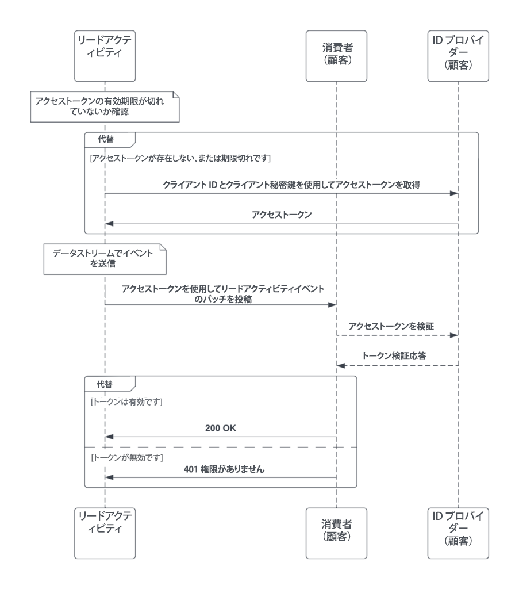

# データストリーム

>[!NOTE]
>
>データストリームに関する現在の情報は、[ データストリームの使用](https://developer.adobe.com/events/docs/guides/using/marketo/marketo-data-streams#)で見つかりました。
>

データストリームは、大量のMarketo Engageデータを外部システムにほぼリアルタイムで配信します。 ストリーミングデータを使用して、タイムリーな意思決定、ターゲットを絞った施策、外部マーケティングプロセス、監査を実施できます。

データストリームは次のような利点をもたらします。

- レートに制限のあるAPI リクエストへの依存を減らします。
- API制限に関するアラートを低減。
- 一括書き出しを実行せずにデータを配信します。

データストリームは、[Marketo Engage パフォーマンス階層パッケージ](https://nation.marketo.com/t5/product-documents/marketo-engage-performance-tiers/ta-p/328835)を購入したユーザが使用できます。

## リードアクティビティデータストリームの概要

リードアクティビティデータストリームは、大量のリードアクティビティデータをほぼリアルタイムで外部システムに送信します。 ストリームを使用して、リードイベントと使用パターンを監査し、リードの変更を表示し、リードイベントからのトリガーワークフローを表示します。

144種類以上のアクティビティタイプに登録できます。

ストリームには、次の項目を含めることができます。

1. すべてのリードフィールドと新しく作成されたリードへの変更。
1. 文書化されたあらゆるリードアクティビティタイプ。
1. 削除されたリード：
1. すべてのリードカスタムオブジェクト（要求された場合）。 個々のカスタムオブジェクトを選択することはできません。

一般的なユースケースは次のとおりです。

- カスタムアラート：一貫性のない条件を持つリードをリストに追加します。 ストリームは、「リストに追加」アクティビティをフォローアッププロセスに送信します。
- マシンラーニングモデル：外部スコアリングモデルでアクティビティインサイトを使用し、その後Marketoにスコアを送信して、ナーチャリングキャンペーンやその他のプロセスに影響を与えます。

ストリーミングされるアクティビティのリスト：

| AchieveGoalInReferral | ClickPredictiveContent | ReceivedForwardToFriendEmail |
| --- | --- | --- |
| AddToList | ClickRTPCallToAction | ReceiveSalesEmail |
| AddToNurture | ClickSalesEmail | ReferToSocialApp |
| AddToOpportunity | ClickSharedLink | RemoveFromList |
| AddToSalesCampaign | ConvertLead | RemoveFromOpportunity |
| CallWebhook | DeleteLead | RequestCampaign |
| ChangeDataValue | DisqualifySweepstakes | SalesEmailBounced |
| ChangeLeadPartition | EarnEntryInSocialApp | SendAlert |
| ChangeNurtureCadence | EmailBounced | SendEmail |
| ChangeNurtureTrack | EmailBouncedSoft | SendSalesEmail |
| ChangeOwner | EmailDelivered | SentForwardToFriendEmail |
| ChangeProgramData | EnrichWithDataDotCom | SFDCActivity |
| ChangeProgramMemberData | EnterSweepstakes | ShareContent |
| ChangeRevenueStage | FillOutFacebookLeadAdsForm | SignUpForReferralOffer |
| ChangeRevenueStageManually | FillOutForm | SyncLeadToMicrosoft |
| ChangeScore | InterestingMoment | SyncLeadToSFDC |
| ChangeSegment | MergeLeads | UnsubscribeEmail |
| ChangeStatusInProgression | NewLead | UpdateOpportunity |
| ChangeStatusInSalesCampaign | OpenEmail | VisitWebPage |
| ClickEmail | OpenSalesEmail | VoteInPoll |
| ClickLink | PushLeadToMarketo | WinSweepstakes |

カスタムオブジェクトをストリーミングする場合は、リード関連のすべてのカスタムオブジェクトを含めます。 個々のカスタムオブジェクトを選択することはできません。

## ユーザ監査データストリームの概要

ユーザー監査データストリームは、アセットに対するユーザーの変更をほぼリアルタイムで追跡します。 これを使用して、アセットイベントを監査し、ユーザーの変更を表示し、監査イベントからトリガープロセスを表示します。

Adobe I/O Eventsは、設定可能なエンドポイントに変更を送信します。 各アセットタイプに必要なイベントタイプを購読します。

ひとつ目のユースケースは、次のとおりです。

- マーケティングシステムをまたいだ変更の追跡：CRMなどのシステムがMarketoとリードをやり取りする場合、監査イベントを使用して、どのシステムが最新の変更を行ったかを特定します。

ストリーミングされるユーザ監査イベントのリスト：

| コンポーネント | イベントタイプリスト |
| --- | --- |
| デフォルトのプログラム | 複製、作成、削除、チャネルを編集、書き出し、プログラム設定を変更、プログラムトークンを変更、名前変更 |
| メール | 承認、複製、作成、削除、編集、移動、名前変更、未承認 |
| メールのバッチ送信プログラム | 承認、childUpdate、複製、作成、削除、編集、チャネルを編集、プログラムスケジュールを変更、プログラム設定を変更、プログラムトークンを変更、名前変更、未承認 |
| メールテンプレート | 承認、複製、作成、削除、draftCreate、draftDiscard、編集、名前変更、未承認 |
| エンゲージメントプログラム | 複製、作成、削除、チャネルを編集、プログラム設定を変更、プログラムストリームを変更、プログラムトークンを変更、名前変更 |
| イベントプログラム | 複製、作成、削除、チャネルを編集、プログラムスケジュールを変更、プログラム設定を変更、プログラムトークンを変更、名前変更 |
| フォルダー | 作成、削除、編集、名前変更 |
| Form | 承認、複製、作成、削除、draftCreate、編集、移動、名前変更 |
| フォーム／ランディングページフォーム | 作成、複製、編集、削除、承認、名前変更 |
| ランディングページ | 承認、複製、作成、削除、draftDiscard、編集、名前変更、未承認 |
| ランディングページテンプレート | 承認、複製、作成、削除、draftCreate、draftDiscard、編集、名前変更、未承認 |
| スマートリスト | 複製、作成、削除、編集、書き出し、スマートリスト設定を変更、名前変更 |
| マーケティングフォルダー | 作成、編集、削除 |
| 育成プログラム | 複製、作成、削除、チャネルを編集、プログラム設定を変更、プログラムストリームを変更、プログラムトークンを変更、名前変更 |
| セグメント | 作成、削除、編集、名前変更 |
| セグメント化 | 承認、作成、削除、draftCreated、draftDiscarded、名前変更，未承認 |
| スマートキャンペーン | 中止、アクティブ化、複製、作成、非アクティブ化、削除、編集、キャンペーンスケジュールを変更、フローステップアクションを変更、スマートリスト設定を変更、移動、名前変更 |
| スニペット | 承認、ドラフトなしで承認、複製、作成、削除、編集、名前変更、未承認 |
| 管理 UI／Launchpoint／統合 | 作成、削除、編集 |
| 管理 UI／ユーザ | 作成、編集、削除（API のみのユーザも同様） |
| 管理ログイン／ユーザ | ログイン成功、ログイン失敗 |
| プログラム／メールのバッチプログラム | Asset API を編集（選択したメールアドレスの変更用） |
| プログラム／マーケティングプログラム | 作成、複製 |

ユーザ監査イベントの例：

```json
{
    "event_id": "a1b2c3d4-zyxw-9876-9z8y-a1b2c3d4e5f6",
    "event": {
        "specversion": "1.0",
        "id": "b77c743a-8e28-40f2-8aab-9541bbc85e68",
        "type": "com.adobe.platform.marketo.audit.user.email",
        "source": "https://www.marketo.com",
        "time": "2020-05-28T19:20:47.28Z",
        "datacontenttype": "application/json",
        "dataschema": "V1.0",
        "data": {
            "componentId": 232459,
            "componentType": "Email",
            "eventAction": "approve",
            "munchkinId": "123-ABC-456",
            "imsOrgId": "ADOBEORGID@AdobeOrg",
            "user": 253,
            "userId": "example@marketo.com"
        }
    }
}
```

## 通知データストリームの概要

通知データストリームは、Marketo Engage のパフォーマンスレベルのオファーの一部として使用できます。

Marketo通知センターは、電子メールアドレスに通知を送信できます。 Notification Data Streamは、Adobe I/O Eventsを介して、これらの通知を設定可能なエンドポイントにも送信します。 これらは、Marketo UIのベルアイコンから使用できる通知と同じです。

通知イベントのリスト：

| コンポーネント | イベントタイプリスト |
| --- | --- |
| 通知 | キャンペーン中止、キャンペーン失敗、育成（プログラム消費済み）、Salesforce 同期の失敗、テストグループ（A/B テスト結果）、web サービス（毎日の割り当て量） |

通知イベントの例：

```json
{
    "event_id": "a1b2c3d4-zyxw-9876-9z8y-a1b2c3d4e5f6",
    "event": {
        "specversion": "1.0",
        "type": "com.adobe.platform.marketo.notification.campaign_abort",
        "source": "https://www.marketo.com",
        "time": "2021-05-27T10:22:37.489-5:00",
        "datacontenttype": "application/json",
        "dataschema": "V1.0",
        "data": {
            "componentType": "campaign_abort",
            "subType": "user_campaign_abort",
            "eventAction": {
                "campaignId":1234,
                "userId":"example@marketo.com",
            }
            "imsOrgId":"ADOBEORGID@AdobeOrg",
            "munchkinId":"123-ABC-456"
        }
    }
}
```

## 技術的詳細

以下の節では、各ストリームからデータを受信するために必要な設定について説明します。 各ストリームには、エンドポイントの設定と統合のコードが必要です。

### リードアクティビティデータストリーム

リードアクティビティストリームは、次のサービス特性を持つ購読済みリードアクティビティイベントを送信します。

- デフォルトでは、データは2秒ごとにプッシュされます。
- 各サブスクリプションでは、100～500 レコードのバッチを使用します。
- 顧客REST サービスには20秒のタイムアウトと3分の間隔で3回の再試行があります。 再試行が成功すると、サービスが自動的に有効になります。 3回のエラーの後、手動でプロビジョニングを解除しない限り、サービスは3分ごとに一時停止して再試行します。
- キューに入れたデータは、最大7日間保持されます。

リード・アクティビティ・データ・ストリームを実装する手順は、次のとおりです。

1. パブリックインターネットから JSON 本文を含む POST リクエストを受信できる HTTP エンドポイントを公開します。 アクティビティプッシュデータストリームでリクエストが送信されたら、次の手順に進みます。
1. アドビに次を提供します。
   1. サブスクリプションの Marketo Munchkin ID
   1. 手順 1 のエンドポイントの URL
   1. 受信するアクティビティタイプ（上記の完全なリスト）
   1. リクエストが正当であることをお客様が確認できる認証の手段。 次のいずれか：
      1. OAuth [クライアント資格情報認証](https://www.oauth.com/oauth2-servers/access-tokens/client-credentials/)用の ID プロバイダー URL、クライアント ID およびクライアント秘密鍵
      1. API トークン。これは、リードアクティビティデータストリームがAuthorization http ヘッダーで送信するリクエストに含めることができます

Adobeは、必要な情報を受け取った後、データストリームを有効にします。 その後、エンドポイントはデータの受信を開始します。

一般的なリードアクティビティデータストリーム呼び出しの UML 図：



URL エンドポイントの作成例：

```javascript
/*
Copyright 2022 Adobe
All Rights Reserved.

NOTICE: Adobe permits you to use, modify, and distribute this file in
accordance with the terms of the Adobe license agreement accompanying
it.
*/
constexpress=require('express')
constwinston=require('winston');
constport=3000

constapp=express().use(express.json())

constlogger=winston.createLogger({
  level: 'info',
  format: winston.format.json(),
  defaultMeta: {service: 'activity-stream-consumer-example'},
  transports: [
    // - Write all logs with level `error` and below to `error.log`
    newwinston.transports.File({filename: 'error.log',level: 'error'}),
    // - Write all logs with level `info` and below to `combined.log`
    newwinston.transports.File({filename: 'combined.log'}),
    newwinston.transports.Console({format: winston.format.simple()})
  ],
});

app.get('/',(req,res)=>{
  logger.info(JSON.stringify(req.query))
  res.sendStatus(200)
})

app.post('/',(req,res)=>{
  logger.info(JSON.stringify(req.body))
  res.sendStatus(200)
})

app.listen(port,()=>{
  logger.info(`app listening on port ${port}`)
})
```

サンプルアプリケーションコードについては、[ リードアクティビティデータストリームコンシューマーの例](https://github.com/ihgrant/activity-stream-consumer-example)を参照してください。

### ユーザ監査データストリームと通知データストリーム

ユーザー監査イベントは、Adobe I/Oを通じて送信されます。Adobe IDでこれらを使用するには：

1. Adobeに次の情報を提供します。
   1. Adobe ID
   1. サブスクリプションの Marketo Munchkin ID
1. REST エンドポイント（通常はWebhook）を公開してイベントを消費します。
1. エンドポイント情報を受け取った後、Adobeはサブスクリプションのストリームを有効にします。
1. Adobe I/Oでストリームを設定します。
   1. この手順には、アドビ組織が必要です
   1. アドビ組織ユーザに開発者またはシステム管理者のロールが必要です

Adobe I/Oを設定するには、[Marketo User Audit Data StreamsとAdobe I/Oの設定](https://developer.adobe.com/events/docs/guides/using/marketo/marketo-user-audit-data-stream-setup#)を参照してください。

### Marketo でのユーザ監査データストリームの設定

ユーザ監査データストリームは現在、他の 3 つのデータストリームと共にパフォーマンスパッケージの一部として使用できます。 パッケージについて詳しくは、[製品説明ページ](https://helpx.adobe.com/jp/legal/product-descriptions/adobe-marketo-engage---product-description.html)を参照し、製品の制限と機能を確認してください。

### Adobe I/O の設定

[Adobe I/O Eventsの概要を参照してください](https://developer.adobe.com/runtime/docs/guides/getting-started/)

このユースケースの基本的な手順について詳しくは、[console.adobe.io](https://developer.adobe.com/console) を参照してください。

プロンプトが表示されたら、「**[!UICONTROL 新しいプロジェクトを作成]**」または「**[!UICONTROL イベントを追加]**」のいずれかを選択します。

### 新しいプロジェクトの概要

アドビサービスの使用を開始するには、API、イベントまたはランタイムを追加し、[ドキュメント](https://developer.adobe.com/runtime/docs/)を参照してください。

## 公開ドキュメント

- [Marketo Data Streams](https://developer.adobe.com/events/docs/guides/using/marketo/marketo-data-streams/)
- [Adobe IO Events &amp; Webhookの概要](https://developer.adobe.com/events/docs/guides/)
- [データストリームに関するブログ](https://blog.developer.adobe.com/introducing-the-adobe-marketo-engage-data-streams-61198b567fbb)
