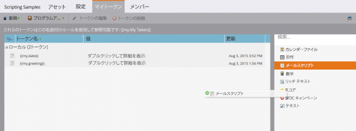
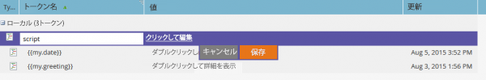
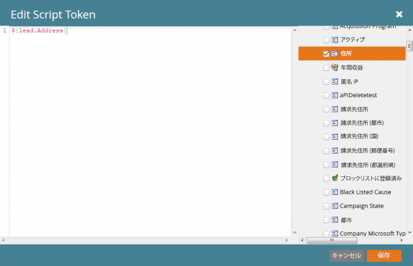
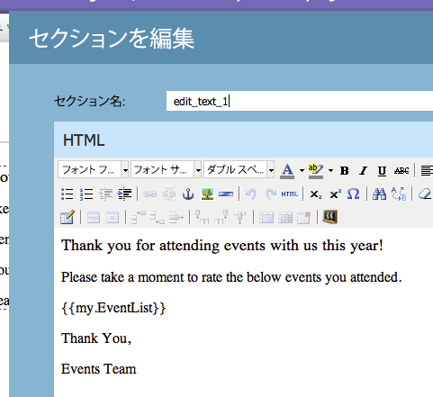
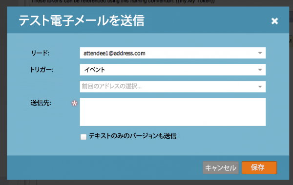
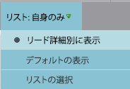

# メールスクリプト

メモ：Velocity テンプレート言語の動作について詳しくは、[Velocity ユーザーガイド ](https://velocity.apache.org/engine/devel/user-guide.html) を参照することを強くお勧めします。

[Apache Velocity](https://velocity.apache.org/) は Java 上に構築された言語で、HTMLコンテンツのテンプレート化とスクリプト作成のために設計されています。 Marketoでは、スクリプトトークンを使用して、メールのコンテキストで使用できます。 これにより、商談やカスタムオブジェクトに保存されたデータにアクセスでき、メール内で動的コンテンツを作成できるようになります。 Velocity では、if/else、for および for each を使用した標準的な高レベルの制御フローを提供し、コンテンツの条件付きおよび反復操作を可能にします。 次に、正しい敬称で挨拶を印刷する簡単な例を示します。

```java
//check if the lead is male
if(${lead.MarketoSocialGender} == "Male")
    if the lead is male, use the salutation 'Mr.'
    set($greeting = "Dear Mr. ${lead.LastName},")
//check is the lead is female
elseif(${lead.MarketoSocialGender} == "Female")
    if female, use the salutation 'Ms.'
    set($greeting = "Dear Ms. ${lead.LastName},")
else
    //otherwise, use the first name
    set($greeting = "Dear ${lead.FirstName},")
end
print the greeting and some content
${greeting}

    Lorem ipsum dolor sit amet...
```

## 変数

変数の先頭には常に「$」が付き、#set を使用して設定および更新されます。

```
#set($variable = "value")
```

その後、様々な動作を持つ複数の異なる参照タイプを介して、その値を取得できます。

```
$variable ##outputs 'value'
$variablename ##outputs '$variablename'
${variable}name ##outputs 'valuename'
```

`$` の後に Included という `!` があるクワイエット参照表記もあります。 通常、velocity が未定義の参照に遭遇した場合、参照を表す文字列はそのままになります。 クワイエット参照表記では、未定義の参照が検出されても、値は出力されません。

```
##Defined Reference

#set($foo = "bar")
$foo ##outputs "bar"

##Undefined Reference

##normal
$baz ##outputs "$baz"

##quiet
$!baz ##outputs nothing
```

変数の参照方法について詳しくは、[Apache ユーザーガイド ](https://velocity.apache.org/engine/devel/user-guide.html#formal-reference-notation) を参照してください。

## Velocity ツール

Apache Velocity プロジェクトでは、[Velocity ツール ](https://velocity.apache.org/tools/devel/apidocs/overview-summary.html) を使用して機能を使用できます。 これらは単に Java オブジェクトのラッパーであり、すべてのスクリプトで使用できるグローバル変数を通じてそのメソッドを公開します。

- [AlternatorTool](https://velocity.apache.org/tools/devel/apidocs/org/apache/velocity/tools/generic/AlternatorTool.html)
- [ComparisonDateTool](https://velocity.apache.org/tools/devel/apidocs/org/apache/velocity/tools/generic/ComparisonDateTool.html)
- [ConversionTool](https://velocity.apache.org/tools/devel/apidocs/org/apache/velocity/tools/generic/ConversionTool.html)
- [DateTool](https://velocity.apache.org/tools/devel/apidocs/org/apache/velocity/tools/generic/DateTool.html)
- [DisplayTool](https://velocity.apache.org/tools/devel/apidocs/org/apache/velocity/tools/generic/DisplayTool.html)
- [MathTool](https://velocity.apache.org/tools/devel/apidocs/org/apache/velocity/tools/generic/MathTool.html)
- [ 数値ツール ](https://velocity.apache.org/tools/devel/apidocs/org/apache/velocity/tools/generic/NumberTool.html)
- [EscapeTool](https://velocity.apache.org/tools/devel/apidocs/org/apache/velocity/tools/generic/EscapeTool.html)
- [LoopTool](https://velocity.apache.org/tools/devel/apidocs/org/apache/velocity/tools/generic/LoopTool.html)

例えば、`ComparisonDateTool` からメソッドを使用するには、スクリプトトークンで `$date` 変数から if にアクセスします。

```
#set($birthday = $convert.parseDate("2015-08-07","yyyy-MM-dd"))
##use whenIs to determine how many days away it is
$date.whenIs($birthday).days ##outputs 1
```

## スクリプトトークンの作成

Velocity スクリプトは、メールスクリプティングトークンを使用してメールに含まれます。 これらは、マーケティングフォルダーまたはプログラムのマーケティングアクティビティで作成できます。 トークンをメール内で使用するには、そのメールが、トークンを所有するプログラムの子であるか、マーケティングフォルダーから継承されている必要があります。 トークンを作成するには、フォルダーまたはプログラムに移動し、「[!UICONTROL &#x200B; マイトークン &#x200B;]」タブを選択します。 右側のメニューから「Email Script」オプションをトークン・リストにドラッグします



ここから、トークンの名前を編集し、「[!UICONTROL &#x200B; クリックして編集 &#x200B;] オプションでエディターを開くことができます。



エディターを開くと、スクリプトでアクセス可能なオブジェクト内のすべての変数にアクセスできるスクリプトを作成できます。 オブジェクトからフィールド参照を取得するには、右側のツリーからスクリプトにドラッグします。



## スクリプトの埋め込みとテスト

プログラムマイトークン内でスクリプトを定義したら、特定のメール内でMarketoのメールエディターを使用してスクリプトを参照できます。



Marketoのメールデザイナー内で「[!UICONTROL &#x200B; サンプルのメールを送信 &#x200B;]」メールアクションを使用して、スクリプトをテストできます。 スクリプトが正しく処理されるようにするには、別のユーザーとして実行する既存のリードを「[!UICONTROL &#x200B; リード &#x200B;]」フィールドで選択する必要があります。 `$TriggerObject` を使用してテストしている場合は、[!UICONTROL &#x200B; トリガー] パラメーターを介してトリガーオブジェクトを選択できます。 そのタイプの最も新しく更新されたオブジェクトのデータを `$TriggerObject` 変数として使用します。



また、[!UICONTROL &#x200B; メールのプレビュー &#x200B;] を使用して、スクリプトをテストすることもできます。 これを行うには、「**[!UICONTROL 表示形態：リード詳細]**」を選択し、使用可能な静的リストからリードを選択する必要があります。 これには、スクリプトの実行中に発生した例外を出力できるという利点もあります。



## 役に立つヒント

特定のメール内のすべてのメールスクリプトトークンの長さを組み合わせた長さは、100,000 バイトを超えることはできません。 この制限は、（トークンを拡張した後の長さの合計ではなく）トークン文字列自体の長さの合計に関係します。

- メールスクリプトで参照される変数は、スクリプトで使用可能ないずれかのオブジェクトにMarketoにある必要があります。
- 第 1 レベルと第 2 レベルのカスタムオブジェクトを参照できます。これらのカスタムオブジェクトは、ネイティブに統合された CRM から派生し、リードまたは連絡先に直接接続されていますが、第 3 レベルのカスタムオブジェクトは参照できません。 カスタムオブジェクトは、リードまたは会社の親にできません
- Marketoのカスタムオブジェクトの場合は、親子関係を持つ第 2 レベルのカスタムオブジェクトを参照できます。 例：`Lead <- Parent <- Child`。 EdgeとBridgeの関係を持つ第 2 レベルのカスタムオブジェクトは参照できません。 例：`Lead <- Bridge -> Edge`
- リード、連絡先またはアカウントに接続されたカスタムオブジェクトを参照できますが、複数は参照できません。
- カスタムオブジェクトは、1 つの接続、リード、連絡先、アカウントからのみ参照できます
- 使用しているフィールドのスクリプトエディターのチェックボックスをオンにする必要があります。オンにしない場合、処理されません
- 各カスタムオブジェクトでは、ユーザー/連絡先ごとに最近更新された 10 件のレコードが実行時に使用可能で、最近更新されたレコード（0 の場合）から最も古い更新レコード（9 の場合）へと並べられます。 使用可能なレコードの数を増やすには、[ 手順に従う ](https://experienceleague.adobe.com/en/docs/marketo/using/product-docs/administration/email-setup/change-custom-object-retrieval-limits-in-velocity-scripting) を実行します。
- 1 つのメールに複数のメールスクリプトを含めると、上から下に向かって実行されます。 最初に実行するスクリプトで定義された変数のスコープは、後続のスクリプトでも使用できます。
- ツールリファレンス：[https://velocity.apache.org/tools/2.0/index.html](https://velocity.apache.org/tools/2.0/index.html)
- 改行文字「\\n」または「\\r\\n」を含むトークンに関するメモ。 「サンプルの送信」または「バッチキャンペーン」を使用してメールが送信されると、トークン内の改行文字がスペースに置き換えられます。 トリガーキャンペーン経由でメールが送信されると、改行文字はそのまま残ります。
- URL を適切に解析するには、パス全体を変数として設定してから印刷する必要があります。また、変数を URL 参照内に印刷しないでください。 プロトコル （http://またはhttps://）を含め、URL の残りの部分とは別にする必要があります。 URL は、完全な形式のアンカー（<a>） タグの一部である必要があります。 リンクをトラッキングするには、スクリプトが完全な形式のアンカータグを出力する必要があります。 for ループまたは foreach ループ内から出力されたリンクはトラッキングされません。

```html
<!-- Correct -->
#set($url = "www.example.com/${object.id}")
<a href="http://${url}">Link Text</a>

<!-- Correct -->
<a href="http://www.example.com/${object.id}">Link Text</a>

<!-- Incorrect -->
<a href="${url}">Link Text</a>

<!-- Incorrect -->
<a href="{{my.link}}">Link Text</a>

<!-- Incorrect -->
<a href="http://{{my.link}}">Link Text</a>
```
