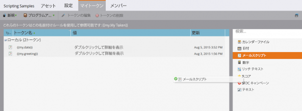
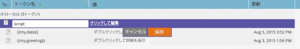
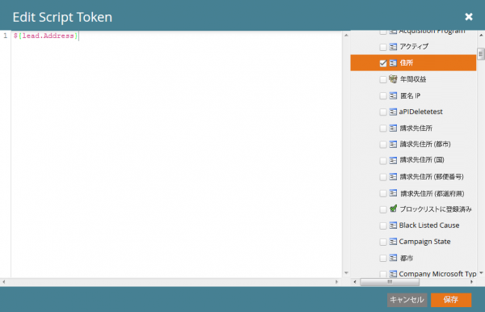
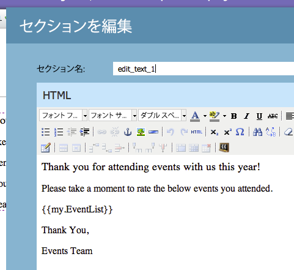
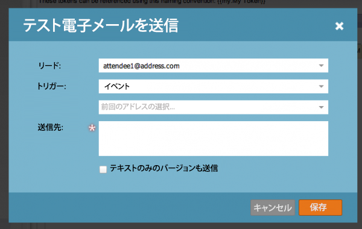
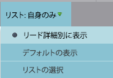

# メールスクリプト

Velocity テンプレート言語の動作の詳細な説明については、[Velocity ユーザーガイド &#x200B;](https://velocity.apache.org/engine/devel/user-guide.html)を参照してください。

[Apache Velocity](https://velocity.apache.org/)は、HTML コンテンツのテンプレート化とスクリプト作成を行うためのJava ベースの言語です。 MarketoのメールスクリプトトークンでVelocityを使用すると、商談やカスタムオブジェクトに保存されているデータにアクセスし、動的なメールコンテンツを作成できます。

Velocityは、条件付きコンテンツと反復的なコンテンツに対して`if`/`else`、`for`および`foreach`の制御フローを提供します。

## 変数

変数の先頭に`$`を付けます。 `#set`で作成または更新：

```velocity
#set($variable = "value")
```

異なる動作を提供する参照タイプを使用して変数値を取得します。

```text
$variable ##outputs 'value'
$variablename ##outputs '$variablename'
${variable}name ##outputs 'valuename'
```


静止参照表記法には、`$`の後に`!`が含まれます。 デフォルトでは、参照が未定義の場合、Velocityは参照文字列を配置したままにします。 サイレント参照は、未定義の場合、値を生成しません。

```velocity
##Defined Reference

#set($foo = "bar")
$foo ##outputs "bar"

##Undefined Reference

##normal
$baz ##outputs "$baz"

##quiet
$!baz ##outputs nothing
```

変数の参照方法について詳しくは、[Apache ユーザガイド](https://velocity.apache.org/engine/devel/user-guide.html#formal-reference-notation)を参照してください。

## Velocity ツール

Apache Velocity プロジェクトは[Velocity Tools](https://velocity.apache.org/tools/devel/apidocs/overview-summary.html)を提供します。 これらのラッパーは、すべてのスクリプトで使用できるグローバル変数を通じてJava オブジェクトメソッドを公開します。

- [AlternatorTool](https://velocity.apache.org/tools/devel/apidocs/org/apache/velocity/tools/generic/AlternatorTool.html)
- [ComparisonDateTool](https://velocity.apache.org/tools/devel/apidocs/org/apache/velocity/tools/generic/ComparisonDateTool.html)
- [ConversionTool](https://velocity.apache.org/tools/devel/apidocs/org/apache/velocity/tools/generic/ConversionTool.html)
- [DateTool](https://velocity.apache.org/tools/devel/apidocs/org/apache/velocity/tools/generic/DateTool.html)
- [DisplayTool](https://velocity.apache.org/tools/devel/apidocs/org/apache/velocity/tools/generic/DisplayTool.html)
- [MathTool](https://velocity.apache.org/tools/devel/apidocs/org/apache/velocity/tools/generic/MathTool.html)
- [NumberTool](https://velocity.apache.org/tools/devel/apidocs/org/apache/velocity/tools/generic/NumberTool.html)
- [EscapeTool](https://velocity.apache.org/tools/devel/apidocs/org/apache/velocity/tools/generic/EscapeTool.html)
- [LoopTool](https://velocity.apache.org/tools/devel/apidocs/org/apache/velocity/tools/generic/LoopTool.html)

例えば、`ComparisonDateTool`のメソッドを使用するには、スクリプトトークンの`$date`変数からメソッドにアクセスします。

```velocity
#set($birthday = $convert.parseDate("2015-08-07","yyyy-MM-dd"))
##use whenIs to determine how many days away it is
$date.whenIs($birthday).days ##outputs 1
```

## スクリプトトークンの作成

メールスクリプトトークンを使用して、メールにVelocity スクリプトを追加します。 マーケティングフォルダーまたはプログラム内のマーケティングアクティビティでトークンを作成します。

トークンを使用するには、メールはトークンを所有するプログラムの子であるか、マーケティングフォルダーから継承する必要があります。 フォルダーまたはプログラムに移動し、「[!UICONTROL &#x200B; マイトークン &#x200B;]」タブを選択します。 右側のメニューから「メールスクリプト」オプションをトークンリストにドラッグします。



トークン名を編集し、「[!UICONTROL &#x200B; クリックして編集]」を選択してエディターを開きます。



エディターで、スクリプトにアクセス可能なオブジェクトの変数にアクセスするスクリプトを作成します。 オブジェクトフィールド参照を追加するには、右側のツリーからスクリプトにドラッグします。



## スクリプトの埋め込みとテスト

プログラムのマイトークンでスクリプトを定義したら、Marketoのメールエディターでメールからスクリプトを参照します。



Marketoの電子メールデザイナーで、[!UICONTROL &#x200B; サンプル電子メールを送信] アクションを使用してスクリプトをテストします。 スクリプトが正しく処理されるように、[!UICONTROL &#x200B; リード &#x200B;] フィールドで既存のリードを選択します。

`$TriggerObject`をテストするときは、[!UICONTROL トリガー] パラメーターを持つトリガーオブジェクトを選択します。 Marketoは、その型の最も最近更新されたオブジェクトを`$TriggerObject`変数として使用します。



[!UICONTROL 電子メールプレビュー]でテストすることもできます。 「**[!UICONTROL 別名で表示：リードの詳細]**」を選択してから、静的リストからリードを選択します。 プレビューには、スクリプト実行の例外も表示されます。



## ベストプラクティス

特定のメール内のすべてのメールスクリプトトークンの組み合わせた長さは、100,000 バイトを超えることはできません。 この制限は、トークン文字列自体の合計長に適用されます（トークンを展開した後の合計長ではありません）。

- メールスクリプトで参照される変数は、スクリプトに使用できる Marketo 内のオブジェクトの 1 つに存在している必要があります。
- ネイティブに統合された CRM から生成され、リードまたは取引先責任者に直接接続された第 1 レベルおよび第 2 レベルのカスタムオブジェクトは参照できますが、第 3 レベルのカスタムオブジェクトは参照できません。 カスタムオブジェクトは、リードまたは会社の親にすることはできません
- Marketo カスタムオブジェクトの場合、親子関係を持つ第 2 レベルのカスタムオブジェクトを参照できます。 例：`Lead <- Parent <- Child`。 エッジ-ブリッジ関係を持つ第 2 レベルのカスタムオブジェクトを参照することはできません。 例：`Lead <- Bridge -> Edge`
- リード、取引先責任者またはアカウントに接続されたカスタムオブジェクトは参照できますが、複数のオブジェクトは参照できません。
- カスタムオブジェクトは、単一の接続、リード、取引先責任者またはアカウントを通じてのみ参照できます
- 使用しているフィールドのスクリプトエディターのチェックボックスをオンにします。チェックボックスをオンにすると、フィールドは処理されません
- カスタムオブジェクトごとに、1人/取引先責任者あたり10件の最新の更新レコードを実行時に利用できます。 レコードは、インデックス 0で最近更新されたレコードから、インデックス 9で最も古いレコードに並べ替えられます。 使用可能なレコードの数は、指示[&#128279;](https://experienceleague.adobe.com/ja/docs/marketo/using/product-docs/administration/email-setup/change-custom-object-retrieval-limits-in-velocity-scripting)に従って増加させることができます。
- メール内に複数のメールスクリプトを含める場合、スクリプトは上から下に向かって実行されます。 最初に実行するスクリプトで定義された変数の範囲は、後続のスクリプトで使用できます。
- ツール参照：[https://velocity.apache.org/tools/2.0/index.html](https://velocity.apache.org/tools/2.0/index.html)
- 改行文字「\n」または「\r\n」を含むトークンに関する注意事項。 「サンプルを送信」またはバッチキャンペーン経由でメールを送信すると、トークン内の改行文字はスペースに置き換えられます。 トリガーキャンペーン経由でメールを送信すると、改行文字はそのままになります。
- 正しいURL解析を確実に行うには、完全なパスを変数として設定し、それを印刷します。 URL参照内の変数は印刷しないでください。 プロトコル （`http://`または`https://`）を他のURLとは別に含めます。 リンクを追跡できるように、完全なアンカー（`<a>`）タグを出力します。 `for`または`foreach` ループから出力されたリンクは追跡されません。

```html
<!-- Correct -->
#set($url = "www.example.com/${object.id}")
<a href="http://${url}">Link Text</a>

<!-- Correct -->
<a href="http://www.example.com/${object.id}">Link Text</a>

<!-- Incorrect -->
<a href="${url}">Link Text</a>

<!-- Incorrect -->
<a href="{{my.link}}">Link Text</a>

<!-- Incorrect -->
<a href="http://{{my.link}}">Link Text</a>
```
