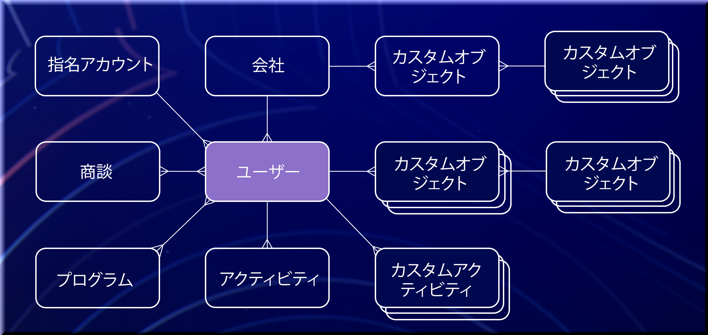

# はじめに

Marketo Engageは、マーケターが見込み客や顧客に対してパーソナライズされたマルチチャネルプログラムやキャンペーンを管理できるようにするマーケティング自動処理プラットフォームです。 Marketo Engageプラットフォームは、統合ポイントを使用して拡張できます。 以下に、コアエンティティとその関係を示します。

>[!NOTE]
>SOAP API は非推奨（廃止予定）となっており、2025 年 10 月 31 日（PT）以降は使用できなくなります。 すべての新規開発はMarketo [REST API](./rest-api/rest-api.md) を使用して行う必要があり、サービスが中断されないように、既存のサービスはその日までに移行する必要があります。 SOAP API を使用するサービスがある場合は、SOAP API [ 移行ガイド ](./soap-api/migration.md) を参照して、移行方法を確認してください。
>

Marketo EngageインスタンスでネイティブのSFDCまたは MS Dynamics CRM 連携が有効になっている場合、会社、オポチュニティ、商談ロール、販売担当者などのオブジェクトは読み取り専用です

## 人物（リード）

人物は、あらゆるマーケティング自動化プラットフォームの基盤です。 Marketo内では、すべての営業外担当者レコードは、営業の観点からリード、見込み客、容疑者、連絡先などに指定されているかどうかに関係なく、リードと呼ばれます。 リードオブジェクトには、メール、名、姓など、一連の標準フィールドが用意されています。 リードオブジェクトタイプにフィールドを追加して、システム内のレコードに関連付けられている情報のタイプを拡張することができます。 カスタム属性は、標準フィールドと同様に読み取りおよび書き込みが可能です。 すべてのフィールドのリストは、Marketoの **[!UICONTROL 管理者]**/**[!UICONTROL フィールド管理]** メニューにあります。 リードは、Marketoで id フィールドによって一意に識別されます。 その他の一意のキーは、システムの外部で適用する必要があります。

関連する API: [REST](https://developer.adobe.com/marketo-apis/api/mapi/#tag/Leads)、[JavaScript](javascript-api/lead-tracking.md#lead-tracking-api)

## アクティビティ

リードは、いくつかの方法で組織とやり取りします。 リードは、会社の web サイトのページを訪問したり、展示会に出席したり、ホワイトペーパーをダウンロードしたりできます。 これらの各アクションをMarketo内で取り込むことで、マーケターがリードが行ったアクティビティとそのタイミングをより深く理解し、タイムリーで関連性の高いコミュニケーションを調整できるようになります。 アクティビティは、常に leadId によってリードに関連付けられます。

独自のカスタムアクティビティを定義できます。 カスタムアクティビティを作成して公開したら、Marketo API を介してカスタムアクティビティを追加できます。 カスタムアクティビティの詳細については、[ こちら ](https://experienceleague.adobe.com/en/docs/marketo/using/product-docs/administration/marketo-custom-activities/understanding-custom-activities) を参照してください。

関連する API: [REST](https://developer.adobe.com/marketo-apis/api/mapi/#tag/Activities)、[JavaScript](javascript-api/lead-tracking.md#munchkin-behavior)

## プログラムとキャンペーン

プログラムとは、マーケターが様々なタイプのマーケティング活動をすべて 1 つの一元的な場所から整理するメカニズムです。 プログラムの例は、メールの爆破です。 リードは、プログラムに関連付けられた特定のプログラムに関連する複数のアクションやアクティビティを実行できます。 これは、リードの進行として知られています。 メール送信プログラムの進行状況の例では、リードがメールを送信したとき、その人物がメールを開いたとき、またはメールのリンクをクリックしたかどうかを記録します。

キャンペーンは、プログラム内の特定の目的と特定の目標を果たすために作成されます。 キャンペーンの例として、リードのグループを絞り込んで電子メールのブラストを送信したり、リードが電子メールのブラストプログラム内のリンクをクリックした場合のフォローアップについて営業担当者に通知したりすることができます。

関連する API: [REST](https://developer.adobe.com/marketo-apis/api/mapi/#tag/Campaigns)

## タグ

タグは、レポート目的でデータをグループ化する方法の 1 つです。 これらの識別子は、データを分類し、プログラムの有効性と ROI を理解するためにプログラムに関するレポート方法を定義する機能を提供します。

Marketo管理者は、Marketo ユーザーがプログラムを作成する際に選択可能な必須およびオプションのタグタイプを作成できます。 これらの各タグタイプの取り得る値はユーザーが定義し、レポート目的で会社がカスタムタグをどのように使用したいかを反映します。

例えば、複数のタグ値（北東部、南東部など）を持つカスタム「地域」タグタイプを作成して、最もリードを生成している地域を分析できる場合があります。 例えば、「所有者」タグタイプを作成して、リードやオポチュニティの作成に最も影響を与えているプログラム所有者（Maria、David、John など）を評価および理解できます。 タグについて詳しくは、[ こちら ](https://experienceleague.adobe.com/en/docs/marketo/using/product-docs/core-marketo-concepts/programs/working-with-programs/understanding-tags) を参照してください。

関連する API: [REST](https://developer.adobe.com/marketo-apis/api/asset/)

## リスト

マーケターは、リストを使用してリードのコレクションを整理できます。 Marketo内には、静的リストとスマート リストの 2 種類があります。 静的リストは、マーケターが選択に応じて追加または削除できるリードの固定リストです。 スマートリストは、指定された一連の特性に基づいてリードを動的に収集したものです。 スマートリストの例としては、「当社の web サイトの価格ページにアクセスしたすべてのリード」があります。 このスマートリストは、より多くのリードが価格ページにアクセスするにつれて増加し続けます。 リストの詳細については、[ こちら ](https://experienceleague.adobe.com/ja/docs/marketo/using/home) を参照してください。

関連する API: [REST](https://developer.adobe.com/marketo-apis/api/asset/#tag/Static-Lists)

## 商談

マーケターは、オポチュニティの形式でリードを販売に導きます。 オポチュニティは、潜在的な販売取引を表し、Marketoのリードまたは連絡先および組織に関連付けられます。 オポチュニティの役割は、特定のリードと組織の積集合です。 オポチュニティの役割は、組織内のリードの機能に関連しています。

関連する API: [REST](https://developer.adobe.com/marketo-apis/api/mapi/#tag/Opportunities)

## 企業

組織（Marketoではアカウントとも呼ばれます）は、ユーザーが属する組織を指します。 Marketoまたは収益サイクル分析（RCA）で ROI レポートを使用する場合、適切な ROI アトリビューションを決定できるように、ユーザーを組織やオポチュニティに関連付けることが重要です。

関連する API: [REST](https://developer.adobe.com/marketo-apis/api/mapi/#tag/Companies)

## アセット

Assetsは、プログラム内で使用されるランディングページ、メール、フォームおよび画像を参照します。 Assetsは、特定のプログラムに対してローカルまたはグローバルのいずれかです。 グローバルアセットは、どのプログラムでも使用できます。

関連する API: [REST](https://developer.adobe.com/marketo-apis/api/asset/)

## トークン

トークンを使用すると、マーケターはアセットとのメッセージをパーソナライズし、フローアクションにロジックを追加できます。 システム全体、プログラム、リード、企業のトークンがあります。 リードトークンの例は {{lead.First Name}} です。 このトークンをメール内に配置すると、リードの名を表示できます。

プログラムレベルまたはフォルダーレベルで定義されるトークンは、Marketo内では「マイトークン」と呼ばれます。 マイトークンは、ローカル、継承、上書きの 3 つのタイプのいずれかです。

特定のキャンペーンフォルダーまたはプログラム内でローカルに作成されたマイトークンは、その特定のプログラムまたはキャンペーンフォルダー（ローカル）で使用できます。 キャンペーンフォルダーレベルで作成されたマイトークンは、そのキャンペーンフォルダー内に含まれるすべてのプログラムで使用できます（継承）。 プログラムレベルでカスタム値によって変更されたマイトークンは、プログラムフォルダーレベル（上書き）でのトークンの親マイトークン値を変更しません。

マイトークンは、命名規則 {{my.My Token}} を使用し、トークン名の先頭に「my」という単語を追加します。 例えば、EventDate という名前で Date タイプ My Token を作成した場合、トークンの名前は {{my.EventDate}} になります。 マイトークンについて詳しくは、[ こちら ](https://experienceleague.adobe.com/en/docs/marketo/using/product-docs/core-marketo-concepts/programs/tokens/understanding-my-tokens-in-a-program) を参照してください。

関連する API: [REST](https://developer.adobe.com/marketo-apis/api/asset/#tag/Tokens)

## カスタムオブジェクト

Marketo カスタムオブジェクトを使用すると、Marketo リードとカスタムオブジェクトレコードの間に、1 対多または多対多（EdgeとBridgeとEdge）の関係を作成できます。 Marketo カスタムオブジェクトを作成して公開したら、Marketo API を使用して、カスタムオブジェクトに対して CRUD 操作を実行できます。 カスタムオブジェクトの作成の詳細については、[ こちら ](https://experienceleague.adobe.com/ja/docs/marketo/using/home) を参照してください。 カスタムオブジェクトに新しいレコードが追加された場合は、スマートリストトリガーを使用して応答できます。 また、カスタムオブジェクトデータをスマートリスト（セグメント化）のフィルターとして使用したり、[ メールスクリプティング ](email-scripting.md) を使用したメールで使用したりすることもできます。

関連する API: [REST](https://developer.adobe.com/marketo-apis/api/mapi/#tag/Custom-Objects)

## 販売担当者

ネイティブの CRM 統合が有効化されていない場合は、営業担当者レコードとリードの関係をMarketoで管理できます。 これらのレコードには、名前、メール、役職など、販売担当者に関する基本情報が含まれています。これらの情報を使用して、リードが 1 人の所有にあるときにMarketoでフィルタリングやトークン設定を行うことができます。 販売担当者との関係は、「externalSalesPersonId」フィールドを使用してリードレベルで管理されます。このフィールドは、「リードを同期 [ API を使用して更新する必要があり ](https://developer.adobe.com/marketo-apis/api/mapi/#tag/Leads/operation/syncLeadUsingPOST) す。

関連する API: [REST](https://developer.adobe.com/marketo-apis/api/mapi/#tag/Sales-Persons)
