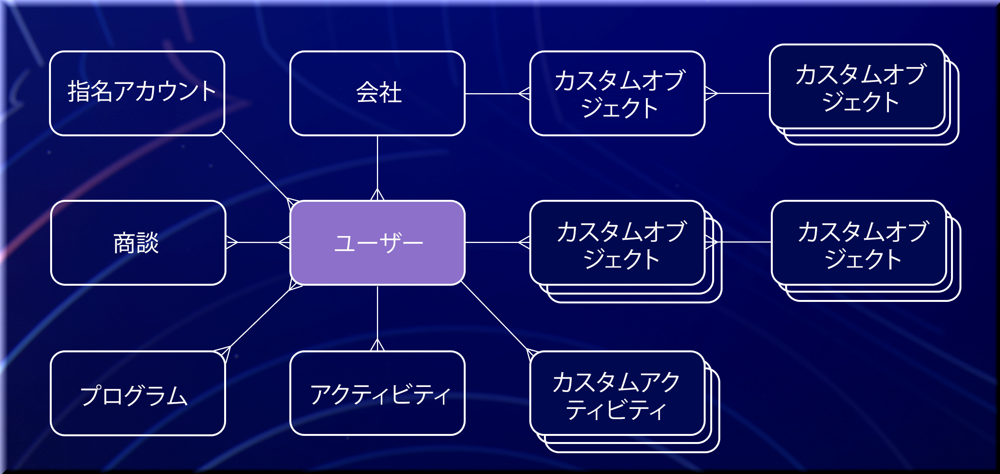

# はじめに

Marketo Engageは、見込み顧客や顧客向けにパーソナライズされたマルチチャネルプログラムやキャンペーンを管理するためのマーケティングオートメーションプラットフォームです。 統合ポイントを通じてプラットフォームを拡張できます。

ここでは、Marketo Engageの中核となるエンティティとその関係について説明します。

>[!NOTE]
>
>SOAP APIは非推奨（廃止予定）であり、2026年7月31日以降は使用できなくなります。 すべての新規開発にMarketo [REST API](./rest-api/rest-api.md)を使用します。 サービスの中断を避けるために、その日までに既存のサービスを移行します。 サービスがSOAP APIを使用する場合は、SOAP API [移行ガイド ](./soap-api/migration.md)を参照してください。
>

Marketo Engage インスタンスでNative SFDCまたはMS Dynamics CRM接続が有効になっている場合、これらのオブジェクトは読み取り専用です。

- 会社
- 商談
- 商談のロール
- 営業担当者

## ユーザ（リード）

従業員は、MAの基礎となります。 Marketoでは、営業担当者がリードをリード、見込み客、容疑者、連絡先とみなすかどうかに関係なく、営業担当者でなくても、あらゆるリードとして個人の記録を指します。

リードオブジェクトには、電子メール、名、姓などの標準フィールドが含まれます。 他の情報を格納するフィールドを追加したり、標準フィールドと同じ方法でカスタム属性を読み取ったり書き込んだりできます。 Marketoの&#x200B;**[!UICONTROL Admin]** > **[!UICONTROL Field Management]**&#x200B;の下にある完全なフィールドリストを検索します。

Marketoは、id フィールドによってリードを一意に識別します。 システム外の他の一意のキーを適用する必要があります。

関連 API：[REST](https://developer.adobe.com/marketo-apis/api/mapi#tag/Leads)、[JavaScript](javascript-api/lead-tracking.md#lead-tracking-api)

## アクティビティ

リードは、web ページへのアクセス、展示会への参加、ホワイトペーパーのダウンロードなど、いくつかの方法で企業と接触します。 Marketoは、これらのアクションをアクティビティとして捉え、リードがいつ何をしたのかを把握できるようにします。

アクティビティは常にリードに関連付けられます。

カスタムアクティビティを定義することもできます。 カスタムアクティビティを作成して公開したら、Marketo APIを使用してカスタムアクティビティのインスタンスを追加できます。 詳しくは、[ カスタムアクティビティについて](https://experienceleague.adobe.com/ja/docs/marketo/using/product-docs/administration/marketo-custom-activities/understanding-custom-activities)を参照してください。

関連 API：[REST](https://developer.adobe.com/marketo-apis/api/mapi#tag/Activities)、[JavaScript](javascript-api/lead-tracking.md#munchkin-behavior)

## プログラムとキャンペーン

プログラムは、マーケターの関連するマーケティング活動を1か所で整理するものです。 たとえば、メールの一斉配信はプログラムにすることができます。

リードは、プログラムに関連する複数のアクションやアクティビティを実行できます。 このプロセスはリードプログレッションと呼ばれます。 メールの一斉送信プログラムの場合、進行状況は、Marketoがメールを送信した時点、そのユーザーがメールを開いた時点、およびそのユーザーがリンクをクリックしたかどうかを記録できます。

キャンペーンは、プログラム内の特定の目的と目標を果たします。 たとえば、キャンペーンではリードグループを選択して、メールの一斉配信を送信できます。 また、リードが電子メールのリンクをクリックすると、セールス担当者に通知することができます。

関連 API：[REST](https://developer.adobe.com/marketo-apis/api/mapi#tag/Campaigns)

## タグ

レポート用のタググループ化とプログラムデータの分類。 タグを使用して、プログラムの効果とROIを測定する。

Marketo管理者は、プログラムの作成時にユーザーが選択する必須およびオプションのタグタイプを作成できます。 会社のレポート要件に基づいて、各タグタイプで可能な値を定義します。

例えば、NortheastやSoutheastなどの値を持つカスタムの「Region」タグタイプを作成して、どの地域が最も多くのリードを生み出しているかを分析します。 「所有者」タグのタイプを作成して、リードと機会の作成に最も大きな影響を与えるプログラム所有者（Maria、David、Johnなど）を比較します。 詳細については、「[ タグについて](https://experienceleague.adobe.com/ja/docs/marketo/using/product-docs/core-marketo-concepts/programs/working-with-programs/understanding-tags)」を参照してください。

関連 API：[REST](https://developer.adobe.com/marketo-apis/api/asset)

## リスト

リストはリードのコレクションを整理します。 Marketoには、次の2種類があります。

- 静的リストとは、マーケターがリードを追加または削除できる固定のコレクションです。
- スマートリストとは、定義された特性にもとづく動的なコレクションです。

例えば、「web サイトの価格ページを訪問した全リード」という名前のスマートリストは、そのページに訪問するリードが増えるにつれて増加し続けます。 詳しくは、[Marketo Engageのドキュメント ](https://experienceleague.adobe.com/ja/docs/marketo/using/home)を参照してください。

関連 API：[REST](https://developer.adobe.com/marketo-apis/api/asset#tag/Static-Lists)

## 商談

オポチュニティとは、マーケターがセールス部門に提供する潜在的なセールス取引を表します。 Marketoでは、商談はリードまたは取引先責任者と組織に関連付けられます。

オポチュニティの役割は、リードを組織に結びつけ、その組織内でのリードの機能を説明します。

関連 API：[REST](https://developer.adobe.com/marketo-apis/api/mapi#tag/Opportunities)

## 会社

組織（Marketoではアカウントと呼ばれることもあります）とは、個人が属する組織のことです。

MarketoのROI レポートやRCA （Revenue Cycle Analytics）における正確なROI アトリビューションを取得するには、従業員を自社やオポチュニティに関連付けます。

関連 API：[REST](https://developer.adobe.com/marketo-apis/api/mapi#tag/Companies)

## アセット

Assetsには、プログラムで使用されるランディングページ、メール、フォーム、画像が含まれます。 アセットは、特定のプログラムのローカルまたはグローバルにすることができます。 グローバルなアセットは、すべてのプログラムで利用できます。

関連 API：[REST](https://developer.adobe.com/marketo-apis/api/asset)

## トークン

トークンを活用すると、マーケターはアセットを使用してメッセージをパーソナライズし、フローアクションにロジックを追加できます。 Marketoは、システム、プログラム、リード、企業全体のトークンを提供します。

例えば、電子メールにリードトークン `{{lead.First Name}}`を配置して、リードの名を表示します。

プログラムまたはフォルダーレベルで定義されたトークンは、Marketoでは「マイトークン」と呼ばれます。 マイトークンには3つのタイプがあります：

- ローカル：特定のキャンペーンフォルダーまたはプログラムで作成され、そのフォルダーまたはプログラムでのみ使用できます。
- 継承：キャンペーンフォルダーレベルで作成され、そのフォルダー内のすべてのプログラムで使用できます。
- 上書き：プログラムフォルダーレベルで親のマイトークン値を変更せずに、プログラムレベルでカスタム値で変更しました。

マイトークンでは、トークン名の先頭に「my」という単語が付いた命名規則`{{my.My Token}}`が使用されます。 例えば、EventDateという名前の日付タイプのMy Tokenには、トークン名`{{my.EventDate}}`があります。 詳細については、「[ プログラム内のマイトークンについて](https://experienceleague.adobe.com/ja/docs/marketo/using/product-docs/core-marketo-concepts/programs/tokens/understanding-my-tokens-in-a-program)」を参照してください。

関連 API：[REST](https://developer.adobe.com/marketo-apis/api/asset#tag/Tokens)

## カスタムオブジェクト

Marketo カスタムオブジェクトは、Marketo リードとカスタムオブジェクトレコードの間に1対多または多対多（Edge-Bridge-Edge）のリレーションシップを作成します。

Marketo カスタムオブジェクトを作成して公開すると、Marketo APIを使用してCRUD操作を実行できます。 新しいレコードが追加されたら、スマートリストトリガーを使用して応答できます。 カスタムオブジェクトデータは、セグメント化のためのスマートリストフィルターとして、または[ メールスクリプティング ](email-scripting.md)を通じたメールで使用することもできます。 カスタムオブジェクトの作成について詳しくは、[Marketo Engage ドキュメント ](https://experienceleague.adobe.com/ja/docs/marketo/using/home)を参照してください。

関連 API：[REST](https://developer.adobe.com/marketo-apis/api/mapi#tag/Custom-Objects)

## セールス担当者

ネイティブのCRM統合が有効になっていない場合は、Marketoで営業担当者のレコードとそのリードの関係を管理できます。 これらのレコードには、名前、メールアドレス、役職などの情報が含まれます。 営業担当者がリードを所有している場合、この情報をフィルタリングやトークンに使用できます。

「externalSalesPersonId」フィールドを使用して、リードレベルの営業担当者との関係を管理します。 [ リードの同期](https://developer.adobe.com/marketo-apis/api/mapi#tag/Leads/operation/syncLeadUsingPOST) APIを使用してこのフィールドを更新します。

関連 API：[REST](https://developer.adobe.com/marketo-apis/api/mapi#tag/Sales-Persons)
