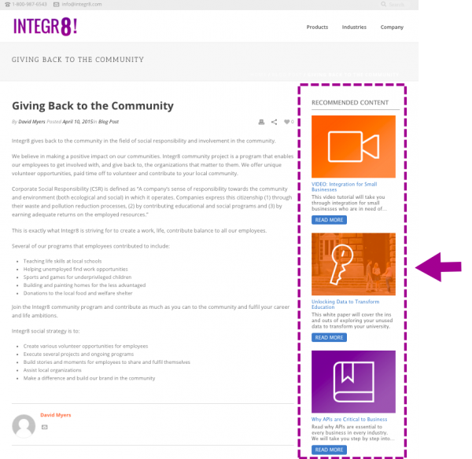

# リッチメディアレコメンデーション

リッチメディアレコメンデーションテンプレートを表示するページで、次のタグと API 呼び出しを設定する必要があります。

1. ページヘッダー内
   1. RTP タグをインストール
   1. GET 呼び出しをページに追加して、レコメンデーションに入力
   1. SET 呼び出しを追加して、テンプレートを設定
1. ページ本文内
   1. テンプレートを表示する場所にテンプレートタグ（div クラス）を配置

詳しくは、[こちら](https://experienceleague.adobe.com/ja/docs/marketo/using/product-docs/predictive-content/enabling-predictive-content/enable-predictive-content-for-web-rich-media)を参照してください。

## テンプレートタグ

| 属性 | オプション／必須 | 説明 |
|---|---|---|
| クラス | 必須 | この div HTML 要素が RTP レコメンデーション div であることを指定します。 |
| data-rtp-template-id | 必須 | テンプレート ID。これにより、レコメンデーションの配置が決定されます。水平方向の配置には「template1」、垂直方向の配置には「template2」、タイトルと説明のみを含む垂直方向の配置には「template3」を使用します。スクリプトは、template1、template2、template3 の `div.Permissible` 値に一致するテンプレートを挿入します。 |

### 例

レコメンデーションを水平方向の配置に表示するには、「template1」を使用します。

```html
<div class="RTP_RCMD2" data-rtp-template-id="template1"></div>
```

レコメンデーションを垂直方向の配置に表示するには、「template2」を使用します。

```html
<div class="RTP_RCMD2" data-rtp-template-id="template2"></div>
```

レコメンデーションをタイトルと説明のみで垂直方向の配置に表示するには、「template3」を使用します。

```html
<div class="RTP_RCMD2" data-rtp-template-id="template3"></div>
```

テンプレートの配置のスクリーンショットについて詳しくは、[こちら](#example_of_rich_media_recommendation_template_1)を参照してください。

## レコメンデーションの入力

この方法では、ページ上のすべてのリッチメディア `<divs>` にレコメンデーションが入力されます。

### 使用方法

`rtp('get', 'rcmd', 'richmedia');`

| パラメーター | オプション／必須 | タイプ | 説明 |
|---|---|---|---|
| &#39;get&#39; | 必須 | 文字列 | メソッドアクション。 |
| &#39;rcmd&#39; | 必須 | 文字列 | メソッド名。 |
| &#39;richmedia&#39; | 必須 | 文字列 | サブメソッド名。 |

## テンプレート設定の変更

このメソッドでは、テンプレートのデフォルト設定が変更されます。

メモ：このメソッドを使用する場合は、rtp(&#39;get&#39;,&#39;rcmd&#39;, &#39;richmedia&#39;); を呼び出す前に、これを呼び出す必要があります。

### 使用方法

`rtp('set', 'rcmd', 'richmedia', 'template_id', conf_obj);`

| パラメーター | オプション／必須 | タイプ | 説明 |
|---|---|---|---|
| ‘set’ | 必須 | 文字列 | メソッドアクション。 |
| &#39;rcmd&#39; | 必須 | 文字列 | メソッド名。 |
| &#39;richmedia&#39; | 必須 | 文字列 | サブメソッド名。 |
| template_id | オプション | 文字列 | 設定変更のテンプレート ID。1 つのテンプレートのみの設定変更を指定するのに使用します。 |
| conf_obj | 必須 | オブジェクト | 新しい設定。オブジェクトは、すべての設定をキーと値のペアとして保持します。 |

### 例

このコードスニペットは、テンプレートのタイトルテキストを変更します。

```javascript
rtp("set", "rcmd", "richmedia","template1",
    {
        "rcmd.title.text": "RECOMMENDED CONTENT"
    }
);
```

このコードスニペットは、テンプレートに対して複数の設定を持つ設定カテゴリを示しています。

```javascript
rtp("set", "rcmd", "richmedia",
    {
        "template1":
        {
            "rcmd.title.text": "RECOMMENDED CONTENT",
            "rcmd.general.font.family": "arial",
            "category":
            [
                "webinar",
                "blog posts",
                "pricing_page_category",
                "product_a_category"
            ]
        }
    }
);
```

メモ：「category」を使用して、予測コンテンツレコメンデーションの結果に表示されるコンテンツをフィルタリングします。有効なすべてのコンテンツに予測コンテンツを適用するには、「category」を空のままにします。リッチメディアテンプレートの出力に特定のコンテンツのみを推奨する場合は、「コンテンツを設定」ページでコンテンツのカテゴリを追加し、レコメンデーションテンプレートコード内でこのカテゴリを関連付けます。Web サイトのセクション（製品やソリューション）に従って関連コンテンツを分類します。

このコードスニペットは、テンプレートに対して複数のテンプレート設定の指定を示しています。

```javascript
rtp("set", "rcmd", "richmedia",
    {
        "template1":
        {
            "rcmd.title.text": "RECOMMENDED CONTENT",
            "rcmd.general.font.family": "arial"
        }
    }
);
```

#### 設定プロパティ

| 設定 | 例 | 説明 |
|---|---|---|
| rcmd.general.font.family | &quot;rcmd.general.font.family&quot; : &quot;arial&quot; | テンプレート内のすべてのテキストのフォントファミリーを変更します。このプロパティは、ブラウザータイプ別のすべての CSS 値をサポートします。ページに存在する場合は、カスタムフォントファミリーを使用できます。 |
| rcmd.content.background.color | &quot;rcmd.content.background.color&quot; : &quot;black&quot; | テンプレートの内部ボックスの背景色を変更します。このプロパティは、ブラウザータイプ別のすべての CSS 値をサポートします。 |
| rcmd.title.text | &quot;rcmd.title.text&quot; : &quot;RECOMMENDED CONTENT&quot; | テンプレートのタイトルを変更します。 |
| rcmd.title.background.color | &quot;rcmd.title.background.color&quot; : &quot;blue&quot; | タイトルボックスの背景色を変更します。このプロパティは、すべての css カラー値（color name、rgb など）をサポートします。 |
| rcmd.title.font.size | &quot;rcmd.title.font.size&quot; : &quot;26px&quot; | タイトルのフォントサイズを変更します。このプロパティは、使用可能なすべてのフォントサイズの CSS 値（px、em など）をサポートします。 |
| rcmd.title.font.color | &quot;rcmd.title.font.color&quot; : &quot;white&quot; | タイトルのフォントカラーを変更します。このプロパティは、すべてのフォントカラー値（rgb、hex など）をサポートします |
| rcmd.description.font.color | &quot;rcmd.description.font.color&quot; : &quot;white&quot; | 説明のフォントカラーを変更します。このプロパティは、すべてのフォントカラー値（rgb、hex など）をサポートします |
| rcmd.cta.background.color | &quot;rcmd.cta.background.color&quot; : &quot;green&quot; | ボタンの背景色を変更します。このプロパティは、すべての css カラー値（color name、rgb など）をサポートします。 |
| rcmd.cta.font.color | &quot;rcmd.cta.font.color&quot; : &quot;rgb(90, 84, 164)&quot; | ボタンのフォントカラーを変更します。このプロパティは、すべてのフォントカラー値（rgb、hex など）をサポートします |
| rcmd.cta.text | &quot;rcmd.cta.text&quot; : &quot;Push&quot; | ボタンのテキストを変更します。テキストは、すべてのボタンで同じです。 |
| カテゴリ | &quot;category&quot; : [&quot;one category&quot;] | このテンプレートがサポートするレコメンデーションカテゴリを変更します。テンプレートには、この設定で指定されたカテゴリの 1 つを持つレコメンデーションのみが表示されます。 |

メモ：設定のサポートは、テンプレートごとに変更される場合があります。

#### 基本的な例

この例には、3 つのレコメンデーションを含む 1 つのテンプレートがあります。この例を HTML ページにコピーしてから、RTP タグを自分のタグに置き換えます。

```html
<!DOCTYPE>
<html>
<head>
<meta http-equiv="Content-Type" content="text/html; charset=UTF-8">
<title>RTP recommendation</title>
<!-- RTP tag -->
<script type='text/javascript'>

// This tag needs to be replaced with your account tag
(function(c,h,a,f,i,e){c[a]=c[a]||function(){(c[a].q=c[a].q||[]).push(arguments)};
c[a].a=i;c[a].e=e;var g=h.createElement("script");g.async=true;g.type="text/javascript";
g.src=f+'?aid='+i;var b=h.getElementsByTagName("script")[0];b.parentNode.insertBefore(g,b);
})(window,document,"rtp","//example.rtp.com/rtp-api/v1/rtp.js","account_id");

// Send page view (required by  the recommendation)
rtp('send','view');
// Populate recommendation
rtp('get','rcmd', 'richmedia');
</script>
<!-- End of RTP tag -->
</head>
<body>
<div class="RTP_RCMD2" data-rtp-template-id="template1"></div>
</body>
</html>
```

#### 高度な例

この例には、3 つのレコメンデーションを含む 1 つのテンプレートがあります。テンプレートのタイトルは「RECOMMENDED CONTENT」、ボタンのテキストは「Read More」になります。この例を HTML ページにコピーしてから、RTP タグを自分のタグに置き換えます。

```html
<!DOCTYPE>
<html>
<head>
<meta http-equiv="Content-Type" content="text/html; charset=UTF-8">
<title>RTP recommendation</title>
<!-- RTP tag -->
<script type='text/javascript'>

// This tag needs to be replaced with your account tag
(function(c,h,a,f,i,e){c[a]=c[a]||function(){(c[a].q=c[a].q||[]).push(arguments)};
c[a].a=i;c[a].e=e;var g=h.createElement("script");g.async=true;g.type="text/javascript";
g.src=f+'?aid='+i;var b=h.getElementsByTagName("script")[0];b.parentNode.insertBefore(g,b);
})(window,document,"rtp","//example.rtp.com/rtp-api/v1/rtp.js","account_id");

// Send page view (required by  the recommendation)
rtp('send','view');
// Populate the recommendation zone
rtp('get', 'campaign',true);
// Change template configuration
rtp('set', 'rcmd', 'richmedia',
    {
        template1 :
        {
            "rcmd.title.text" : "RECOMMENDED CONTENT",
            "rcmd.cta.text" : "Read More"
        }
    }
);
// Populate recommendation
rtp('get','rcmd', 'richmedia');
</script>
<!-- End of RTP tag -->
</head>
<body>
<div class="RTP_RCMD2" data-rtp-template-id="template1"></div>
</body>
</html>
```

#### リッチメディアレコメンデーションテンプレート #1 の例

**名前**：template1 **説明**：画像、タイトル、説明、コールトゥアクションボタンを含む水平コンテンツ。


#### リッチメディアレコメンデーションテンプレート #2 の例

**名前**：template2 **説明**：画像、タイトル、説明、コールトゥアクションボタンを含む垂直コンテンツ。



#### リッチメディアレコメンデーションテンプレート #3 の例

**名前**：template3 **説明**：タイトルと説明のみを含む垂直コンテンツ。ポインタを合わせると、ヘッダーのカラーが変わり、コンテンツ URL にハイパーリンクされます。また、説明は、カラーの変更を使用しないコンテンツにもリンクします。
