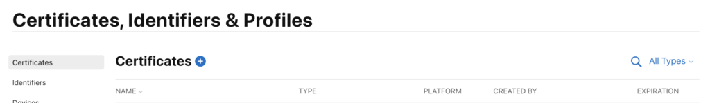

# プッシュ通知

プッシュ通知を有効にする方法。

## iOSでのプッシュ通知の設定

プッシュ通知を有効にするには、次の 3 つの手順があります。

1. Apple開発者アカウントでプッシュ通知を設定します。
1. xCode でプッシュ通知を有効にします。
1. Marketo SDK を使用して、アプリでプッシュ通知を有効にします。

### Apple開発者アカウントでのプッシュ通知の設定

1. Apple Developer[ メンバーセンター ](http://developer.apple.com/membercenter) にログインします。
1. 「証明書、識別子、プロファイル」をクリックします。
1. 「iOS、tvOS、watchOS」の下の「証明書 – > すべて」フォルダーをクリックします。
1. 左上の証明書  の横にある「+」を選択します
1. 「Apple プッシュ通知サービス SSL （サンドボックスおよび実稼動）」チェックボックスを有効にし、「続行」をクリックします。
1. アプリケーションのビルドに使用しているアプリケーション識別子を選択します。
1. CSR を作成してアップロードし、プッシュ証明書を生成します。
1. 証明書をローカルコンピューターにダウンロードし、ダブルクリックしてインストールします。
1. 「キーチェーンアクセス」を開き、証明書を右クリックして、`.p12` ファイルに 2 つの項目を書き出します。
1. 通知を設定するには、Marketo Admin Console経由でこのファイルをアップロードします。
1. アプリのプロビジョニングプロファイルを更新します。

### xCode でのプッシュ通知の有効化

xCode プロジェクトのプッシュ通知機能を有効にします。

### Marketo SDK を使用したアプリでのプッシュ通知の有効化

顧客のデバイスにプッシュ通知 `AppDelegate.m` 配信するには、ファイルに次のコードを追加します。

**メモ** - [!DNL Adobe Launch] 拡張機能を使用する場合、クラス名として `ALMarketo` を使用します

`AppDelegate.h` に次を読み込みます。

>[!BEGINTABS]

>[!TAB 目標 C]

```
#import <UserNotifications/UserNotifications.h>
```

>[!TAB Swift]

```
import UserNotifications
```

>[!ENDTABS]

次に示すように、`AppDelegate` に `UNUserNotificationCenterDelegate` を追加します。

>[!BEGINTABS]

>[!TAB 目標 C]

```
@interface AppDelegate : UIResponder <UIApplicationDelegate, UNUserNotificationCenterDelegate>
```

>[!TAB Swift]

```
class AppDelegate: UIResponder, UIApplicationDelegate , UNUserNotificationCenterDelegate
```

>[!ENDTABS]

プッシュ通知サービスを開始します。 プッシュ通知を有効にするには、以下のコードを追加します。

>[!BEGINTABS]

>[!TAB 目標 C]

```objectivec
BOOL)application:(UIApplication *)application didFinishLaunchingWithOptions:(NSDictionary *)launchOptions {
UNUserNotificationCenter *center = [UNUserNotificationCenter currentNotificationCenter];
        center.delegate = self;
        [center requestAuthorizationWithOptions:(UNAuthorizationOptionSound | UNAuthorizationOptionAlert | UNAuthorizationOptionBadge) completionHandler:^(BOOL granted, NSError * _Nullable error){
            if(!error){
                dispatch_async(dispatch_get_main_queue(), ^{
                    [[UIApplication sharedApplication] registerForRemoteNotifications];
                });
            }
        }];

    return YES;
}
```

>[!TAB Swift]

```
func application(_ application: UIApplication, didFinishLaunchingWithOptions launchOptions: [UIApplication.LaunchOptionsKey: Any]?) -> Bool {
            
    UNUserNotificationCenter.current().requestAuthorization(options: [.alert, .sound,    .badge]) { granted, error in
            if let error = error {
                print("\(error.localizedDescription)")
            } else {
                DispatchQueue.main.async {
                    application.registerForRemoteNotifications()
                }
            }
        }
        
        return true
}
```

>[!ENDTABS]

このメソッドを呼び出して、Apple プッシュサービスの登録プロセスを開始します。 登録に成功した場合、アプリはアプリ委任オブジェクトの `application:didRegisterForRemoteNotificationsWithDeviceToken:` メソッドを呼び出し、デバイストークンを渡します。

登録に失敗した場合、アプリは代わりにアプリのデリゲートの `application:didFailToRegisterForRemoteNotificationsWithError:` メソッドを呼び出します。

プッシュトークンをMarketoに登録します。 Marketoからプッシュ通知を受け取るには、デバイストークンをMarketoに登録する必要があります。

>[!BEGINTABS]

>[!TAB 目標 C]

```
- (void)application:(UIApplication *)application didRegisterForRemoteNotificationsWithDeviceToken:(NSData *)deviceToken {
    // Register the push token with Marketo
    [[Marketo sharedInstance] registerPushDeviceToken:deviceToken];
}
```

>[!TAB Swift]

```
func application(_ application: UIApplication, didRegisterForRemoteNotificationsWithDeviceToken deviceToken: Data) {
    // Register the push token with Marketo
    Marketo.sharedInstance().registerPushDeviceToken(deviceToken)
}
```

>[!ENDTABS]

ユーザーがログアウトした際に、トークンの登録を解除することもできます。

>[!BEGINTABS]

>[!TAB 目標 C]

```
[[Marketo sharedInstance] unregisterPushDeviceToken];
```

>[!TAB Swift]

```
Marketo.sharedInstance().unregisterPushDeviceToken
```

>[!ENDTABS]

プッシュトークンを再登録するには、手順 3 のコードを AppDelegate メソッドに抽出し、ViewController ログインメソッドから呼び出します。

プッシュ通知を処理します。 Marketoからプッシュ通知を受け取るには、デバイストークンをMarketoに登録する必要があります。

>[!BEGINTABS]

>[!TAB 目標 C]

```
- (void)application:(UIApplication *)application didReceiveRemoteNotification:(NSDictionary *)userInfo
{
    [[Marketo sharedInstance] handlePushNotification:userInfo];
}
```

>[!TAB Swift]

```
func application(_ application: UIApplication, didReceiveRemoteNotification userInfo: [AnyHashable : Any]) {
    Marketo.sharedInstance().handlePushNotification(userInfo)
}
```

>[!ENDTABS]

AppDelegate に次のメソッドを追加します

この方法を使用すると、アプリがフォアグラウンドにあるときに、アラートやサウンドを表示したり、バッジを増やしたりすることができます。 このメソッドでは、選択した completionHandler を呼び出す必要があります。

>[!BEGINTABS]

>[!TAB 目標 C]

```
-(void)userNotificationCenter:(UNUserNotificationCenter *)center
    willPresentNotification:(UNNotification *)notification
        withCompletionHandler:(void (^)(UNNotificationPresentationOptions options))completionHandler{

    completionHandler(UNAuthorizationOptionSound | UNAuthorizationOptionAlert | UNAuthorizationOptionBadge);
}
```

>[!TAB Swift]

```
func userNotificationCenter(_ center: UNUserNotificationCenter, 
            willPresent notification: UNNotification, withCompletionHandler completionHandler: @escaping (
    UNNotificationPresentationOptions) -> Void) {
    completionHandler([.alert, .sound,.badge])
}
```

>[!ENDTABS]

AppDelegate での新しく受信したプッシュ通知の処理

メソッドは、ユーザーがアプリケーションを開いたり、通知を却下したり、UNNotificationAction を選択したりして通知に応答したときに、デリゲートで呼び出されます。 アプリケーションが applicationDidFinishLaunching：から戻る前に、デリゲートを設定する必要があります。

>[!BEGINTABS]

>[!TAB 目標 C]

```
- (void)userNotificationCenter:(UNUserNotificationCenter *)center
didReceiveNotificationResponse:(UNNotificationResponse *)response withCompletionHandler:(void(^)(void))completionHandler {
    [[Marketo sharedInstance] userNotificationCenter:center didReceiveNotificationResponse:response withCompletionHandler:completionHandler];
}
```

>[!TAB Swift]

```
func userNotificationCenter(_ center: UNUserNotificationCenter,
                                didReceive response: UNNotificationResponse,
                                withCompletionHandler
                                completionHandler: @escaping () -> Void) {
        Marketo.sharedInstance().userNotificationCenter(center, didReceive: response, withCompletionHandler: completionHandler)
}
```

>[!ENDTABS]

プッシュ通知のトラッキング

アプリがバックグラウンドで実行されている（またはアクティブでない）場合、デバイスは次に示すようにプッシュ通知を受け取ります。 Marketoでは、ユーザーが通知をタップした際に状況が追跡されます。


デバイスがプッシュ通知を受け取ると、アプリのデリゲート上 `application:didReceiveRemoteNotification:` コールバックに渡されます。

次に、アプリイベントとプッシュ通知イベントを示す、MarketoのMarketo アクティビティログを示します。


## Androidでのプッシュ通知の設定

1. アプリケーションタグ内に次の権限を追加します。

   `AndroidManifest.xml` を開いて、次の権限を追加します。 アプリは、「インターネット」および「ACCESS_NETWORK_STATE」権限をリクエストする必要があります。 アプリがこれらの権限を既にリクエストしている場合は、この手順をスキップします。

   ```xml
   <uses‐permission android:name="android.permission.INTERNET"/>
   <uses‐permission android:name="android.permission.ACCESS_NETWORK_STATE"/>
   
   <!‐‐Following permissions are required for push notification.‐‐>
   <uses-permission android:name="android.permission.GET_ACCOUNTS"/>
   <!‐‐Keeps the processor from sleeping when a message is received.‐‐>
   <uses-permission android:name="android.permission.WAKE_LOCK"/>
   <permission android:name="<PACKAGE_NAME>.permission.C2D_MESSAGE" android:protectionLevel="signature" />
   <uses-permission android:name="<PACKAGE_NAME>.permission.C2D_MESSAGE" />
   <!-- This app has permission to register and receive data message. -->
   <uses-permission android:name="com.google.android.c2dm.permission.RECEIVE" />
   ```

1. HTTPv1 を使用した FCM の設定（Googleは 2023 年 6 月 12 日に [ 非推奨の XMPP プロトコル ](https://firebase.google.com/docs/cloud-messaging/xmpp-server-ref) を発表し、2024 年 6 月に削除されます） 

- Marketo feature manager  で MME FCM HTTPv1 を有効にする
   - アプリのサービスアカウント JSON ファイルを MLM にアップロードします。
   - サービスアカウントの JSON ファイルは、Firebase コンソールからダウンロードできます。   
   - Marketoにサービスアカウントの JSON ファイルをアップロードしてから 1 時間待ってから、プッシュ通知を送信します。  

## Android テストデバイス

アプリケーションタグ内のマニフェストファイルにMarketo アクティビティを追加します。

```xml
<activity android:name="com.marketo.MarketoActivity"  android:configChanges="orientation|screenSize">
    <intent-filter android:label="MarketoActivity">
        <action  android:name="android.intent.action.VIEW"/>
        <category  android:name="android.intent.category.DEFAULT"/>
        <category  android:name="android.intent.category.BROWSABLE"/>
        <data android:host="add_test_device" android:scheme="mkto"/>
    </intent-filter/>
</activity/>
```

## Marketo プッシュサービスの登録

1. Marketoからプッシュ通知を受け取るには、`AndroidManifest.xml` に Firebase Messaging サービスを追加する必要があります。 アプリケーション終了タグの前にを追加します。

   ```xml
   <meta-data
       android:name="com.google.android.gms.version"
       android:value="@integer/google_play_services_version" />
   <service android:name=".MyFirebaseMessagingService">
   <intent-filter>
   <action android:name="com.google.firebase.INSTANCE_ID_EVENT"/>
   <action android:name="com.google.firebase.MESSAGING_EVENT"/>
   </intent-filter>
   </service>
   ```

1. Marketo SDK メソッドをファイル `MyFirebaseMessagingService` に次のように追加します

   ```java
   import com.marketo.Marketo;
   
   public class MyFirebaseMessagingService extends FirebaseMessagingService {
   
       @Override
       public void onNewToken(String s) {
           super.onNewToken(s);
           Marketo marketoSdk = Marketo.getInstance(this.getApplicationContext());
           marketoSdk.setPushNotificaitonToken(s);
           // Add your code here...
       }
   
       @Override
       public void onMessageReceived(RemoteMessage remoteMessage) {
           Marketo marketoSdk = Marketo.getInstance(this.getApplicationContext());
           marketoSdk.showPushNotificaiton(remoteMessage);
           // Add your code here...
       }
   
   }
   ```

   **メモ** - Adobe拡張機能を使用する場合は、次のように追加します

   ```java
   import com.marketo.Marketo;
   
   public class MyFirebaseMessagingService extends FirebaseMessagingService {
   
       @Override
       public void onNewToken(String token) {
           super.onNewToken(token);
           ALMarketo.setPushNotificationToken(token);
           // Add your code here...
       }
   
       @Override
       public void onMessageReceived(RemoteMessage remoteMessage) {
           ALMarketo.showPushNotification(remoteMessage);
           // Add your code here...
       }
   
   }
   ```

**注意**:FCM SDK は、必要なすべての権限と必要な受信者機能を自動的に追加します。 以前のバージョンの SDK を使用している場合は、次の古い（潜在的に有害な）要素をアプリのマニフェストから削除してください

```xml
<receiver android:name="com.marketo.MarketoBroadcastReceiver" android:permission="com.google.android.c2dm.permission.SEND">
    <intent-filter>
        <!‐‐Receives the actual messages.‐‐>
        <action android:name="com.google.android.c2dm.intent.RECEIVE"/>
        <!‐‐Register to enable push notification‐‐>
        <action android:name="com.google.android.c2dm.intent.REGISTRATION"/>
        <!‐‐‐Replace YOUR_PACKAGE_NAME with your own package name‐‐>
        <category android:name="YOUR_PACKAGE_NAME"/>
    </intent-filter>
</receiver>

<!‐‐Marketo service to handle push registration and notification‐‐>
<service android:name="com.marketo.MarketoIntentService"/>
```

1. Marketoのプッシュ通知の初期化上記の設定を保存したら、Marketoのプッシュ通知を初期化する必要があります。 Application クラスを作成するか開き、以下のコードをコピー&amp;ペーストします。 送信者 ID は、Firebase コンソールから取得できます。


   ```java
   Marketo marketoSdk = Marketo.getInstance(getApplicationContext());
   
   // Enable push notification here. The push notification channel name can by any string
   marketoSdk.initializeMarketoPush(SENDER_ID,"ChannelName");
   ```

   [!DNL Adobe Launch] Extension を使用している場合は、次の手順を使用します

   ```java
   // Enable push notification here. The push notification channel name can by any string
   ALMarketo.initializeMarketoPush(SENDER_ID,"ChannelName");
   ```

   SENDER_ID がない場合は、[ このチュートリアル ](https://developers.google.com/cloud-messaging/) で説明されている手順を実行してGoogle Cloud Messaging Service を有効にします。

   ユーザーがログアウトした際に、トークンの登録を解除することもできます。

   ```java
   marketoSdk.uninitializeMarketoPush();
   ```

   拡張機能 [!DNL Adobe Launch] 使用する場合は、次の手順を使用します

   ```java
   ALMarketo.uninitializeMarketoPush();
   ```

   メモ：プッシュトークンを再登録するには、手順 3 のコードを AppDelegate メソッドに抽出し、ViewController ログインメソッドから呼び出します。

1. 通知アイコンを設定（オプション） カスタム通知アイコンを設定するには、次のメソッドを呼び出す必要があります。

   ```java
   MarketoConfig.Notification config = new MarketoConfig.Notification();
   // Optional bitmap for honeycomb and above
   config.setNotificationLargeIcon(bitmap);
   
   // Required icon Resource ID
   config.setNotificationSmallIcon(R.drawable.notification_small_icon); 
   
   // Set the configuration 
   //Use the static methods on ALMarketo class when using Adobe Extension
   Marketo.getInstance(context).setNotificationConfig(config); 
   
   // Get the configuration set 
   Marketo.getInstance(context).getNotificationConfig();
   ```

## トラブルシューティング

モバイルプッシュメッセージの設定には、多くの手順と、開発者やマーケターの連携が必要です。 困難が発生している場合は、確認できる簡単なことがあります。

単純なことが正しいことを確認したら、プログラミングの詳細をさらに掘り下げることができます。

### プッシュメッセージが表示されない

まず、受話器でプッシュメッセージが無効になっているかどうかを確認します。 モバイルユーザーは、特定のアプリでメッセージを受信するかどうかを制御できます。 多くの場合、開発者（およびマーケター）は、開発中のある時点でこれらのメッセージを無効にします。 したがって、最初に確認するのは、受信者がアプリでプッシュメッセージを無効にしているかどうかです。

次に、アプリはデバイスで既に開かれ、アクティブになっていますか？ アプリがデバイス上でアクティブなアプリの場合、モバイルプッシュメッセージは画面にポップアップ表示されません。 代わりに、アプリの「ローカル通知」領域に表示されます。

### Marketoでアクティビティログを表示する

エラーをトラッキングする際にまず考慮すべき点は、Marketoのアクティビティログです。 アクティビティログを使用すると、メッセージが送信されたことを確認できます。

アクティビティログで、メッセージを受信する予定だった人のアクティビティレコードを確認します。 メッセージが送信された場合、アクティビティログにはレコードが存在します。 そうでない場合、Marketo内のiOS証明書またはAndroid API キーの設定が原因で問題が発生している可能性があります。

### 証明書またはキーが無効です

設定を再度確認し、サンドボックスまたは実稼動用に読み込まれた適切な証明書があることを確認します。 証明書（iOS）またはキー（Android）を開発者に再度書き出させ、Marketoに再読み込みして、正しいことを確認する方が良い場合があります。

### .p12 ファイルに証明書またはキーがありません（iOS）

証明書を書き出す場合は、必ずキー _および_ 証明書を書き出します。

### プロファイルのプロビジョニングが最新ではない（iOS）

新しいデバイスを追加するたびに、プロビジョニングプロファイルを更新し、新しい証明書を生成する必要があります。 Xcode プロジェクトが正しいプロファイルと証明書を指していることを確認し、それらの証明書をMarketoに読み込みます。

### iOS証明書（IOS）をアップロードできない

証明書の書き出し時に使用するパスワードにスペースが含まれていないことを確認してください。  例えば、以下の代わりに以下を実行します。

`Hello World 123`

これを使用します。

`HelloWorld123`

### iOS証明書のトラブルシューティング

サンドボックスアプリケーションの場合は、「開発者」または「ユニバーサル」証明書を使用できます。 ただし、実稼動アプリケーションの場合は、有効な「配布版」または「ユニバーサル」証明書をアップロードする必要があります。

### プッシュバウンス /無効なトークン

既存の登録トークンは、次のような多くのシナリオで無効になる場合があります。

- クライアントアプリが GCM の登録を解除した場合。
- クライアントアプリの登録が自動的に解除された場合、この状況はユーザーがアプリケーションをアンインストールした場合に発生する可能性があります。 例えば、iOSで、APNS フィードバックサービスが APNS トークンを無効としてレポートした場合です。
- 登録トークンの有効期限。 例えば、Googleが登録トークンの更新を決定した場合や、iOS デバイスの APNS トークンの有効期限が切れた場合などです。
- クライアントアプリが更新されても、新しいバージョンがメッセージを受信するように設定されていない場合。
