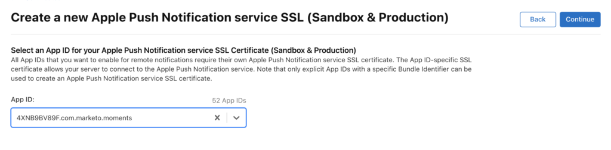
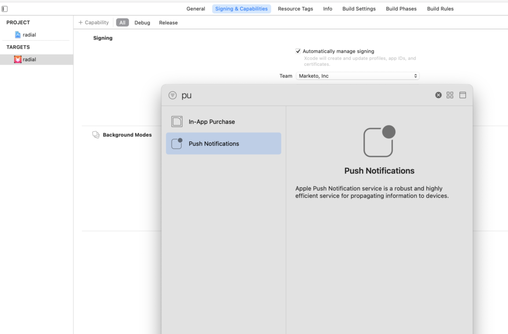

# プッシュ通知

プッシュ通知を有効にする方法

## iOS でのプッシュ通知の設定

プッシュ通知を有効にするには、次の 3 つの手順があります。

1. Apple Developer アカウントでプッシュ通知を設定します。
1. xCode でプッシュ通知を有効にします。
1. Marketo SDK を使用して、アプリでプッシュ通知を有効にします。

### Apple Developer アカウントでのプッシュ通知の設定

1. Apple Developer [Member Center](http://developer.apple.com/membercenter) にログインします。
1. 「Certificates, Identifiers &amp; Profiles」をクリックします。
1. 「iOS, tvOS, watchOS」の下の「Certificates->All」フォルダーをクリックします。
1. 画面左上の証明書の横にある「+」を選択します 
1. 「Apple Push Notification service SSL (Sandbox &amp; Production)」チェックボックスを有効にし、「続行」をクリックします。
1. アプリケーションのビルドに使用しているアプリケーション識別子を選択します。
1. CSR を作成してアップロードし、プッシュ証明書を生成します。
1. 証明書をローカルコンピューターにダウンロードし、ダブルクリックしてインストールします。
1. 「キーチェーンアクセス」を開き、証明書を右クリックして、2 つの項目を `.p12` ファイルに書き出します。
1. 通知を設定するには、Marketo Admin Console を通じてこのファイルをアップロードします。
1. アプリのプロビジョニングプロファイルを更新します。

### xCode でのプッシュ通知の有効化

xCode プロジェクトでプッシュ通知機能をオンにします。

### Marketo SDK を使用したアプリでのプッシュ通知の有効化

顧客のデバイスにプッシュ通知を配信するには、`AppDelegate.m` ファイルに次のコードを追加します。

**メモ** - [!DNL Adobe Launch] 拡張機能を使用する場合は、クラス名として `ALMarketo` を使用します

`AppDelegate.h` に次を読み込みます。

>[!BEGINTABS]

>[!TAB Objective C]

```
#import <UserNotifications/UserNotifications.h>
```

>[!TAB Swift]

```
import UserNotifications
```

>[!ENDTABS]

次に示すように、`AppDelegate` に `UNUserNotificationCenterDelegate` を追加します。

>[!BEGINTABS]

>[!TAB Objective C]

```
@interface AppDelegate : UIResponder <UIApplicationDelegate, UNUserNotificationCenterDelegate>
```

>[!TAB Swift]

```
class AppDelegate: UIResponder, UIApplicationDelegate , UNUserNotificationCenterDelegate
```

>[!ENDTABS]

プッシュ通知サービスを開始します。プッシュ通知を有効にするには、次のコードを追加します。

>[!BEGINTABS]

>[!TAB Objective C]

```objectivec
BOOL)application:(UIApplication *)application didFinishLaunchingWithOptions:(NSDictionary *)launchOptions {
UNUserNotificationCenter *center = [UNUserNotificationCenter currentNotificationCenter];
        center.delegate = self;
        [center requestAuthorizationWithOptions:(UNAuthorizationOptionSound | UNAuthorizationOptionAlert | UNAuthorizationOptionBadge) completionHandler:^(BOOL granted, NSError * _Nullable error){
            if(!error){
                dispatch_async(dispatch_get_main_queue(), ^{
                    [[UIApplication sharedApplication] registerForRemoteNotifications];
                });
            }
        }];

    return YES;
}
```

>[!TAB Swift]

```
func application(_ application: UIApplication, didFinishLaunchingWithOptions launchOptions: [UIApplication.LaunchOptionsKey: Any]?) -> Bool {

    UNUserNotificationCenter.current().requestAuthorization(options: [.alert, .sound,    .badge]) { granted, error in
            if let error = error {
                print("\(error.localizedDescription)")
            } else {
                DispatchQueue.main.async {
                    application.registerForRemoteNotifications()
                }
            }
        }

        return true
}
```

>[!ENDTABS]

Apple Push Service による登録プロセスを開始するには、このメソッドを呼び出します。登録に成功した場合、アプリはアプリデリゲートオブジェクトの `application:didRegisterForRemoteNotificationsWithDeviceToken:` メソッドを呼び出し、デバイストークンを渡します。

登録に失敗した場合、アプリは代わりにアプリデリゲートの `application:didFailToRegisterForRemoteNotificationsWithError:` メソッドを呼び出します。

Marketo にプッシュトークンを登録します。Marketo からプッシュ通知を受信するには、デバイストークンを Marketo に登録する必要があります。

>[!BEGINTABS]

>[!TAB Objective C]

```
- (void)application:(UIApplication *)application didRegisterForRemoteNotificationsWithDeviceToken:(NSData *)deviceToken {
    // Register the push token with Marketo
    [[Marketo sharedInstance] registerPushDeviceToken:deviceToken];
}
```

>[!TAB Swift]

```
func application(_ application: UIApplication, didRegisterForRemoteNotificationsWithDeviceToken deviceToken: Data) {
    // Register the push token with Marketo
    Marketo.sharedInstance().registerPushDeviceToken(deviceToken)
}
```

>[!ENDTABS]

ユーザがログアウトした際に、トークンを登録解除することもできます。

>[!BEGINTABS]

>[!TAB Objective C]

```
[[Marketo sharedInstance] unregisterPushDeviceToken];
```

>[!TAB Swift]

```
Marketo.sharedInstance().unregisterPushDeviceToken
```

>[!ENDTABS]

プッシュトークンを再登録するには、手順 3 のコードを AppDelegate メソッドに抽出し、ViewController ログインメソッドから呼び出します。

プッシュ通知を処理します。Marketo からプッシュ通知を受信するには、デバイストークンを Marketo に登録する必要があります。

>[!BEGINTABS]

>[!TAB Objective C]

```
- (void)application:(UIApplication *)application didReceiveRemoteNotification:(NSDictionary *)userInfo
{
    [[Marketo sharedInstance] handlePushNotification:userInfo];
}
```

>[!TAB Swift]

```
func application(_ application: UIApplication, didReceiveRemoteNotification userInfo: [AnyHashable : Any]) {
    Marketo.sharedInstance().handlePushNotification(userInfo)
}
```

>[!ENDTABS]

AppDelegate に次のメソッドを追加

この方法を使用すると、アプリがフォアグラウンドにある間、アラートやサウンドを出力したり、バッジを増やしたりすることができます。このメソッドでは、選択した completionHandler を呼び出す必要があります。

>[!BEGINTABS]

>[!TAB Objective C]

```
-(void)userNotificationCenter:(UNUserNotificationCenter *)center
    willPresentNotification:(UNNotification *)notification
        withCompletionHandler:(void (^)(UNNotificationPresentationOptions options))completionHandler{

    completionHandler(UNAuthorizationOptionSound | UNAuthorizationOptionAlert | UNAuthorizationOptionBadge);
}
```

>[!TAB Swift]

```
func userNotificationCenter(_ center: UNUserNotificationCenter,
            willPresent notification: UNNotification, withCompletionHandler completionHandler: @escaping (
    UNNotificationPresentationOptions) -> Void) {
    completionHandler([.alert, .sound,.badge])
}
```

>[!ENDTABS]

AppDelegate で新しく受信したプッシュ通知を処理

このメソッドは、ユーザがアプリケーションを開いたり、通知を却下したり、UNNotificationAction を選択したりして通知に応答した際に、デリゲートで呼び出されます。デリゲートは、アプリケーションが applicationDidFinishLaunching: から戻る前に設定する必要があります。

>[!BEGINTABS]

>[!TAB Objective C]

```
- (void)userNotificationCenter:(UNUserNotificationCenter *)center
didReceiveNotificationResponse:(UNNotificationResponse *)response withCompletionHandler:(void(^)(void))completionHandler {
    [[Marketo sharedInstance] userNotificationCenter:center didReceiveNotificationResponse:response withCompletionHandler:completionHandler];
}
```

>[!TAB Swift]

```
func userNotificationCenter(_ center: UNUserNotificationCenter,
                                didReceive response: UNNotificationResponse,
                                withCompletionHandler
                                completionHandler: @escaping () -> Void) {
        Marketo.sharedInstance().userNotificationCenter(center, didReceive: response, withCompletionHandler: completionHandler)
}
```

>[!ENDTABS]

プッシュ通知のトラッキング

アプリがバックグラウンドで実行されている場合（またはアクティブでない場合）、デバイスは次に示すようなプッシュ通知を受信します。Marketo は、ユーザが通知をタップしたタイミングを追跡します。


デバイスがプッシュ通知を受信すると、アプリのデリゲートの `application:didReceiveRemoteNotification:` コールバックに渡されます。

次に、アプリイベントとプッシュ通知イベントを表示する Marketo からの Marketo アクティビティログを示します。


## Android でのプッシュ通知の設定

1. アプリケーションタグ内に次の権限を追加します。

   `AndroidManifest.xml` を開き、次の権限を追加します。アプリでは、「INTERNET」および「ACCESS_NETWORK_STATE」権限をリクエストする必要があります。アプリで既にこれらの権限をリクエストしている場合は、この手順をスキップしてください。

   ```xml
   <uses‐permission android:name="android.permission.INTERNET"/>
   <uses‐permission android:name="android.permission.ACCESS_NETWORK_STATE"/>
   
   <!‐‐Following permissions are required for push notification.‐‐>
   <uses-permission android:name="android.permission.GET_ACCOUNTS"/>
   <!‐‐Keeps the processor from sleeping when a message is received.‐‐>
   <uses-permission android:name="android.permission.WAKE_LOCK"/>
   <permission android:name="<PACKAGE_NAME>.permission.C2D_MESSAGE" android:protectionLevel="signature" />
   <uses-permission android:name="<PACKAGE_NAME>.permission.C2D_MESSAGE" />
   <!-- This app has permission to register and receive data message. -->
   <uses-permission android:name="com.google.android.c2dm.permission.RECEIVE" />
   ```

1. HTTPv1 を使用した FCM の設定（Googleは 2023 年 6 月 12 日に [&#x200B; 非推奨の XMPP プロトコル &#x200B;](https://firebase.google.com/docs/cloud-messaging/xmpp-server-ref) を発表し、2024 年 6 月に削除されます）

- Marketo 機能マネージャーで MME FCM HTTPv1 を有効にします 
   - MLM のアプリのサービスアカウント JSON ファイルをアップロードします。
   - Firebase コンソールからサービスアカウント JSON ファイルをダウンロードできます。
   - Marketo にサービスアカウント JSON ファイルをアップロードした後、プッシュ通知を送信する前に 1 時間ほど待ってください。  

## Android テストデバイス

アプリケーションタグ内のマニフェストファイルに Marketo アクティビティを追加します。

```xml
<activity android:name="com.marketo.MarketoActivity"  android:configChanges="orientation|screenSize">
    <intent-filter android:label="MarketoActivity">
        <action  android:name="android.intent.action.VIEW"/>
        <category  android:name="android.intent.category.DEFAULT"/>
        <category  android:name="android.intent.category.BROWSABLE"/>
        <data android:host="add_test_device" android:scheme="mkto"/>
    </intent-filter/>
</activity/>
```

## Marketo プッシュサービスの登録

1. Marketo からプッシュ通知を受信するには、`AndroidManifest.xml` に Firebase メッセージサービスを追加する必要があります。アプリケーションの終了タグの前に追加します。

   ```xml
   <meta-data
       android:name="com.google.android.gms.version"
       android:value="@integer/google_play_services_version" />
   <service android:name=".MyFirebaseMessagingService">
   <intent-filter>
   <action android:name="com.google.firebase.INSTANCE_ID_EVENT"/>
   <action android:name="com.google.firebase.MESSAGING_EVENT"/>
   </intent-filter>
   </service>
   ```

1. 次のように、`MyFirebaseMessagingService` ファイルに Marketo SDK メソッドを追加します

   ```java
   import com.marketo.Marketo;
   
   public class MyFirebaseMessagingService extends FirebaseMessagingService {
   
       @Override
       public void onNewToken(String s) {
           super.onNewToken(s);
           Marketo marketoSdk = Marketo.getInstance(this.getApplicationContext());
           marketoSdk.setPushNotificaitonToken(s);
           // Add your code here...
       }
   
       @Override
       public void onMessageReceived(RemoteMessage remoteMessage) {
           Marketo marketoSdk = Marketo.getInstance(this.getApplicationContext());
           marketoSdk.showPushNotificaiton(remoteMessage);
           // Add your code here...
       }
   
   }
   ```

   **メモ** - Adobe 拡張機能を使用する場合は、次のように追加します

   ```java
   import com.marketo.Marketo;
   
   public class MyFirebaseMessagingService extends FirebaseMessagingService {
   
       @Override
       public void onNewToken(String token) {
           super.onNewToken(token);
           ALMarketo.setPushNotificationToken(token);
           // Add your code here...
       }
   
       @Override
       public void onMessageReceived(RemoteMessage remoteMessage) {
           ALMarketo.showPushNotification(remoteMessage);
           // Add your code here...
       }
   
   }
   ```

**メモ**：FCM SDK では、必要なすべての権限と必要な受信者機能が自動的に追加されます。 以前のバージョンの SDK を使用している場合は、アプリのマニフェストから次の古い（メッセージの重複を引き起こす可能性があるので、潜在的に有害な）要素を削除します

```xml
<receiver android:name="com.marketo.MarketoBroadcastReceiver" android:permission="com.google.android.c2dm.permission.SEND">
    <intent-filter>
        <!‐‐Receives the actual messages.‐‐>
        <action android:name="com.google.android.c2dm.intent.RECEIVE"/>
        <!‐‐Register to enable push notification‐‐>
        <action android:name="com.google.android.c2dm.intent.REGISTRATION"/>
        <!‐‐‐Replace YOUR_PACKAGE_NAME with your own package name‐‐>
        <category android:name="YOUR_PACKAGE_NAME"/>
    </intent-filter>
</receiver>

<!‐‐Marketo service to handle push registration and notification‐‐>
<service android:name="com.marketo.MarketoIntentService"/>
```

1. Marketo プッシュを初期化します。上記の設定を保存したら、Marketo プッシュ通知を初期化する必要があります。アプリケーションクラスを作成するか開き、以下のコードをコピー＆ペーストします。Firebase コンソールから送信者 ID を取得できます。

   ```java
   Marketo marketoSdk = Marketo.getInstance(getApplicationContext());
   
   // Enable push notification here. The push notification channel name can by any string
   marketoSdk.initializeMarketoPush(SENDER_ID,"ChannelName");
   ```

   [!DNL Adobe Launch] 拡張機能を使用する場合は、次の手順に従います

   ```java
   // Enable push notification here. The push notification channel name can by any string
   ALMarketo.initializeMarketoPush(SENDER_ID,"ChannelName");
   ```

   [このチュートリアル](https://developers.google.com/cloud-messaging/)で詳しく説明されている手順を実行して、Google Cloud Messaging サービスを有効にします。

   ユーザがログアウトした際に、トークンを登録解除することもできます。

   ```java
   marketoSdk.uninitializeMarketoPush();
   ```

   [!DNL Adobe Launch] 拡張機能を使用する場合は、次の手順に従います

   ```java
   ALMarketo.uninitializeMarketoPush();
   ```

   メモ：プッシュトークンを再登録するには、手順 3 のコードを AppDelegate メソッドに抽出し、ViewController ログインメソッドから呼び出します。

1. 通知アイコンを設定します（オプション）。カスタム通知アイコンを設定するには、次のメソッドを呼び出す必要があります。

   ```java
   MarketoConfig.Notification config = new MarketoConfig.Notification();
   // Optional bitmap for honeycomb and above
   config.setNotificationLargeIcon(bitmap);
   
   // Required icon Resource ID
   config.setNotificationSmallIcon(R.drawable.notification_small_icon);
   
   // Set the configuration
   //Use the static methods on ALMarketo class when using Adobe Extension
   Marketo.getInstance(context).setNotificationConfig(config);
   
   // Get the configuration set
   Marketo.getInstance(context).getNotificationConfig();
   ```

## トラブルシューティング

モバイルプッシュメッセージの設定には、多くの手順と、開発者とマーケターの調整が必要です。問題が発生した場合は、いくつかの簡単な確認事項があります。

簡単な確認事項に問題がないことを確認したら、プログラミングの詳細について詳しく調べてください。

### プッシュメッセージが表示されない

最初に、ハンドセットでプッシュメッセージが無効になっているかどうかを確認します。モバイルユーザは、特定のアプリのメッセージを受信するかどうかを制御できます。多くの場合、開発者（およびマーケター）は開発中のある時点でこれらのメッセージを無効にします。したがって、最初に確認するのは、受信者がアプリのプッシュメッセージを無効にしているかどうかです。

2 番目に、アプリはデバイス上で既に開いていてアクティブかどうかです。アプリがデバイス上でアクティブなアプリである場合、モバイルプッシュメッセージは画面にポップアップされません。代わりに、アプリの「ローカル通知」領域に表示されます。

### Marketo でのアクティビティログの表示

エラーを追跡する際に最初に確認する場所は、Marketo アクティビティログです。アクティビティログを使用して、メッセージが送信されたことを確認できます。

アクティビティログで、メッセージを受信する予定だったユーザのアクティビティレコードを確認します。メッセージを送信した場合は、アクティビティログにレコードが残ります。そうでない場合、Marketo 内の iOS 証明書または Android API キーの設定により問題が発生している可能性があります。

### 証明書またはキーが無効

設定を再確認して、サンドボックスまたは実稼動環境に適切な証明書が読み込まれていることを確認します。開発者に証明書（iOS）またはキー（Android）を再度書き出してもらい、Marketo にリロードして正しいことを確認する方が良い場合があります。

### .p12 ファイルに証明書またはキーが欠落している（iOS）

証明書を書き出す際は、キー&#x200B;_と_&#x200B;証明書を書き出します。

### プロファイルのプロビジョニングが最新ではない（iOS）

新しいデバイスを追加するたびに、プロビジョニングプロファイルを更新し、新しい証明書を生成する必要があります。Xcode プロジェクトが正しいプロファイルと証明書を指していることを確認し、これらの証明書を Marketo に読み込みます。

### iOS 証明書をアップロードできない（iOS）

証明書を書き出す間に使用するパスワードにスペースが含まれていないことを確認します。例えば、次は使用しないでください。

`Hello World 123`

次を使用します。

`HelloWorld123`

### iOS 証明書のトラブルシューティング

サンドボックスアプリケーションの場合、「開発者」証明書または「ユニバーサル」証明書のいずれかを使用できます。ただし、実稼動アプリケーションの場合は、有効な「ディストリビューション」証明書または「ユニバーサル」証明書をアップロードする必要があります。

### プッシュバウンス／無効なトークン

既存の登録トークンは、次を含む多くのシナリオで無効になる場合があります。

- クライアントアプリが GCM を登録解除した場合。
- クライアントアプリが自動的に登録解除される場合。これは、ユーザがアプリケーションをアンインストールした場合に発生することがあります。例えば、iOS では、APNS フィードバックサービスが APNS トークンを無効として報告した場合です。
- 登録トークンが期限切れになった場合。例えば、Google が登録トークンを更新することを決定した場合や、iOS デバイスの APNS トークンが期限切れになった場合です。
- クライアントアプリが更新されたが、新しいバージョンがメッセージを受信するように設定されていない場合。
