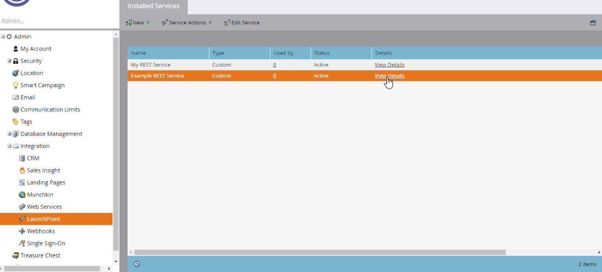
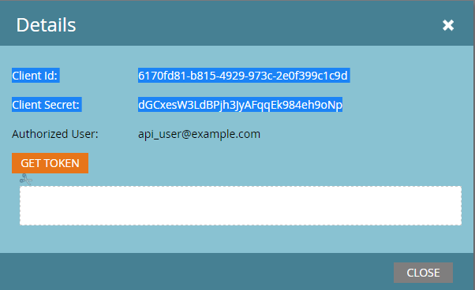

# 認証

Marketo REST APIでは、認証に2 レッグ OAuth 2.0を使用します。 カスタムサービスは、アクセストークンの取得に使用するクライアント IDとクライアントシークレットを提供します。

各カスタムサービスは、APIのみのユーザーに属します。 ユーザーの役割と権限により、特定のアクションを実行するサービスが許可されます。 アクセストークンは1つのカスタムサービスに属し、その有効期限はインスタンス内の他のカスタムサービスのトークンから独立しています。

## アクセストークンの生成

`Client ID`と`Client Secret`を見つけるには、**[!UICONTROL 管理者]** > **[!UICONTROL 統合]** > **[!UICONTROL LaunchPoint]**&#x200B;に移動します。 カスタムサービスを選択し、**[!UICONTROL 詳細を表示]**&#x200B;を選択します。





`Identity URL`を見つけるには、**[!UICONTROL 管理者]** > **[!UICONTROL 統合]** > **[!UICONTROL Web サービス]**&#x200B;に移動します。 URLはREST API セクションに表示されます。

HTTP GETまたはPOST リクエストを使用してアクセストークンを作成します。

```http
GET <Identity URL>/oauth/token?grant_type=client_credentials&client_id=<Client Id>&client_secret=<Client Secret>
```

リクエストが有効な場合は、次のような JSON 応答が返されます。

```json
{
    "access_token": "cdf01657-110d-4155-99a7-f986b2ff13a0:int",
    "token_type": "bearer",
    "expires_in": 3599,
    "scope": "apis@acmeinc.com"
}
```

応答には、次のフィールドが含まれます。

- `access_token`: ターゲットインスタンスで認証するために後続の呼び出しで渡すトークン。
- `token_type`: OAuth認証方法。
- `expires_in`：現在のトークンの残りの有効期間（秒単位）。 新しいアクセストークンの有効期間は3,600秒、つまり1時間です。
- `scope`：認証に使用するカスタムサービスを所有するユーザー。

## アクセストークンの使用

すべてのREST API呼び出しには、HTTP ヘッダーにアクセストークンを含める必要があります。

>[!IMPORTANT]
>
>`access_token` クエリパラメーターを使用した認証のサポートは、2026年8月31日（PT）に削除されます。 プロジェクトでクエリパラメーターを使用してアクセストークンを渡す場合は、できるだけ早く[認証ヘッダー](https://experienceleague.adobe.com/ja/docs/marketo-developer/marketo/rest/authentication#using-an-access-token)を使用するように更新する必要があります。 新しい開発では、`Authorization` ヘッダーのみを使用する必要があります。

### 認証ヘッダーへの切り替え

`access_token` クエリパラメーターを認証ヘッダーに置き換えるには、リクエストがトークンを送信する方法を更新します。

次のcURLの例では、`access_token`値を`-F` フラグ付きのフォームパラメーターとして送信します。

```bash
curl ...  -F access_token=<Access Token> <REST API Endpoint Base URL>/bulk/v1/apiCall.json
```

次の例では、`-H` フラグを使用して、`Authorization: Bearer` HTTP ヘッダーに同じ値を送信します。

```bash
curl ... -H 'Authorization: Bearer <Access Token>' <REST API Endpoint Base URL>/bulk/v1/apiCall.json
```

## ヒントとベストプラクティス

ID応答からのアクセストークンと有効期限を保存します。 トークンの有効期限を管理することで、通常の操作中に予期しない認証エラーが発生するのを防ぐことができます。

REST呼び出しを行う前に、トークンの残りの有効期間を確認します。 トークンの有効期限が切れている場合は、[ID](https://developer.adobe.com/marketo-apis/api/identity/#tag/Identity/operation/identityUsingGET) エンドポイントを呼び出してトークンを更新します。 事前対応的な更新により、期限切れのトークンに起因するエラーを防ぎ、REST呼び出しの遅延をより予測可能にします。これは、エンドユーザー向けアプリケーションにとって重要です。

認証エラーは、次のコードを返します。

- `602`: アクセストークンの有効期限が切れています。
- `601`: アクセストークンが無効です。

クライアントがいずれかのコードを受信した場合は、ID エンドポイントを呼び出してトークンを更新します。

トークンの有効期限が切れる前にID エンドポイントを呼び出すと、応答は同じトークンとその残りの有効期間を返します。

アクセストークンは、ユーザーではなくカスタムサービスに属します。 2つの異なるサービスからの資格情報が同じユーザーに対するID応答を生成する場合、そのアクセストークンと有効期限は独立したままになります。

アプリケーションが複数の資格情報セットを使用する場合は、クライアント IDをキーとして使用して、各トークンを個別に管理します。
