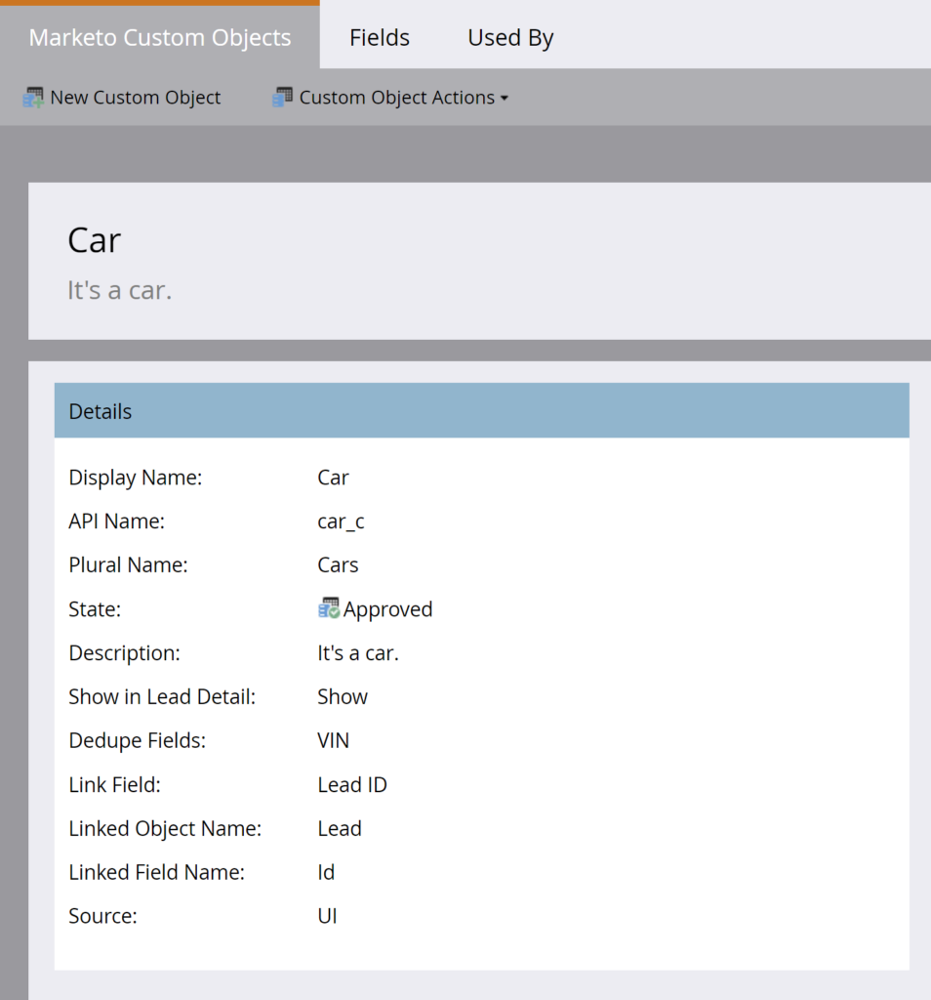

# カスタムオブジェクトの一括抽出

[カスタムオブジェクトの一括抽出エンドポイント参照](https://developer.adobe.com/marketo-apis/api/mapi/#tag/Bulk-Export-Custom-Objects)

REST API のカスタムオブジェクトの一括抽出のセットには、Marketo から大量のカスタムオブジェクトレコードを取得するためのプログラムインターフェイスが用意されています。これは、ETL、データウェアハウス、アーカイブの目的で、Marketo と 1 つ以上の外部システム間で継続的にデータを交換する必要があるユースケースに推奨されるインターフェイスです。

この API では、リードに直接リンクされている第 1 レベルの Marketo カスタムオブジェクトレコードの書き出しをサポートしています。カスタムオブジェクトの名前と、オブジェクトのリンク先となるリードのリストを渡します。リスト内の各リードについて、指定したカスタムオブジェクト名に一致するリンクされたカスタムオブジェクトレコードが、書き出しファイルに行として書き込まれます。カスタムオブジェクトデータは、Marketo UI のリード詳細ページの「[カスタムオブジェクト](https://experienceleague.adobe.com/en/docs/marketo/using/product-docs/administration/marketo-custom-objects/understanding-marketo-custom-objects)」タブに表示されます。

## 権限

カスタムオブジェクトの一括抽出 API では、API ユーザーに、「読み取り専用カスタムオブジェクト」権限または「読み取り／書き込みカスタムオブジェクト」権限のいずれかまたは両方を含むロールを用意する必要があります。

## フィルター

カスタムオブジェクトの抽出では、カスタムオブジェクトにリンクされているリードのリストを指定するために使用されるフィルターオプションがいくつかサポートされています。リスト内のリードが、指定したカスタムオブジェクト名に一致するカスタムオブジェクトレコードにリンクされている場合、このレコードは書き出しファイルに書き込まれます。書き出しジョブごとに指定できるフィルタータイプは 1 つだけです。

| フィルタータイプ | データタイプ | メモ |
|---|---|---|
| `updatedAt` | 日付範囲 | メンバー `startAt` と `endAt` を持つ JSON オブジェクトを受け取ります。`startAt` は透かし（低）を表す日時を受け取り、`endAt` は透かし（高）を表す日時を受け取ります。範囲は 31日以内にする必要があります。 このフィルタータイプのジョブは、日付範囲内で更新されたアクセス可能なすべてのレコードを返します。日時形式は、ミリ秒を含まない ISO-8601 形式にする必要があります。 |
| `staticListName` | 文字列 | 静的リストの名前を受け取ります。このフィルタータイプのジョブは、ジョブの処理開始時点で静的リストのメンバーであるアクセス可能なすべてのレコードを返します。「リストを取得」エンドポイントを使用して静的リスト名を取得します。 |
| `staticListId` | 整数 | 静的リストの ID を受け取ります。このフィルタータイプのジョブは、ジョブの処理開始時点で静的リストのメンバーであるアクセス可能なすべてのレコードを返します。「リストを取得」エンドポイントを使用して静的リスト ID を取得します。 |
| `smartListName`* | 文字列 | スマートリストの名前を受け取ります。このフィルタータイプのジョブは、ジョブの処理開始時点でスマートリストのメンバーであるアクセス可能なすべてのレコードを返します。「スマートリストを取得」エンドポイントを使用してスマートリスト名を取得します。 |
| `smartListId`* | 整数 | スマートリストの ID を受け取ります。このフィルタータイプのジョブは、ジョブの処理開始時点でスマートリストのメンバーであるアクセス可能なすべてのレコードを返します。「スマートリストを取得」エンドポイントを使用してスマートリスト ID を取得します。 |

一部のサブスクリプションでは、フィルタータイプは使用できません。サブスクリプションで使用できない場合は、「リードを書き出しジョブを作成」エンドポイントを呼び出す際にエラーが発生します（「1035、ターゲットサブスクリプションでサポートされていないフィルタータイプ」）。顧客は、Marketo サポートに連絡して、サブスクリプションでこの機能を有効にすることができます。

## オプション

「[カスタムオブジェクトを書き出しジョブを作成](https://developer.adobe.com/marketo-apis/api/mapi/#tag/Bulk-Export-Custom-Objects/operation/createExportCustomObjectsUsingPOST)」エンドポイントには、複数の書式設定オプションが用意されています。これらのオプションにより、ユーザは次の操作を実行できます。

- 書き出されたファイル内に含めるフィールドの指定
- これらのフィールドの列ヘッダーの名前の変更
- 書き出すファイルの形式の指定

| パラメーター | データタイプ | 必須 | メモ |
|---|---|---|---|
| `fields` | 配列[文字列] | はい | 「カスタムオブジェクトを説明」エンドポイントによって返されるカスタムオブジェクト属性名の値を含む文字列の配列。リストされたフィールドは、書き出されたファイルに含まれます。 |
| `columnHeaderNames` | オブジェクト | いいえ | フィールド名と列ヘッダー名のキーと値のペアを含む JSON オブジェクト。キーは、書き出しジョブに含まれるフィールドの名前にする必要があります。値は、このフィールドの書き出された列ヘッダーの名前です。 |
| `format` | 文字列 | いいえ | CSV、TSV、SSV のいずれかを受け入れます。書き出されたファイルは、設定した場合、それぞれコンマ区切り値、タブ区切り値、またはスペース区切り値のファイルとしてレンダリングされます。未設定の場合は、デフォルトで CSV に設定されます。 |

## ジョブの作成

ジョブのパラメーターは、[カスタムオブジェクトを書き出しジョブを作成](https://developer.adobe.com/marketo-apis/api/mapi/#tag/Bulk-Export-Custom-Objects/operation/createExportCustomObjectsUsingPOST)エンドポイントを使用して、書き出しの開始前に定義されます。

必須の `apiName` パスパラメーターは、[カスタムオブジェクトを説明](https://developer.adobe.com/marketo-apis/api/mapi/#tag/Custom-Objects/operation/describeUsingGET_1)エンドポイントによって返されるカスタムオブジェクト名です。これは、書き出す Marketo カスタムオブジェクトを指定します。CRM カスタムオブジェクトは許可されていません。必須の `filter` パラメーターには、カスタムオブジェクトにリンクされているリードのリストが含まれます。これは、静的リストまたはスマートリストを参照できます。必須の `fields` パラメーターには、書き出しファイルに含めるカスタムオブジェクト属性の API 名が含まれます。オプションで、ファイルの `format` と、`columnHeaderNames` を定義できます。

例えば、「カラー」、「メーカー」、「モデル」、「VIN（車両識別番号）」のフィールドを持つ「自動車」という名前のカスタムオブジェクトを作成したとします。リンクフィールドはリード ID で、重複排除フィールドは VIN です。

カスタムオブジェクトの定義



カスタムオブジェクトフィールド


[カスタムオブジェクトを説明](https://developer.adobe.com/marketo-apis/api/mapi/#tag/Custom-Objects/operation/describeUsingGET_1)を呼び出して、応答の `fields` 属性に表示されるカスタムオブジェクト属性をプログラムで調べることができます。

```
GET /rest/v1/customobjects/car_c/describe.json
```

```json
{
    "requestId": "148ef#1793e00f64f",
    "result": [
        {
            "name": "car_c",
            "displayName": "Car",
            "description": "It's a car.",
            "createdAt": "2021-05-05T16:14:41Z",
            "updatedAt": "2021-05-05T16:14:42Z",
            "idField": "marketoGUID",
            "dedupeFields": [
                "vIN"
            ],
            "searchableFields": [
                [
                    "vIN"
                ],
                [
                    "marketoGUID"
                ],
                [
                    "leadID"
                ]
            ],
            "relationships": [
                {
                    "field": "leadID",
                    "type": "child",
                    "relatedTo": {
                        "name": "Lead",
                        "field": "Id"
                    }
                }
            ],
            "fields": [
                {
                    "name": "createdAt",
                    "displayName": "Created At",
                    "dataType": "datetime",
                    "updateable": false,
                    "crmManaged": false
                },
                {
                    "name": "marketoGUID",
                    "displayName": "Marketo GUID",
                    "dataType": "string",
                    "length": 36,
                    "updateable": false,
                    "crmManaged": false
                },
                {
                    "name": "updatedAt",
                    "displayName": "Updated At",
                    "dataType": "datetime",
                    "updateable": false,
                    "crmManaged": false
                },
                {
                    "name": "color",
                    "displayName": "Color",
                    "dataType": "string",
                    "length": 255,
                    "updateable": true,
                    "crmManaged": false
                },
                {
                    "name": "leadID",
                    "displayName": "Lead ID",
                    "dataType": "integer",
                    "updateable": true,
                    "crmManaged": false
                },
                {
                    "name": "make",
                    "displayName": "Make",
                    "dataType": "string",
                    "length": 255,
                    "updateable": true,
                    "crmManaged": false
                },
                {
                    "name": "model",
                    "displayName": "Model",
                    "dataType": "string",
                    "length": 255,
                    "updateable": true,
                    "crmManaged": false
                },
                {
                    "name": "vIN",
                    "displayName": "VIN",
                    "dataType": "string",
                    "length": 255,
                    "updateable": true,
                    "crmManaged": false
                }
            ]
        }
    ],
    "success": true
}
```

複数のカスタムオブジェクトレコードを作成し、[カスタムオブジェクトを同期](https://developer.adobe.com/marketo-apis/api/mapi/#tag/Custom-Objects/operation/syncCustomObjectsUsingPOST)エンドポイントを使用して、それぞれを異なるリードにリンクします。1 つのリードを多数のカスタムオブジェクトレコードにリンクできます。これは「1 対多」の関係と呼ばれます。

```
POST /rest/v1/customobjects/car_c.json
```

```json
{
   "action":"createOrUpdate",
   "input":[
       {
           "leadId": 11,
           "color": "Pearl White",
           "make": "Tesla",
           "model": "Model S",
           "vIN": "5YJSA1E41FF156789"
       },
       {
           "leadId": 12,
           "color": "Midnight Silver Metallic",
           "make": "Tesla",
           "model": "Model X",
           "vIN": "LRWXB2B41FF198765"
       },
       {
           "leadId": 13,
           "color": "Fusion Red",
           "make": "Tesla",
           "model": "Roadster",
           "vIN": "SFGRC3C41FF154321"
       }
    ]
}
```

```json
{
    "requestId": "50d9#1793e066088",
    "result": [
        {
            "seq": 0,
            "marketoGUID": "d911eaa1-fd0b-4a99-9b71-c6a7233c782c",
            "status": "created"
        },
        {
            "seq": 1,
            "marketoGUID": "20d04ffb-51f0-4336-924c-c783b9bb4215",
            "status": "created"
        },
        {
            "seq": 2,
            "marketoGUID": "e7da4331-8e7a-473b-85c8-047638eb6c7f",
            "status": "created"
        }
    ],
    "success": true
}
```

上記の 3 つのリードはそれぞれ、「自動車購入者」という名前の静的リストに属しており、この `id`は 1081 です。これは、[リスト ID によるリードを取得](https://developer.adobe.com/marketo-apis/api/mapi/#tag/Static-Lists/operation/getLeadsByListIdUsingGET_1)エンドポイントを呼び出すと、次のように表示されます。

```
GET /rest/v1/lists/1081/leads.json
```

```json
{
    "requestId": "d023#1793e1e982b",
    "result": [
        {
            "id": 11,
            "firstName": "Hanna",
            "lastName": "Crawford",
            "email": "208161Hanna.Crawford@pookmail.com",
            "updatedAt": "2020-01-16T02:38:22Z",
            "createdAt": "2017-07-27T01:38:42Z"
        },
        {
            "id": 12,
            "firstName": "Bertha",
            "lastName": "Fulton",
            "email": "208160Bertha.Fulton@trashymail.com",
            "updatedAt": "2020-01-16T02:38:22Z",
            "createdAt": "2017-07-27T01:38:42Z"
        },
        {
            "id": 13,
            "firstName": "Faith",
            "lastName": "England",
            "email": "208159Faith.England@dodgit.com",
            "updatedAt": "2020-01-16T02:38:22Z",
            "createdAt": "2017-07-27T01:38:42Z"
        }
    ],
    "success": true
}
```

次に、これらのレコードを取得する書き出しジョブを作成します。[カスタムオブジェクトを書き出しジョブを作成](https://developer.adobe.com/marketo-apis/api/mapi/#tag/Bulk-Export-Custom-Objects/operation/createExportCustomObjectsUsingPOST)エンドポイントを使用して、`fields` パラメーターにカスタムオブジェクト属性を指定し、`filter` パラメーターに静的リスト ID を指定します。

```
POST /bulk/v1/customobjects/car_c/export/create.json
```

```json
{
    "fields": [
        "leadId",
        "color",
        "make",
        "model",
        "vIN"
    ],
    "filter": {
        "staticListId": 1081
    }
}
```

```json
{
    "requestId": "8d2f#1793e289e87",
    "result": [
        {
            "exportId": "f2c03f1d-226f-47c1-a557-357af8c2b32a",
            "format": "CSV",
            "status": "Created",
            "createdAt": "2021-05-05T20:12:01Z"
        }
    ],
    "success": true
}
```

これにより、応答では、ジョブが作成されたことを示すステータスが返されます。ジョブは定義および作成されましたが、まだ開始されていません。これを行うには、`apiName` と、作成ステータス応答の `exportId` を使用して、[カスタムオブジェクトを書き出しジョブをキューに入れる](https://developer.adobe.com/marketo-apis/api/mapi/#tag/Bulk-Export-Custom-Objects/operation/enqueueExportCustomObjectsUsingPOST)エンドポイントを呼び出す必要があります。

```
POST /bulk/v1/customobjects/car_c/export/f2c03f1d-226f-47c1-a557-357af8c2b32a/enqueue.json
```

```json
{
    "requestId": "cfaf#1793e2a0762",
    "result": [
        {
            "exportId": "f2c03f1d-226f-47c1-a557-357af8c2b32a",
            "format": "CSV",
            "status": "Queued",
            "createdAt": "2021-05-05T20:12:01Z",
            "queuedAt": "2021-05-05T20:13:32Z"
        }
    ],
    "success": true
}
```

これは、最初の `status` の &quot;Queued&quot; で応答し、その後、使用可能な書き出しスロットがある場合に &quot;Processing&quot; に設定されます。

## ジョブステータスのポーリング

ステータスを取得できるのは、同じ API ユーザによって作成されたジョブのみです。

これは非同期エンドポイントなので、ジョブを作成した後、その進行状況を判断するためにこのステータスをポーリングする必要があります。[カスタムオブジェクトを書き出しジョブのステータスを取得](https://developer.adobe.com/marketo-apis/api/mapi/#tag/Bulk-Export-Custom-Objects/operation/getExportCustomObjectsStatusUsingGET)エンドポイントを使用してポーリングします。ステータスは 60 秒ごとに 1 回しか更新されないので、これより低いポーリング頻度はお勧めしません。ほとんどの場合、それでも過剰です。ステータスフィールドには、作成済み、待機中、処理中、キャンセル済み、完了、失敗のいずれかが返されます。

```
GET /bulk/v1/customobjects/{apiName}/export/{exportId}/status.json
```

```json
{
    "requestId": "14daa#1793e2cf9de",
    "result": [
        {
            "exportId": "f2c03f1d-226f-47c1-a557-357af8c2b32a",
            "format": "CSV",
            "status": "Processing",
            "createdAt": "2021-05-05T20:12:01Z",
            "queuedAt": "2021-05-05T20:13:32Z",
            "startedAt": "2021-05-05T20:14:15Z"
        }
    ],
    "success": true
}
```

ステータスエンドポイントは、ジョブがまだ処理中なので、ファイルはまだ取得できないことを示す応答を返します。ジョブの `status` が「完了」に変更されると、ダウンロードできます。

```json
{
    "requestId": "14daa#1793e2cf9de",
    "result": [
        {
            "exportId": "f2c03f1d-226f-47c1-a557-357af8c2b32a",
            "format": "CSV",
            "status": "Completed",
            "createdAt": "2021-05-05T20:12:01Z",
            "queuedAt": "2021-05-05T20:13:32Z",
            "startedAt": "2021-05-05T20:14:15Z",
            "finishedAt": "2021-05-05T20:14:28Z",
            "numberOfRecords": 3,
            "fileSize": 182,
            "fileChecksum": "sha256:fac0cabc2352229c12e18b2fde03d1f24178bc71e9e926f520ae8d61bbe98c01"
        }
    ],
    "success": true
}
```

## データの取得

完了したカスタムオブジェクトの書き出しのファイルを取得するには、`apiName` と `exportId` を使用して[カスタムオブジェクトを書き出しファイルを取得](https://developer.adobe.com/marketo-apis/api/mapi/#tag/Bulk-Export-Custom-Objects/operation/getExportCustomObjectsFileUsingGET)エンドポイントを呼び出すだけです。

応答には、ジョブの設定方法に従って書式設定されたファイルが含まれます。エンドポイントは、ファイルのコンテンツを使用して応答します。リクエストされたカスタムオブジェクト属性が空（データが含まれていない）の場合、書き出しファイル内の対応するフィールドに `null` が配置されます。

```
GET /bulk/v1/customobjects/car_c/export/f2c03f1d-226f-47c1-a557-357af8c2b32a/file.json
```

```csv
leadId,color,make,model,vIN
11,Pearl White,Tesla,Model S,5YJSA1E41FF156789
12,Midnight Silver Metallic,Tesla,Model X,LRWXB2B41FF198765
13,Fusion Red,Tesla,Roadster,SFGRC3C41FF154321
```

抽出されたデータの部分的で再開にわかりやすい取得をサポートするのに、ファイルエンドポイントは、オプションで `bytes` タイプの HTTP ヘッダー `Range` をサポートします。ヘッダーが設定されていない場合は、コンテンツ全体が返されます。Marketo 一括抽出で範囲ヘッダーを使用する方法について詳しくは、[こちら](bulk-extract.md)を参照してください。

## ジョブのキャンセル

ジョブが誤って設定されたり、不要になったりした場合は、[カスタムオブジェクトを書き出しジョブをキャンセル](https://developer.adobe.com/marketo-apis/api/mapi/#tag/Bulk-Export-Custom-Objects/operation/getExportCustomObjectsFileUsingPOST)エンドポイントを使用して簡単にキャンセルできます。これは、ジョブがキャンセルされたことを示す `status` で応答します。

```
POST /bulk/v1/customobjects/car_c/export/f2c03f1d-226f-47c1-a557-357af8c2b32a/cancel.json
```

```json
{
    "requestId": "e5f9#179391286a7",
    "result": [
        {
            "exportId": "4a8cdd80-0d16-4dd6-9923-6ec97e30e91b",
            "format": "CSV",
            "status": "Cancelled",
            "createdAt": "2021-05-04T20:24:33Z"
        }
    ],
    "success": true
}
```
