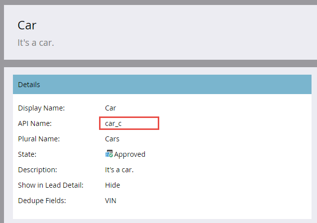

# カスタムオブジェクトの一括読み込み

[一括カスタムオブジェクト読み込みエンドポイント参照](https://developer.adobe.com/marketo-apis/api/mapi#tag/Bulk-Import-Custom-Objects)

Bulk APIを使用して、多数のカスタムオブジェクトレコードを非同期でインポートします。 10 MB未満のコンマ、タブ、またはセミコロンで区切られたフラットファイルでレコードを指定します。 ファイルが大きい場合、APIはHTTP 413 ステータスコードを返します。

ファイルの内容は、カスタムオブジェクト定義によって異なります。 最初の行はヘッダーである必要があり、すべてのヘッダーフィールドはAPI名と一致する必要があります。 残りの各行には、1つのレコードが含まれます。

カスタムオブジェクトの一括読み込みは、「挿入または更新」レコード操作のみをサポートします。

## 処理制限

各一括読み込みリクエストは、ジョブとしてFIFO （先入れ先出し）キューに追加されます。 次の制限が適用されます。

- 最大2つのジョブを同時に処理できます。
- 処理中の2つのジョブを含め、最大10個のジョブをキューに入れることができます。

10 ジョブの最大値を超えると、APIは`1016, Too many imports` エラーを返します。

## カスタムオブジェクトの例

Bulk APIを使用する前に、Marketo管理UIを使用して[&#x200B; カスタムオブジェクトを作成します](https://experienceleague.adobe.com/ja/docs/marketo/using/product-docs/administration/marketo-custom-objects/create-marketo-custom-objects)。

この例では、`Color`、`Make`、`Model`、`VIN`のフィールドを持つ`Car` カスタムオブジェクトを使用しています。 VIN フィールドは重複排除に使用されます。 管理UI画面では、一括API エンドポイントに必要なAPI名がハイライト表示されます。



管理 UI に表示されるカスタムオブジェクトフィールドを以下に示します。


### API 名

API名をプログラムで取得するには、カスタムオブジェクト API名を[&#x200B; カスタムオブジェクトの記述](#describe) エンドポイントに渡します。

```text
/rest/v1/customobjects/{apiName}/describe.json
```

```json
{
    "requestId": "46ff#15a686e66de",
    "result": [
        {
            "name": "car_c",
            "displayName": "Car",
            "description": "It is a car.",
            "createdAt": "2017-02-22T19:55:51Z",
            "updatedAt": "2017-02-22T19:55:51Z",
            "idField": "marketoGUID",
            "dedupeFields": [
                "vin"
            ],
            "searchableFields": [
                [
                    "vin"
                ],
                [
                    "marketoGUID"
                ]
            ],
            "fields": [
                {
                    "name": "createdAt",
                    "displayName": "Created At",
                    "dataType": "datetime",
                    "updateable": false
                },
                {
                    "name": "marketoGUID",
                    "displayName": "Marketo GUID",
                    "dataType": "string",
                    "length": 36,
                    "updateable": false
                },
                {
                    "name": "updatedAt",
                    "displayName": "Updated At",
                    "dataType": "datetime",
                    "updateable": false
                },
                {
                    "name": "color",
                    "displayName": "Color",
                    "dataType": "string",
                    "length": 255,
                    "updateable": true
                },
                {
                    "name": "make",
                    "displayName": "Make",
                    "dataType": "string",
                    "length": 255,
                    "updateable": true
                },
                {
                    "name": "model",
                    "displayName": "Model",
                    "dataType": "string",
                    "length": 255,
                    "updateable": true
                },
                {
                    "name": "vin",
                    "displayName": "VIN",
                    "dataType": "string",
                    "length": 255,
                    "updateable": true
                }
            ]
        }
    ],
    "success": true
}
```

### ファイルの読み込み

次のCSV ファイルには、3つの`Car` カスタムオブジェクトレコードが含まれています。

```text
color,make,model,vin
red,bmw,2002,WBA4R7C55HK895912
yellow,bmw,320i,WBA4R7C30HK896061
blue,bmw,325i,WBS3U9C52HP970604
```

最初の行はヘッダーです。 2 ～ 4行目には、カスタムオブジェクトデータレコードが含まれています。

## ジョブの作成

一括読み込みジョブを作成するには、[&#x200B; カスタムオブジェクトの読み込み](https://developer.adobe.com/marketo-apis/api/mapi#tag/Identity/operation/identityUsingPOST) エンドポイントへのパスにカスタムオブジェクト API名を含めます。 次のパラメーターを含めます。

- `file`: インポートファイルの名前。
- `format`: ファイル区切り文字の形式（`csv`、`tsv`、または`ssv`）。

```http
POST /bulk/v1/customobjects/{apiName}/import.json?format=csv
```

```text
Transfer-Encoding: chunked
Content-Type: multipart/form-data; boundary=----WebKitFormBoundaryXjWP6BP8Ciq6bPeo
Content-Length: 290
Host: <munchkinId>.mktorest.com
```

```text
------WebKitFormBoundaryXjWP6BP8Ciq6bPeo
Content-Disposition: form-data; name="file"; filename="custom_object_import.csv"
Content-Type: text/csv

color,make,model,vin
red,bmw,2002,WBA4R7C55HK895912
yellow,bmw,320i,WBA4R7C30HK896061
blue,bmw,325i,WBS3U9C52HP970604
------WebKitFormBoundaryXjWP6BP8Ciq6bPeo--
```

```json
{
    "requestId": "c015#15a68a23418",
    "result": [
        {
            "batchId": 1013,
            "status": "Queued",
            "objectApiName": "car_c"
        }
    ],
    "success": true
}
```

この例では、`csv`形式を指定し、読み込みファイル `custom_object_import.csv`に名前を付けます。

呼び出しは非同期であるため、応答には、同期カスタムオブジェクト エンドポイントによって返される個々の成功と失敗の代わりに`batchId`が含まれます。 `status`は、`Queued`、`Importing`、または`Failed`にすることができます。

`batchId`を保持して、読み込みステータスを確認し、完了後にエラーまたは警告を取得します。 `batchId` は 7 日間有効です。

次のコマンドライン cURL リクエストは、ジョブの例を送信します。

```bash
curl -X POST -i -F format='csv' -F file='@custom_object_import.csv' -F access_token='<Access Token>' <REST API Endpoint URL>/bulk/v1/customobjects/car_c/import.json
```

この例では、`custom_object_import.csv` ファイルに次のデータが含まれています。

```text
color,make,model,vin
red,bmw,2002,WBA4R7C55HK895912
yellow,bmw,320i,WBA4R7C30HK896061
blue,bmw,325i,WBS3U9C52HP970604
```

## ジョブステータスのポーリング

インポートジョブを作成したら、5～30秒ごとにポーリングします。 カスタムオブジェクト API名と`batchId`をパスの[&#x200B; カスタムオブジェクトのステータスを取り込む](https://developer.adobe.com/marketo-apis/api/mapi#tag/Bulk-Import-Custom-Objects/operation/getImportCustomObjectStatusUsingGET) エンドポイントに渡します。

```http
GET /bulk/v1/customobjects/{apiName}/import/{batchId}/status.json
```

```json
{
    "requestId": "2a5#15a68dd9be1",
    "result": [
        {
            "batchId": 1013,
            "operation": "import",
            "status": "Complete",
            "objectApiName": "car_c",
            "numOfObjectsProcessed": 3,
            "numOfRowsFailed": 0,
            "numOfRowsWithWarning": 0,
            "importTime": "2 second(s)",
            "message": "Import succeeded, 3 records imported (3 members)"
        }
    ],
    "success": true
}
```

この応答は、完了した読み込みを示しています。 `status`は、`Complete`、`Queued`、`Importing`または`Failed`にすることができます。

ジョブが完了すると、応答には、処理された行、失敗した行、および警告を伴って処理された行の数が一覧表示されます。 `message`属性は、追加のジョブ情報を提供できます。

## 失敗

[&#x200B; カスタムオブジェクトステータスの取得](https://developer.adobe.com/marketo-apis/api/mapi#tag/Bulk-Import-Custom-Objects/operation/getImportCustomObjectStatusUsingGET)応答の`numOfRowsFailed`属性は、失敗した行数を示します。 0より大きい値は、エラーが発生したことを意味します。

カスタムオブジェクト API名と`batchId`をパスの[&#x200B; カスタムオブジェクトのインポート失敗](https://developer.adobe.com/marketo-apis/api/mapi#tag/Bulk-Import-Custom-Objects/operation/getImportCustomObjectFailuresUsingGET) エンドポイントに渡します。 エンドポイントは、エラーの詳細を含むファイルを返します。 エラーファイルが存在しない場合は、HTTP 404 ステータスコードが返されます。

エラーを示すには、`vin`を` vin`に変更し、コンマと`vin`の間にスペースを追加して、ヘッダーを変更します。

```text
color,make,model, vin
```

ファイルを再インポートすると、ステータス応答に`numRowsFailed`: 3と表示され、3回のエラーが発生したことを示します。

```http
GET /bulk/v1/customobjects/car_c/import/{batchId}/status.json
```

```json
{
    "requestId": "12260#15a68f491ed",
    "result": [
        {
            "batchId": 1016,
            "operation": "import",
            "status": "Complete",
            "objectApiName": "car_c",
            "numOfObjectsProcessed": 0,
            "numOfRowsFailed": 3,
            "numOfRowsWithWarning": 0,
            "importTime": "1 second(s)",
            "message": "Import completed with errors, 0 records imported (0 members), 3 failed"
        }
    ],
    "success": true
}
```

詳細については、カスタムオブジェクトのインポート失敗の取得エンドポイントを呼び出します。

```http
GET /bulk/v1/customobjects/car_c/import/{batchId}/failures.json
```

```text
color,make,model, vin,Import Failure Reason
red,bmw,2002,WBA4R7C55HK895912,missing.dedupe.fields
yellow,bmw,320i,WBA4R7C30HK896061,missing.dedupe.fields
blue,bmw,325i,WBS3U9C52HP970604,missing.dedupe.fields
```

応答は、重複排除フィールド `vin`が見つからないことを示しています。

## 警告

カスタムオブジェクトステータスの取得応答の`numOfRowsWithWarning`属性は、警告を含む行数を示します。 0より大きい値は、警告が発生したことを意味します。

カスタムオブジェクト API名と`batchId`をパスの[&#x200B; カスタムオブジェクトのインポート警告を取得](https://developer.adobe.com/marketo-apis/api/mapi#tag/Bulk-Import-Custom-Objects/operation/getImportCustomObjectWarningsUsingGET) エンドポイントに渡します。 エンドポイントは、警告の詳細を含むファイルを返します。 警告ファイルが存在しない場合は、HTTP 404 ステータスコードが返されます。

```http
GET /bulk/v1/customobjects/car_c/import/{batchId}/warnings.json
```
