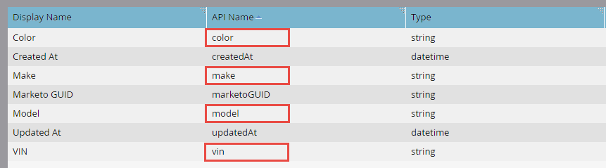

# カスタムオブジェクトの一括読み込み

[カスタムオブジェクト読み込みの一括エンドポイント参照](https://developer.adobe.com/marketo-apis/api/mapi/#tag/Bulk-Import-Custom-Objects)

読み込むカスタムオブジェクトレコードが多数ある場合は、Bulk API を使用して非同期で読み込むことをお勧めします。 これは、区切られたレコード（コンマ、タブ、セミコロン）を含んだフラットファイルをインポートすることで行われます。 ファイルは、サイズが 10 MB 未満の場合、任意の数のレコードを含めることができます（それ以外の場合は、HTTP 413 ステータスコードが返されます）。 ファイルの内容は、カスタムオブジェクト定義によって異なります。 最初の行には常に、各行の値をマッピングするフィールドをリストするヘッダーが含まれます。 ヘッダーのすべてのフィールド名は、（以下で説明するように） API 名と一致する必要があります。 残りの行には、読み込むデータが含まれ、行ごとに 1 つのレコードになります。 レコード操作は、「挿入または更新」のみです。

## 処理制限

制限内で複数の一括読み込みリクエストを送信できます。 各リクエストは、処理される FIFO キューにジョブとして追加されます。 最大 2 つのジョブが同時に処理されます。 任意の時点でキューに入れられるジョブの数は最大 10 個です（現在処理中の 2 個を含む）。 ジョブの最大数 10 を超えると、「1016, Too many imports」エラーが返されます。

## カスタムオブジェクトの例

一括 API を使用する前に、まずMarketo管理 UI を使用して以下を行う必要があります [カスタムオブジェクトの作成](https://experienceleague.adobe.com/en/docs/marketo/using/product-docs/administration/marketo-custom-objects/create-marketo-custom-objects). 例えば、「Color」、「Make」、「Model」、「VIN」の各フィールドを持つ「Car」カスタムオブジェクトを作成したとします。 カスタムオブジェクトを表示する管理 UI 画面を以下に示します。 重複排除に VIN フィールドを使用したことがわかります。 API 名は、API 関連の一括エンドポイントを呼び出す際に使用する必要があるので、ハイライト表示されています。


管理 UI に表示されるカスタムオブジェクトフィールドを次に示します。



### API 名

カスタムオブジェクト API 名をに渡すことで、プログラムで API 名を取得できます [カスタムオブジェクトの説明](#describe) エンドポイント。

```
/rest/v1/customobjects/{apiName}/describe.json
```

```json
{
    "requestId": "46ff#15a686e66de",
    "result": [
        {
            "name": "car_c",
            "displayName": "Car",
            "description": "It's a car.",
            "createdAt": "2017-02-22T19:55:51Z",
            "updatedAt": "2017-02-22T19:55:51Z",
            "idField": "marketoGUID",
            "dedupeFields": [
                "vin"
            ],
            "searchableFields": [
                [
                    "vin"
                ],
                [
                    "marketoGUID"
                ]
            ],
            "fields": [
                {
                    "name": "createdAt",
                    "displayName": "Created At",
                    "dataType": "datetime",
                    "updateable": false
                },
                {
                    "name": "marketoGUID",
                    "displayName": "Marketo GUID",
                    "dataType": "string",
                    "length": 36,
                    "updateable": false
                },
                {
                    "name": "updatedAt",
                    "displayName": "Updated At",
                    "dataType": "datetime",
                    "updateable": false
                },
                {
                    "name": "color",
                    "displayName": "Color",
                    "dataType": "string",
                    "length": 255,
                    "updateable": true
                },
                {
                    "name": "make",
                    "displayName": "Make",
                    "dataType": "string",
                    "length": 255,
                    "updateable": true
                },
                {
                    "name": "model",
                    "displayName": "Model",
                    "dataType": "string",
                    "length": 255,
                    "updateable": true
                },
                {
                    "name": "vin",
                    "displayName": "VIN",
                    "dataType": "string",
                    "length": 255,
                    "updateable": true
                }
            ]
        }
    ],
    "success": true
}
```

### ファイルのインポート

次に、3 つの「Car」カスタムオブジェクトレコードを読み込むとします。 コンマ区切り形式（CSV）を使用した場合、ファイルは次のようになります。

```
color,make,model,vin
red,bmw,2002,WBA4R7C55HK895912
yellow,bmw,320i,WBA4R7C30HK896061
blue,bmw,325i,WBS3U9C52HP970604
```

行 1 はヘッダー、行 2～4 はカスタムオブジェクトデータレコードです。

## ジョブの作成

一括読み込みリクエストを行うには、へのパスにカスタムオブジェクトの API 名を含める必要があります。 [カスタムオブジェクトを読み込み](https://developer.adobe.com/marketo-apis/api/mapi/#tag/Identity/operation/identityUsingPOST) エンドポイント。 また、読み込みファイルの名前を参照する「file」パラメーターと、読み込みファイルの区切り方法を指定する「format」パラメーター（「csv」、「tsv」、または「ssv」）を含める必要があります。

```
POST /bulk/v1/customobjects/{apiName}/import.json?format=csv
```

```
Transfer-Encoding: chunked
Content-Type: multipart/form-data; boundary=----WebKitFormBoundaryXjWP6BP8Ciq6bPeo
Content-Length: 290
Host: <munchkinId>.mktorest.com
```

```
------WebKitFormBoundaryXjWP6BP8Ciq6bPeo
Content-Disposition: form-data; name="file"; filename="custom_object_import.csv"
Content-Type: text/csv

color,make,model,vin
red,bmw,2002,WBA4R7C55HK895912
yellow,bmw,320i,WBA4R7C30HK896061
blue,bmw,325i,WBS3U9C52HP970604
------WebKitFormBoundaryXjWP6BP8Ciq6bPeo--
```

```json
{
    "requestId": "c015#15a68a23418",
    "result": [
        {
            "batchId": 1013,
            "status": "Queued",
            "objectApiName": "car_c"
        }
    ],
    "success": true
}
```

この例では、「csv」形式を指定し、読み込みファイルの名前を「custom_object_import.csv」にしました。

呼び出しに対する応答では、カスタムオブジェクトを同期エンドポイントから戻るような成功または失敗のリストは表示されません。 代わりに、が表示されます。 `batchId`. これは、の呼び出しが非同期で、が `status` （「待機中」、「インポート」、または「失敗」）。 インポートジョブのステータスを取得したり、完了時に失敗や警告を取得したりできるように、batchId を保持する必要があります。 batchId は 7 日間有効です。

一括読み込みリクエストを簡単にレプリケートするには、コマンドラインから curl を使用します。

```
curl -X POST -i -F format='csv' -F file='@custom_object_import.csv' -F access_token='<Access Token>' <REST API Endpoint URL>/bulk/v1/customobjects/car_c/import.json
```

読み込みファイル「custom_object_import.csv」には、次のファイルが含まれます。

```
color,make,model,vin
red,bmw,2002,WBA4R7C55HK895912
yellow,bmw,320i,WBA4R7C30HK896061
blue,bmw,325i,WBS3U9C52HP970604
```

## ジョブステータスのポーリング

インポートジョブを作成したら、そのステータスを問い合わせる必要があります。 インポートジョブは 5～30 秒ごとにポーリングすることをお勧めします。 これをおこなうには、カスタムオブジェクトの API 名と `batchId` へのパス内 [読み込みのカスタムオブジェクトステータスを取得](https://developer.adobe.com/marketo-apis/api/mapi/#tag/Bulk-Import-Custom-Objects/operation/getImportCustomObjectStatusUsingGET) エンドポイント。

```
GET /bulk/v1/customobjects/{apiName}/import/{batchId}/status.json
```

```json
{
    "requestId": "2a5#15a68dd9be1",
    "result": [
        {
            "batchId": 1013,
            "operation": "import",
            "status": "Complete",
            "objectApiName": "car_c",
            "numOfObjectsProcessed": 3,
            "numOfRowsFailed": 0,
            "numOfRowsWithWarning": 0,
            "importTime": "2 second(s)",
            "message": "Import succeeded, 3 records imported (3 members)"
        }
    ],
    "success": true
}
```

この応答では、読み込みが完了したが、 `status` Complete、Queued、Importing、Failed のいずれかです。 ジョブが完了すると、処理された行数、失敗した行数、警告された行数のリストが表示されます。 また、メッセージ属性は、追加のジョブ情報を探すのにも適しています。

## 失敗

失敗は、によって示されます `numOfRowsFailed` 属性： [読み込みのカスタムオブジェクトステータスを取得](https://developer.adobe.com/marketo-apis/api/mapi/#tag/Bulk-Import-Custom-Objects/operation/getImportCustomObjectStatusUsingGET) 応答。 numOfRowsFailed が 0 より大きい場合、その値は発生したエラーの数を示します。 通話 [カスタムオブジェクトの読み込みの取得に失敗しました](https://developer.adobe.com/marketo-apis/api/mapi/#tag/Bulk-Import-Custom-Objects/operation/getImportCustomObjectFailuresUsingGET) エラーの詳細を含むファイルを取得するエンドポイント。 ここでも、カスタムオブジェクト API 名を渡し、 `batchId` をパスに追加します。 失敗ファイルが存在しない場合は、HTTP 404 ステータスコードが返されます。

例を続けて、ヘッダーを変更して「vin」を「vin」に変更する（コンマと「vin」の間にスペースを追加する）ことで、失敗を強制できます。

```
color,make,model, vin
```

再インポートしてステータスを確認すると、次の応答が表示されます `numRowsFailed`: 3. これは 3 つのエラーを示します。

```
GET /bulk/v1/customobjects/car_c/import/{batchId}/status.json
```

```json
{
    "requestId": "12260#15a68f491ed",
    "result": [
        {
            "batchId": 1016,
            "operation": "import",
            "status": "Complete",
            "objectApiName": "car_c",
            "numOfObjectsProcessed": 0,
            "numOfRowsFailed": 3,
            "numOfRowsWithWarning": 0,
            "importTime": "1 second(s)",
            "message": "Import completed with errors, 0 records imported (0 members), 3 failed"
        }
    ],
    "success": true
}
```

次に、Get Import Custom Object Failures エンドポイントを呼び出して、追加のエラーの詳細を取得します。

```
GET /bulk/v1/customobjects/car_c/import/{batchId}/failures.json
```

```
color,make,model, vin,Import Failure Reason
red,bmw,2002,WBA4R7C55HK895912,missing.dedupe.fields
yellow,bmw,320i,WBA4R7C30HK896061,missing.dedupe.fields
blue,bmw,325i,WBS3U9C52HP970604,missing.dedupe.fields
```

重複排除フィールドがないことがわかります `vin`.

## 警告

警告は、 `numOfRowsWithWarning` 「カスタムオブジェクトステータスをインポートを取得」応答の属性。 numOfRowsWithWarning が 0 より大きい場合、その値は発生した警告の数を示します。 通話 [カスタムオブジェクトの読み込みの警告の取得](https://developer.adobe.com/marketo-apis/api/mapi/#tag/Bulk-Import-Custom-Objects/operation/getImportCustomObjectWarningsUsingGET) エンドポイントを使用して、警告の詳細を含むファイルを取得します。 ここでも、カスタムオブジェクト API 名を渡し、 `batchId` をパスに追加します。 警告ファイルが存在しない場合は、HTTP 404 ステータスコードが返されます。

```
GET /bulk/v1/customobjects/car_c/import/{batchId}/warnings.json
```
