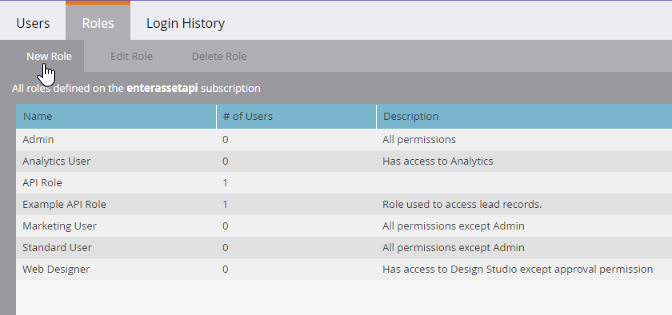

# カスタムサービス

カスタムサービスは、Marketoで認証し、Marketo [ID サービス ](https://developer.adobe.com/marketo-apis/api/identity/#tag/Identity/operation/identityUsingGET)からアクセストークンを取得するために使用される資格情報を提供します。 各カスタムサービスは、1つのAPIのみのユーザーにスコープが設定され、そのユーザーから権限が取得されます。

## ロール

カスタムサービスを作成する前に、関連するAPIのみのユーザーに割り当てる役割を作成します。 **[!UICONTROL 管理者]** > **[!UICONTROL ユーザーと役割]** > **[!UICONTROL 役割]**&#x200B;に移動します。

役割には、特定の機能へのアクセスを許可または制限する個別の権限が含まれます。 ワークスペースとパーティションが有効になっているサブスクリプションでは、ワークスペースごとに権限が割り当てられます。 ユーザーは、ユーザーがその権限を持つワークスペースでのみ、許可されたアクションを実行できます。

役割を作成するには、**[!UICONTROL 新しい役割]**&#x200B;を選択します。

役割にわかりやすい名前を付けます。 APIのみのユーザーには、標準のユーザー権限とは別の特定の権限セットがあります。 API権限は、「Access API」ツリーの下にある独自の階層に表示されます。

### ロール権限

API ユーザーには、「Access API」グループの権限のみが適用されます。 すべての管理者権限を割り当てても、ユーザーにAPI権限が付与されるわけではありません。

役割を作成する場合は、アプリケーションが実行する必要があるアクションを特定します。 これらのアクションに必要な最小権限のみを割り当てます。 不必要な権限を設定すると、サブスクリプション内で不要なアクションを実行する統合機能を利用できるようになります。

[権限ツール ](endpoint-reference.md)を使用して、権限の最小セットを決定します。 詳しくは、[権限](#permission_list)の完全なリストを参照してください。

## ユーザ

役割を作成したら、「APIのみ」ユーザーを作成します。 他のユーザーはAPIのみのユーザーを管理し、APIのみのユーザーはMarketoにログインできません。 次のことが可能です。

- カスタムサービスを作成
- これらのサービスの権限をスコープ
- REST API にアクセス

>[!MORELIKETHIS]
>
>APIのみのユーザーを作成するには、**[!UICONTROL 管理者]** > **[!UICONTROL ユーザーと役割]** > **[!UICONTROL ユーザー]** メニューに移動し、**[!UICONTROL 新しいユーザーを招待]**&#x200B;を選択します。

アカウントを使用するサービスとアプリケーションに基づいて、わかりやすい名前とメールアドレスをユーザーに付与します。 メールアドレスは有効である必要はありません。 必須フィールドに入力し、「**[!UICONTROL API Only]**」チェックボックスを選択して、いずれかのAPI ロールをユーザーに割り当てます。 このアクションは、役割の権限セットをユーザーに割り当てます。

「**[!UICONTROL 送信]**」を選択して、APIのみのユーザーを作成します。

新しいアプリケーションに資格情報をプロビジョニングする場合は、別の統合で同じ権限セットを使用している場合でも、サービス用に別のユーザーを作成することを検討してください。 API呼び出しの使用状況の統計とエラーは、ユーザーごとに追跡されます。

各アプリケーションのユーザーは、特定のアプリケーションの使用状況と問題を分離するのに役立ちます。 この分離は、統合が毎日のAPI呼び出し制限に達したり、API エラーを生成したりする場合に役立ちます。

## カスタムサービス

カスタムサービスは、Marketo インスタンスでの認証に必要なクライアント IDとクライアントシークレットを提供します。 サービスをプロビジョニングするには、**[!UICONTROL Admin]** > **[!UICONTROL Integrations]** > **[!UICONTROL LaunchPoint]**&#x200B;に移動し、**[!UICONTROL New Service]**&#x200B;を選択します。

サービスにわかりやすい名前を付けます。 「サービス」リストから、「カスタム」を選択します。 詳細な説明を入力し、「APIのみユーザー」リストから適切なユーザーを選択し、**[!UICONTROL 作成]**&#x200B;を選択します。

サービスは、「詳細を表示」オプションを使用してLaunchPoint サービスのリストに表示されます。 「詳細を表示」を選択して、クライアント ID、クライアントシークレット、所有ユーザー、トークンを取得オプションにアクセスします。

短期間のテストには、Get Tokenを使用します。 トークンの有効期間は、[ID サービス ](https://developer.adobe.com/marketo-apis/api/identity/#tag/Identity/operation/identityUsingGET)から取得したトークンと同じで、作成後3,600秒間有効です。

## ワークスペースとパーティション

ワークスペースとパーティションを使用したサブスクリプションでは、ワークスペース内のユーザーのロール権限によって、レコードとアセットへのアクセスが決定されます。 各ワークスペースは1つ以上のパーティションにアクセスでき、各リードは1つのパーティションに属しています。

API専用ユーザーがワークスペース内のリードレコードを読み取りまたは書き込むことができる場合、ユーザーはそのワークスペースで使用可能なパーティション内のすべてのレコードにアクセスできます。

Assetsはワークスペースに属します。 ユーザーは、アセットのワークスペースで必要な権限を持つ役割を持っている場合、アセットの読み取りまたは書き込みができます。

## 権限リスト

次の表に、APIのみのユーザーが使用できる権限と、各権限が付与するアクセス権を示します。

| ロール権限 | アクセス権の付与対象… |
| --- | --- |
| アセットを承認 | アセットを承認 |
| キャンペーンを実行 | キャンペーンをリクエストまたはスケジュール |
| 読み取り専用アクティビティ | リードアクティビティを取得 |
| 読み取り専用アクティビティメタデータ | リードアクティビティメタデータを取得 |
| 読み取り専用アセット | アセットの詳細を取得 |
| 読み取り専用キャンペーン | キャンペーンの詳細を取得 |
| 読み取り専用会社 | 会社の詳細を取得 |
| 読み取り専用カスタムオブジェクト | カスタムオブジェクトの詳細を取得 |
| 読み取り専用リード | リードの詳細を取得 |
| 読み取り専用名前付きアカウント | 重点顧客の詳細を取得 |
| 読み取り専用名前付きアカウントリスト | 重点顧客リストの詳細を取得 |
| 読み取り専用商談 | 商談の詳細を取得 |
| 読み取り専用セールス担当者 | セールス担当者の詳細を取得 |
| 読み取り／書き込みアクティビティ | リードアクティビティを取得および作成 |
| 読み取り／書き込みアクティビティメタデータ | リードアクティビティメタデータを取得および作成 |
| 読み取り／書き込みアセット | アセットを取得、作成、更新 |
| 読み取り／書き込みキャンペーン | キャンペーンを取得、作成、更新 |
| 読み取り／書き込み会社 | 会社を取得、作成、更新 |
| 読み取り／書き込みカスタムオブジェクト | カスタムオブジェクトを取得、作成、更新 |
| 読み取り／書き込みリード | リードの詳細を取得、作成、更新 |
| 読み取り／書き込み名前付きアカウント | 重点顧客を取得、作成、更新 |
| 読み取り／書き込み名前付きアカウントリスト | 重点顧客リストを取得、作成、更新 |
| 読み取り／書き込み商談 | 商談を取得、作成、更新 |
| 読み取り／書き込みセールス担当者 | セールス担当者を取得、作成、更新 |
