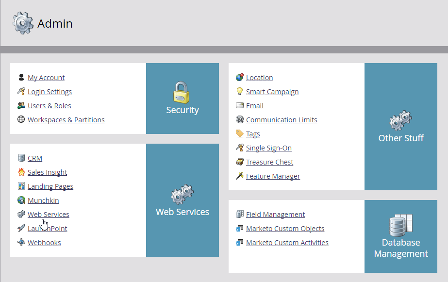

# REST API

Marketoは、システムの機能の多くをリモートで実行できる REST API を公開しています。 プログラムの作成からリードの一括読み込みまで、Marketo インスタンスの詳細な制御を可能にするオプションが多数あります。

これらの API は、通常、[ リードデータベース ](https://developer.adobe.com/marketo-apis/api/mapi/) と [ アセット ](https://developer.adobe.com/marketo-apis/api/asset/) の 2 つの大きなカテゴリに分類されます。 Lead Database API を使用すると、Marketoの人物レコードおよび関連するオブジェクトタイプ（商談や会社など）の取得とやり取りをおこなうことができます。 Asset API を使用すると、マーケティング用販促物やワークフロー関連のレコードを操作できます。

- **毎日の割り当て量：** 購読には、1 日あたり 50,000 回の API 呼び出しが割り当てられます（毎日午前 0 時（CST）にリセットされます）。 アカウントマネージャーを通じて、1 日の割り当て量を増やすことができます。
- **レート制限：インスタンスあたりの** API アクセスは、20 秒あたり 100 回の呼び出しに制限されています。
- **同時実行制限：**  最大 10 回の同時 API 呼び出し。

標準呼び出しのサイズは、URI の長さが 8 KB、本文のサイズが 1 MB に制限されていますが、バルク API の本文は 10 MB にすることができます。 呼び出しでエラーが発生した場合、API は通常、ステータスコード 200 を返しますが、JSON 応答には、値が `false` の「success」メンバーと、「errors」メンバーにエラーの配列が含まれます。 エラーの詳細は [ こちら ](error-codes.md)。

## はじめに

次の手順では、Marketo インスタンスでの管理者権限が必要です。

Marketoへの最初の呼び出しでは、リードレコードを取得します。 Marketoの使用を開始するには、インスタンスに対して認証済み呼び出しを行うための API 資格情報を取得する必要があります。 インスタンスにログインし、**[!UICONTROL 管理者]**/**[!UICONTROL ユーザーと役割]** に移動します。


「**[!UICONTROL 役割]**」タブをクリックし、「新しい役割」をクリックして、「読み取り専用リード」（または「読み取り専用ユーザー」）以上の権限を Access API グループの役割に割り当てます。 必ずわかりやすい名前を付け、「作成 **[!UICONTROL をクリックし]** す。


次に、「[!UICONTROL  ユーザー ]」タブに戻り、「**[!UICONTROL 新規ユーザーを招待]**」をクリックします。 ユーザーに API ユーザーであることを示すわかりやすい名前とメールアドレスを指定し、「**[!UICONTROL 次へ]**」をクリックします。


次に、「[!UICONTROL API のみ ]」オプションをオンにし、作成した API の役割をユーザーに付与し、「**[!UICONTROL 次へ]**」をクリックします。


ユーザー作成プロセスを完了するには、「**[!UICONTROL 送信]**」をクリックします。


次に、[!UICONTROL  管理者 ] メニューに移動し、**[!UICONTROL LaunchPoint]** をクリックします。


**[!UICONTROL 新規]** メニューをクリックし、「**[!UICONTROL 新しいサービス]**」を選択します。 **[!UICONTROL サービスにわかりやすい名前を付け、「サービス]**」ドロップダウンメニューから [!UICONTROL  カスタム ] を選択します。 説明を入力し、「[!UICONTROL API のみのユーザー ]」ドロップダウンメニューから新しいユーザーを選択し、「**[!UICONTROL 作成]**」をクリックします。


新しいサービスの「**[!UICONTROL 詳細を表示]**」をクリックして、クライアント ID とクライアント秘密鍵にアクセスします。 現時点では、「**[!UICONTROL トークンを取得]**」ボタンをクリックして、1 時間有効なアクセストークンを生成できます。 現時点では、トークンをメモに保存します。


次に、**[!UICONTROL 管理者]** メニューに移動し、次に **[!UICONTROL web サービス]** に移動します。



REST API ボックスで [!UICONTROL  エンドポイント ] を見つけて、今はメモに保存します。


新しいブラウザータブを開き、適切な情報を使用して [ フィルタータイプ別にリードを取得 ](https://developer.adobe.com/marketo-apis/api/mapi/#tag/Leads/operation/getLeadsByFilterUsingGET) を呼び出し、次の情報を入力します。

```
<Your Endpoint URL>/rest/v1/leads.json?access_token=<Your Access Token>&filterType=email&filterValues=<Your Email Address>
```

データベースにメールアドレスを含むリードレコードがない場合は、存在することが分かっているメールアドレスに置き換えます。 URL バーで Enter キーを押すと、次のような JSON 応答が返されます。

```json
{
    "requestId":"c493#1511ca2b184",
    "result":[
       {
           "id":1,
           "updatedAt":"2015-08-24T20:17:23Z",
           "lastName":"Elkington",
           "email":"developerfeedback@marketo.com",
           "createdAt":"2013-02-19T23:17:04Z",
           "firstName":"Kenneth"
        }
    ],
    "success":true
}
```

## API 使用量

各 API ユーザーは API 使用状況レポートで個別にレポートされるので、ユーザーごとに web サービスを分割すると、各統合の使用状況を簡単に説明できます。 インスタンスへの API 呼び出し数が制限を超え、以降の呼び出しが失敗した場合は、この方法を使用すると、各サービスのボリュームを考慮して、問題の解決方法を評価できます。 **[!UICONTROL 管理者]**/**[!UICONTROL 統合]**/**[!UICONTROL web サービス]** に移動し、過去 7 日間の呼び出し数をクリックして、使用状況を確認します。
