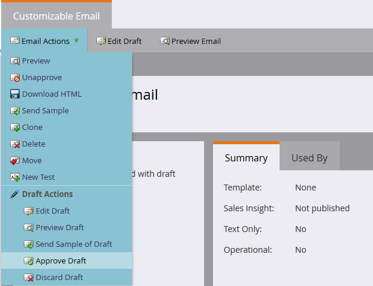

# トランザクションメール

Marketo API の一般的なユースケースは、[Request Campaign](https://developer.adobe.com/marketo-apis/api/mapi/#tag/Campaigns/operation/triggerCampaignUsingPOST) API 呼び出しを通じて特定のレコードへのトランザクションメールの送信をトリガーすることです。Marketo REST API を使用して必要な呼び出しを実行するには、Marketo にいくつかの設定要件があります。

- .受信者は、Marketo 内にレコードを持っている必要があります。
- Marketo インスタンスでトランザクションメールを作成して承認する必要があります。
- メールを送信するように設定された、「キャンペーンをリクエスト、1. ソース：Web Service API」を含むアクティブなトリガーキャンペーンが存在する必要があります。

最初に[メールを作成して承認します](https://experienceleague.adobe.com/docs/marketo/using/home.html?lang=ja)。メールが実際にトランザクション用である場合は、運用に設定する必要がありますが、法的に運用として選定されていることを確認します。これは、編集画面のメールアクション／メール設定から設定します。


承認すると、キャンペーンを作成する準備が整います。



キャンペーンの作成を初めて行う場合は、[新しいスマートキャンペーンの作成](https://experienceleague.adobe.com/docs/marketo/using/product-docs/core-marketo-concepts/smart-campaigns/creating-a-smart-campaign/create-a-new-smart-campaign.html?lang=ja)の記事を参照してください。キャンペーンを作成したら、次の手順を実行する必要があります。「キャンペーンをリクエスト」トリガーでスマートリストを設定します。


次に、「メールを送信」ステップを、アドビのメール宛に指定するようフローを設定する必要があります。


アクティブ化の前に、「スケジュール」タブでいくつかの設定を決定する必要があります。この特定のメールを特定のレコードに 1 回だけ送信する場合は、選定の設定はそのままにしておきます。メールを複数回受信する必要がある場合は、毎回または使用可能な頻度のいずれかに調整する必要があります。

これでアクティブ化する準備が整いました。


## API 呼び出しの送信

**メモ：**&#x200B;以下の Java の例では、コード内の JSON 表現を処理するために [minimal-json パッケージ](https://github.com/ralfstx/minimal-json)を使用しています。

API を通じてトランザクションメールを送信する最初の部分は、対応するメールアドレスのレコードが Marketo インスタンスに存在し、このリード ID へのアクセス権があることを確認するものです。この投稿では、メールアドレスが既に Marketo に存在するものと想定し、レコードの ID を取得するだけで済みます。このため、[フィルタータイプでリードを取得](https://developer.adobe.com/marketo-apis/api/mapi/#tag/Leads/operation/getLeadsByFilterUsingGET)呼び出しを使用しています。キャンペーンをリクエストするための main メソッドを見てみましょう。

```java
package dev.marketo.blog_request_campaign;

import com.eclipsesource.json.JsonArray;

public class App
{
    public static void main( String[] args )
    {
        //Create an instance of Auth so that we can authenticate with our Marketo instance
        Leads leadsRequest = new Leads(auth).setFilterType("email").addFilterValue("requestCampaign.test@marketo.com");

        //Create and parameterize an instance of Leads
        //Set your email filterValue appropriately
        Leads leadsRequest = new Leads(auth).setFilterType("email").addFilterValue("test.requestCamapign@example.com");

        //Get the inner results array of the response
        JsonArray leadsResult = leadsRequest.getData().get("result").asArray();

        //Get the id of the record indexed at 0
        int lead = leadsResult.get(0).asObject().get("id").asInt();

        //Set the ID of your campaign from Marketo
        int campaignId = 0;
        RequestCampaign rc = new RequestCampaign(auth, campaignId).addLead(lead);

        //Send the request to Marketo
        rc.postData();
    }
}
```

leadsRequest の JsonObject 応答からこれらの結果を取得するには、いくつかのコードを記述する必要があります。配列の最初の結果を取得するには、JsonObject から配列を抽出し、インデックス 0 のオブジェクトを取得する必要があります。

```java
JsonArray leadsResult = leadsRequest.getData().get("result").asArray();
int leadId = leadsResult.get(0).asObject().get("id").asInt();
```

ここからは、リクエストキャンペーンの呼び出しだけを行うだけです。これには、リクエストの URL 内の ID と、1つのメンバー &quot;id&quot; を含む JSON オブジェクトの配列が必要です。このコードを見てみましょう。

```java
package dev.marketo.blog_request_campaign;
import java.io.IOException;
import java.io.InputStream;
import java.io.InputStreamReader;
import java.io.OutputStreamWriter;
import java.io.Reader;
import java.net.MalformedURLException;
import java.net.URL;
import java.util.ArrayList;
import javax.net.ssl.HttpsURLConnection;
import com.eclipsesource.json.JsonArray;
import com.eclipsesource.json.JsonObject;

public class RequestCampaign {
    private String endpoint;
    private Auth auth;
    public ArrayList leads = new ArrayList();
    public ArrayList tokens = new ArrayList();

    public RequestCampaign(Auth auth, int campaignId) {
        this.auth = auth;
        this.endpoint = this.auth.marketoInstance + "/rest/v1/campaigns/" + campaignId + "/trigger.json";
    }
    public RequestCampaign setLeads(ArrayList leads) {
        this.leads = leads;
        return this;
    }
    public RequestCampaign addLead(int lead){
        leads.add(lead);
        return this;
    }
    public RequestCampaign setTokens(ArrayList tokens) {
        this.tokens = tokens;
        return this;
    }
    public RequestCampaign addToken(String tokenKey, String val){
        JsonObject jo = new JsonObject().add("name", tokenKey);
        jo.add("value", val);
        tokens.add(jo);
        return this;
    }
    public JsonObject postData(){
        JsonObject result = null;
        try {
            JsonObject requestBody = buildRequest(); //builds the Json Request Body
            System.out.println("Executing RequestCampaign call\n" + "Endpoint: " + endpoint + "\nRequest Body:\n"  + requestBody);
            URL url = new URL(endpoint);
            HttpsURLConnection urlConn = (HttpsURLConnection) url.openConnection(); //Return a URL connection and cast to HttpsURLConnection
            urlConn.setRequestMethod("POST");
            urlConn.setRequestProperty("Content-type", "application/json");
            urlConn.setRequestProperty("accept", "text/json");
            urlConn.setDoOutput(true);
            OutputStreamWriter wr = new OutputStreamWriter(urlConn.getOutputStream());
            wr.write(requestBody.toString());
            wr.flush();
            InputStream inStream = urlConn.getInputStream(); //get the inputStream from the URL connection
            Reader reader = new InputStreamReader(inStream);
            result = JsonObject.readFrom(reader); //Read from the stream into a JsonObject
            System.out.println("Result:\n" + result);
        } catch (MalformedURLException e) {
            e.printStackTrace();
        } catch (IOException e) {
            e.printStackTrace();
        }
        return result;
    }

    private JsonObject buildRequest(){
        JsonObject requestBody = new JsonObject(); //Create a new JsonObject for the Request Body
        JsonObject input = new JsonObject();
        JsonArray leadsArray = new JsonArray();
        for (int lead : leads) {
            JsonObject jo = new JsonObject().add("id", lead);
            leadsArray.add(jo);
        }
        input.add("leads", leadsArray);
        JsonArray tokensArray = new JsonArray();
        for (JsonObject jo : tokens) {
            tokensArray.add(jo);
        }
        input.add("tokens", tokensArray);
        requestBody.add("input", input);
        return requestBody;
    }

}
```

このクラスには、Auth とキャンペーンの ID を受け取る 1 つのコンストラクターがあります。レコードの ID を含む `ArrayList<Integer>` を setLeads に渡すか、1 つの整数を受け取り、leads プロパティの既存の ArrayList に追加する addLead を使用することによって、リードがオブジェクトに追加されます。API 呼び出しをトリガーしてリードレコードをキャンペーンに渡すには、リクエストからの応答データを含む JsonObject を返す postData を呼び出す必要があります。リクエストキャンペーンを呼び出すと、呼び出しに渡されたすべてのリードが Marketo のターゲットトリガーキャンペーンによって処理され、以前に作成したメールが送信されます。これで、Marketo REST API を使用してメールをトリガーしました。パート 2 では、リクエストキャンペーンを通じてメールのコンテンツを動的にカスタマイズする方法について説明します。

### メールの作成

コンテンツをカスタマイズするには、最初に Marketo で[プログラム](https://experienceleague.adobe.com/docs/marketo/using/product-docs/core-marketo-concepts/programs/creating-programs/create-a-program.html?lang=ja)と[メール](https://experienceleague.adobe.com/docs/marketo/using/home.html?lang=ja)を設定する必要があります。カスタムコンテンツを生成するには、プログラム内でトークンを作成し、送信するメールに配置する必要があります。簡単にするために、この例では 1 つのトークンのみを使用していますが、メール内、送信元メール、送信者名、返信先、またはメール内の任意のコンテンツで、任意の数のトークンを置き換えることができます。ここで、置換用のトークンリッチテキストを 1 つ作成し、「bodyReplacement」という名前を付けます。リッチテキストを使用すると、トークン内の任意のコンテンツを、入力する任意の HTML に置き換えることができます。


トークンは空のままでは保存できないので、ここにプレースホルダーテキストを挿入します。次に、メールにトークンを挿入する必要があります。


このトークンにアクセスして、リクエストキャンペーン呼び出しを通じて置き換えることができます。このトークンは、メールごとに置き換える必要がある 1 行のテキストとしてシンプルにすることも、メールのレイアウトのほとんど全体を含めることもできます。

### コード

```java
package dev.marketo.blog_request_campaign;

import com.eclipsesource.json.JsonArray;

public class App
{
    public static void main( String[] args )
    {
        //Create an instance of Auth so that we can authenticate with our Marketo instance
        Auth auth = new Auth("Client ID - CHANGE ME", "Client Secret - CHANGE ME", "Host - CHANGE ME");

        //Create and parameterize an instance of Leads
        Leads leadsRequest = new Leads(auth).setFilterType("email").addFilterValue("requestCampaign.test@marketo.com");

        //get the inner results array of the response
        JsonArray leadsResult = leadsRequest.getData().get("result").asArray();

        //get the id of the record indexed at 0
        int lead = leadsResult.get(0).asObject().get("id").asInt();

        //Set the ID of our campaign from Marketo
        int campaignId = 1578;
        RequestCampaign rc = new RequestCampaign(auth, campaignId).addLead(lead);

        //Create the content of the token here, and add it to the request
        String bodyReplacement = "<div class=\"replacedContent\"><p>This content has been replaced</p></div>";
        rc.addToken("{{my.bodyReplacement}}", bodyReplacement);
        rc.postData();
    }
}
```

コードに見覚えがある場合は、上記の main メソッドから追加の行が 2 行しかないためです。今回は、bodyReplacement 変数にトークンの内容を作成し、addToken メソッドを使用してリクエストに追加します。addToken はキーと値を受け取り、JsonObject 表現を作成して、内部の tokens 配列に追加します。その後、これが postData メソッド中にシリアル化され、次のような本文が作成されます。

```json
{
    "input":
    {
        "leads": [
            {
                "id": 1
            }
        ],
        "tokens": [
            {
                "name": "{{my.bodyReplacement}}",
                "value": "<div class=\"replacedContent\"><p>This content has been replaced</p></div>"
            }
        ]
    }
}
```

組み合わせると、コンソール出力は次のようになります。

```bash
Token is empty or expired. Trying new authentication
Trying to authenticate with ...
Got Authentication Response: {"access_token":"19d51b9a-ff60-4222-bbd5-be8b206f1d40:st","token_type":"bearer","expires_in":3565,"scope":"apiuser@mktosupport.com"}
Executing RequestCampaign call
Endpoint: .../rest/v1/campaigns/1578/trigger.json
Request Body:
{"input":{"leads":[{"id":1}],"tokens":[{"name":"{{my.bodyReplacement}}","value":"<div class=\"replacedContent\"><p>This content has been replaced</p></div>"}]}}
Result:
{"requestId":"1e8d#14eadc5143d","result":[{"id":1578}],"success":true}
```

## まとめ

この方法は、様々な方法で拡張可能で、個々のレイアウトセクション内またはメール外部のメールのコンテンツを変更し、カスタム値をタスクや注目のアクションに渡すことができます。プログラム内からトークンを使用できる場所はすべて、この方法を使用してカスタマイズできます。また、同様の機能は、[キャンペーンをスケジュール](https://developer.adobe.com/marketo-apis/api/mapi/#tag/Campaigns/operation/scheduleCampaignUsingPOST)呼び出しでも使用でき、バッチキャンペーン全体をまたいでトークンを処理できます。これらはリードごとにカスタマイズできませんが、幅広いリードセットをまたいでコンテンツをカスタマイズするのに役立ちます。
