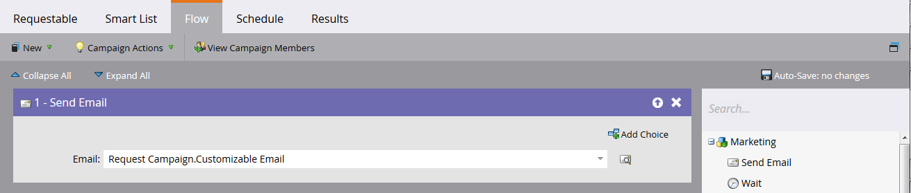

# トランザクションメール

Marketo API の一般的なユースケースは、を介した特定のレコードへのトランザクションメールの送信をトリガーにすることです [リクエストキャンペーン](https://developer.adobe.com/marketo-apis/api/mapi/#tag/Campaigns/operation/triggerCampaignUsingPOST) API 呼び出し。 Marketo REST API を使用して必要な呼び出しを実行するためのMarketo内の設定要件がいくつかあります。

- 受信者には、Marketo内にレコードが必要です
- Marketo インスタンスでトランザクションメールを作成し承認する必要があります。
- 「キャンペーンがリクエストされました、1」という文字を持つアクティブなトリガーキャンペーンが必要です。 ソース：「Web サービス API」。メールを送信するように設定されています。

第 1 [メールの作成と承認](https://experienceleague.adobe.com/docs/marketo/using/home.html?lang=ja). メールが真にトランザクション型である場合、通常はメールを運用可能に設定する必要がありますが、法的には運用可能と認定されていることを確認してください。 これは、メールのアクション/メール設定の下の編集画面を使用して設定します。


承認すると、キャンペーンを作成する準備が整います。


キャンペーンの作成を初めて行う場合は、 [新しいスマートキャンペーンの作成](https://experienceleague.adobe.com/docs/marketo/using/product-docs/core-marketo-concepts/smart-campaigns/creating-a-smart-campaign/create-a-new-smart-campaign.html) 記事。 キャンペーンを作成したら、次の手順を実行する必要があります。 「キャンペーンがリクエストされました」トリガーでスマートリストを設定します。


次に、メールを送信ステップをメールに指すようにフローを設定する必要があります。



アクティベーションの前に、「スケジュール」タブで一部の設定を決定する必要があります。 この特定のメールが特定のレコードに 1 回だけ送信される必要がある場合は、認定設定をそのままにしておきます。 ただし、メールを複数回受信する必要がある場合は、毎回または使用可能な頻度のいずれかに調整する必要があります。

アクティベートする準備ができました。


## API 呼び出しの送信

**注意：** 以下の Java の例では、を使用しています [minimal-json パッケージ](https://github.com/ralfstx/minimal-json) このコードで JSON 表現を処理します。

API を介してトランザクションメールを送信する最初の部分は、対応するメールアドレスを持つレコードがMarketo インスタンスに存在し、そのリード ID にアクセスできることを確認することです。 この投稿の目的上、メールアドレスが既にMarketoにあり、レコードの ID を取得する必要があるとします。 この場合、を使用します [フィルタータイプ別のリードの取得](https://developer.adobe.com/marketo-apis/api/mapi/#tag/Leads/operation/getLeadsByFilterUsingGET) を呼び出します。 キャンペーンをリクエストするためのの主な方法を見てみましょう。

```java
package dev.marketo.blog_request_campaign;

import com.eclipsesource.json.JsonArray;

public class App 
{
    public static void main( String[] args )
    {
        //Create an instance of Auth so that we can authenticate with our Marketo instance
        Leads leadsRequest = new Leads(auth).setFilterType("email").addFilterValue("requestCampaign.test@marketo.com");

        //Create and parameterize an instance of Leads
        //Set your email filterValue appropriately
        Leads leadsRequest = new Leads(auth).setFilterType("email").addFilterValue("test.requestCamapign@example.com");

        //Get the inner results array of the response
        JsonArray leadsResult = leadsRequest.getData().get("result").asArray();

        //Get the id of the record indexed at 0
        int lead = leadsResult.get(0).asObject().get("id").asInt();

        //Set the ID of your campaign from Marketo
        int campaignId = 0;
        RequestCampaign rc = new RequestCampaign(auth, campaignId).addLead(lead);

        //Send the request to Marketo
        rc.postData();
    }
}
```

leadsRequest の JsonObject 応答からこれらの結果を取得するには、いくつかのコードを記述する必要があります。 配列の最初の結果を取得するには、配列を JsonObject から抽出し、0 でインデックス付けされたオブジェクトを取得する必要があります。

```java
JsonArray leadsResult = leadsRequest.getData().get("result").asArray();
int leadId = leadsResult.get(0).asObject().get("id").asInt();
```

今後は、キャンペーンのリクエストコールを行うだけです。 この場合、必須パラメーターはリクエストの URL 内の ID と、1 つのメンバー「id」を含む JSON オブジェクトの配列です。 このコードを見てみましょう。

```java
package dev.marketo.blog_request_campaign;
import java.io.IOException;
import java.io.InputStream;
import java.io.InputStreamReader;
import java.io.OutputStreamWriter;
import java.io.Reader;
import java.net.MalformedURLException;
import java.net.URL;
import java.util.ArrayList;
import javax.net.ssl.HttpsURLConnection;
import com.eclipsesource.json.JsonArray;
import com.eclipsesource.json.JsonObject;

public class RequestCampaign {
    private String endpoint;
    private Auth auth;
    public ArrayList leads = new ArrayList();
    public ArrayList tokens = new ArrayList();
    
    public RequestCampaign(Auth auth, int campaignId) {
        this.auth = auth;
        this.endpoint = this.auth.marketoInstance + "/rest/v1/campaigns/" + campaignId + "/trigger.json";
    }
    public RequestCampaign setLeads(ArrayList leads) {
        this.leads = leads;
        return this;
    }
    public RequestCampaign addLead(int lead){
        leads.add(lead);
        return this;
    }
    public RequestCampaign setTokens(ArrayList tokens) {
        this.tokens = tokens;
        return this;
    }
    public RequestCampaign addToken(String tokenKey, String val){
        JsonObject jo = new JsonObject().add("name", tokenKey);
        jo.add("value", val);
        tokens.add(jo);
        return this;
    }
    public JsonObject postData(){
        JsonObject result = null;
        try {
            JsonObject requestBody = buildRequest(); //builds the Json Request Body
            String s = endpoint + "?access_token=" + auth.getToken(); //takes the endpoint URL and appends the access_token parameter to authenticate
            System.out.println("Executing RequestCampaign call\n" + "Endpoint: " + s + "\nRequest Body:\n"  + requestBody);
            URL url = new URL(s); 
            HttpsURLConnection urlConn = (HttpsURLConnection) url.openConnection(); //Return a URL connection and cast to HttpsURLConnection
            urlConn.setRequestMethod("POST");
            urlConn.setRequestProperty("Content-type", "application/json");
            urlConn.setRequestProperty("accept", "text/json");
            urlConn.setDoOutput(true);
            OutputStreamWriter wr = new OutputStreamWriter(urlConn.getOutputStream());
            wr.write(requestBody.toString());
            wr.flush();
            InputStream inStream = urlConn.getInputStream(); //get the inputStream from the URL connection
            Reader reader = new InputStreamReader(inStream);
            result = JsonObject.readFrom(reader); //Read from the stream into a JsonObject
            System.out.println("Result:\n" + result);
        } catch (MalformedURLException e) {
            e.printStackTrace();
        } catch (IOException e) {
            e.printStackTrace();
        }
        return result;
    }
    
    private JsonObject buildRequest(){
        JsonObject requestBody = new JsonObject(); //Create a new JsonObject for the Request Body
        JsonObject input = new JsonObject();
        JsonArray leadsArray = new JsonArray();
        for (int lead : leads) {
            JsonObject jo = new JsonObject().add("id", lead);
            leadsArray.add(jo);
        }
        input.add("leads", leadsArray);
        JsonArray tokensArray = new JsonArray();
        for (JsonObject jo : tokens) {
            tokensArray.add(jo);
        }
        input.add("tokens", tokensArray);
        requestBody.add("input", input);
        return requestBody;
    }

}
```

このクラスには、Auth とキャンペーンの ID を取得するコンストラクターが 1 つあります。 リードをオブジェクトに追加するには、を渡します。 `ArrayList<Integer>` setLeads に格納するレコードの ID を含むか、addLead を使用します。この場合、1 つの整数を使用して、leads プロパティ内の既存の ArrayList に追加します。 リードレコードをキャンペーンに渡すための API 呼び出しをトリガーするには、postData を呼び出す必要があります。このメソッドは、リクエストからのレスポンスデータを含んだ JsonObject を返します。 リクエストキャンペーンが呼び出されると、その呼び出しに渡されたすべてのリードは、Marketoのターゲットトリガーキャンペーンで処理され、以前に作成されたメールが送信されます。 これで、Marketo REST API を使用してメールをトリガーしました。 リクエストキャンペーンを通じてメールのコンテンツを動的にカスタマイズする方法に関するパート 2 に注目してください。

### メールの作成

コンテンツをカスタマイズするには、まず [プログラム](https://experienceleague.adobe.com/docs/marketo/using/product-docs/core-marketo-concepts/programs/creating-programs/create-a-program.html) および [電子メール](https://experienceleague.adobe.com/docs/marketo/using/home.html?lang=ja) Marketoで。 カスタムコンテンツを生成するには、プログラム内でトークンを作成し、送信するメールに配置する必要があります。 簡単にするために、この例では 1 つのトークンのみを使用していますが、送信元メール、送信者名、返信先またはメール内の任意のコンテンツで、メール内の任意の数のトークンを置き換えることができます。 置き換える 1 つのトークンリッチテキストを作成して、「bodyReplacement」と呼びましょう。 リッチテキストを使用すると、トークン内の任意のコンテンツを入力したい任意のHTMLに置き換えることができます。


空の状態ではトークンを保存できないので、ここにプレースホルダーテキストを挿入します。 次に、メールにトークンを挿入する必要があります。


このトークンにアクセスして、リクエストキャンペーン呼び出しを通じて置き換えることができます。 このトークンは、メールごとに置き換える必要がある 1 行のテキストとして単純にすることも、メールのレイアウトのほぼ全体を含めることもできます。

### コード

```java
package dev.marketo.blog_request_campaign;

import com.eclipsesource.json.JsonArray;

public class App 
{
    public static void main( String[] args )
    {
        //Create an instance of Auth so that we can authenticate with our Marketo instance
        Auth auth = new Auth("Client ID - CHANGE ME", "Client Secret - CHANGE ME", "Host - CHANGE ME");
        
        //Create and parameterize an instance of Leads
        Leads leadsRequest = new Leads(auth).setFilterType("email").addFilterValue("requestCampaign.test@marketo.com");
        
        //get the inner results array of the response
        JsonArray leadsResult = leadsRequest.getData().get("result").asArray();
        
        //get the id of the record indexed at 0
        int lead = leadsResult.get(0).asObject().get("id").asInt();
        
        //Set the ID of our campaign from Marketo
        int campaignId = 1578;
        RequestCampaign rc = new RequestCampaign(auth, campaignId).addLead(lead);

        //Create the content of the token here, and add it to the request
        String bodyReplacement = "<div class=\"replacedContent\"><p>This content has been replaced</p></div>";
        rc.addToken("{{my.bodyReplacement}}", bodyReplacement);
        rc.postData();
    }
}
```

コードに見覚えがある場合は、上記の main メソッドから追加の行が 2 行しかないためです。 今回は、bodyReplacement 変数にトークンの内容を作成し、addToken メソッドを使用してリクエストに追加します。 addToken はキーと値を受け取り、JsonObject 表現を作成して、内部の tokens 配列に追加します。 その後、これが postData メソッド中にシリアル化され、次のような本文が作成されます。

```json
{
    "input":
    {
        "leads": [
            {
                "id": 1
            }
        ],
        "tokens": [
            {
                "name": "{{my.bodyReplacement}}",
                "value": "<div class=\"replacedContent\"><p>This content has been replaced</p></div>"
            }
        ]
    }
}
```

コンソール出力を組み合わせると、次のようになります。

```bash
Token is empty or expired. Trying new authentication
Trying to authenticate with ...
Got Authentication Response: {"access_token":"19d51b9a-ff60-4222-bbd5-be8b206f1d40:st","token_type":"bearer","expires_in":3565,"scope":"apiuser@mktosupport.com"}
Executing RequestCampaign call
Endpoint: .../rest/v1/campaigns/1578/trigger.json?access_token=19d51b9a-ff60-4222-bbd5-be8b206f1d40:st
Request Body:
{"input":{"leads":[{"id":1}],"tokens":[{"name":"{{my.bodyReplacement}}","value":"<div class=\"replacedContent\"><p>This content has been replaced</p></div>"}]}}
Result:
{"requestId":"1e8d#14eadc5143d","result":[{"id":1578}],"success":true}
```

## まとめ

この方法は様々な方法で拡張可能で、個々のレイアウトセクション内または外部のメールのコンテンツを変更することで、カスタム値をタスクや興味深い瞬間に渡すことができます。 プログラム内のどこからでもトークンを使用できる場合は、この方法を使用してカスタマイズできます。 と同様の機能も使用できます [キャンペーンのスケジュール](https://developer.adobe.com/marketo-apis/api/mapi/#tag/Campaigns/operation/scheduleCampaignUsingPOST) を呼び出します。これにより、バッチキャンペーン全体でトークンを処理できます。 これらはリードごとにカスタマイズすることはできませんが、幅広いリードセットにわたってコンテンツをカスタマイズする場合に役立ちます。
