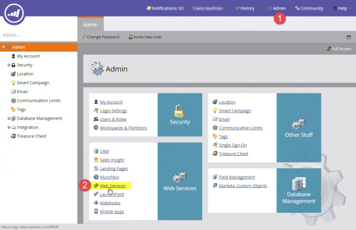

# SOAP API

SOAP API はアクティブに開発中ではなくなりました。 呼び出しは引き続き機能しますが、開発の焦点は次のとおりです [REST](https://developer.adobe.com/marketo-apis/) 先に進む。

Marketo SOAP API を使用すると、Marketoに保存されているエンティティとデータを作成、取得、削除できます。 次を見つけることができます [Marketo-SOAP-SDK](https://github.com/Marketo/SOAP-API-Java-Client) GitHub で。 次のものがあります [クライアントライブラリ](https://github.com/Marketo/Community-Supported-Client-Libraries) 時間を節約するために。

最新の API バージョン：3_1

## SOAP WSDL

SOAP WSDL ドキュメントを取得するには、から SOAP API エンドポイントを取得します。 **[!UICONTROL Admin]** > **[!UICONTROL 統合]** > **[!UICONTROL Web サービス]** メニュー。

WSDL URL は次のとおりです。

`<SOAP API Endpoint> + ?WSDL`

WSDL で定義されているエンドポイントを使用しないでください。 各Marketo インスタンスには、を呼び出す一意のエンドポイントがあります。

## 制限

- **毎日のクォータ：** ほとんどのサブスクリプションには、1 日に 10,000 回の API 呼び出しが割り当てられます（毎日 12:00 にリセットされます）。 アカウントマネージャーを通じて、1 日の割り当て量を増やすことができます。
- **レート制限：** インスタンスごとの API アクセスは、20 秒あたり 100 回の呼び出しに制限されています。
- **同時実行制限：**  最大 10 回の同時 API 呼び出し。

バッチサイズは 300 以下にすることをお勧めします。 大きいサイズはサポートされず、タイムアウトや、極端な場合はスロットリングが発生する可能性があります。

## Marketoでの SOAP API 設定

1. 「管理者」セクションに移動して、「Web サービス」をクリックします。

1. 適切な暗号化キーを設定し、「変更を保存」をクリックし、SOAP API エンドポイント、ユーザー ID、暗号化キーの値を使用して、正しいを生成します。 [認証署名](authentication-signature.md) SOAP API 呼び出し毎。

