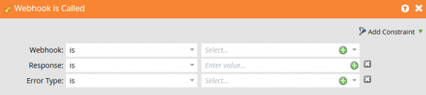

# エラー

ここでは、Marketoの Webhook のエラー応答コードの一覧を示します。

1000 と 1001 はMarketoによって生成され、2xx ～ 5xx はMarketo webhook が呼び出しているシステムから返されるエラーです。

Marketoが値をフィールドにマッピングし直すには、webhook 応答コードが 2xx の種類である必要があります。 Webhook の目的が応答を介してMarketo リードレコード内の値を変更することである場合、呼び出される web サービスは 2xx を返す必要があります。他のすべての応答コードでは、リードレコードの値を更新する目的で webhook が無視されます。

| 応答コード | 説明 |
| --- | --- |
| 1000 | これは、「Webhook を呼び出し」フローアクションがバッチキャンペーン内に格納されていることを示します。 Webhook は、トリガーキャンペーンからのみ呼び出すことができます。 |
| 1001 | これは、web サービスが空の応答本文を発行したことを示します。 |

## Webhook エラーのキャッチ

Webhook からのエラーは、 [!UICONTROL Webhook は呼び出されます] トリガー:

* Response - Response は、リクエストによって受信されたリテラル応答ペイロードです。
* エラータイプ - HTTP ステータスメッセージの理由フレーズに対応しています。

これらを使用して、予測可能なエラーや例外を処理し、対応できます。 統合しているサービスによっては、特定のクラスのエラーを自動的にリカバリできる場合がある一方で、予期しないエラーが発生したことをユーザーに通知するアラートを作成することもできます。
