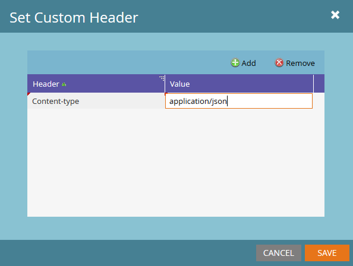

# Web フック

Marketoでは、Webhook を使用してサードパーティの web サービスと通信できます。 Webhook では、GETまたはPOST HTTP 動詞を使用して、特定の URL からデータをプッシュまたは取得できます。 Webhook のアプリケーション内作成と、スマートキャンペーンに追加する方法について詳しくは、次の記事を参照してください。

- [Web フックの作成](https://experienceleague.adobe.com/en/docs/marketo/using/product-docs/administration/additional-integrations/create-a-webhook)
- [Webhook を呼び出す ](https://experienceleague.adobe.com/en/docs/marketo/using/product-docs/core-marketo-concepts/smart-campaigns/flow-actions/call-webhook)
- [スマートキャンペーンでの web フックの使用](https://experienceleague.adobe.com/en/docs/marketo/using/product-docs/core-marketo-concepts/smart-campaigns/flow-actions/use-a-webhook-in-a-smart-campaign)

個々の Webhook には、次のプロパティがあります。

- [!UICONTROL URL] - web サービスへのリクエストを送信する際に使用する URL を入力します。
- [!UICONTROL &#x200B; リクエストタイプ &#x200B;] - HTTP メソッド。
- [!UICONTROL &#x200B; ペイロードテンプレート &#x200B;] - POSTの本体に情報を送信する場合は、テンプレートを入力します。 XML、JSON、SOAP など、HTTP POST をサポートする任意のデータ形式を使用します。シリアル化形式では、文字列を二重引用符で囲む必要があります。 テンプレートにトークンを挿入するには、「**[!UICONTROL トークンを挿入]**」をクリックします。  文字列タイプのトークンは、自動的に二重引用符で囲まれます。
- [!UICONTROL &#x200B; リクエストトークンエンコーディング &#x200B;] - トークン値に特殊文字（アンパサンド、「&amp;」など）が含まれている場合は、リクエストの形式（JSON またはフォーム/URL）を示します。 Webhook が web サービスと正しく通信するように、本文に対して正しいエンコーディングを選択する必要があります。
- [!UICONTROL &#x200B; 応答タイプ &#x200B;] - サービスから受け取る応答の形式（JSON または XML）を選択します。 正しい応答タイプを選択して、応答のプロパティをMarketoのリードフィールドにマッピングし直す必要があります
- [!UICONTROL &#x200B; カスタムヘッダー &#x200B;] - [!UICONTROL Webhook アクション &#x200B;] -> [!UICONTROL &#x200B; カスタムヘッダーの設定 &#x200B;] からアクセスでき、このメニューを使用すると、任意の数のカスタムのキーと値のペアを HTTP ヘッダーとして追加できます。

[ 応答マッピング ](response-mappings.md) を使用すると、web サービス応答からのリードにデータを書き戻すことができます

## トークン

Webhook のすべての送信フィールド（URL、テンプレート、カスタムヘッダー）は、フローステップの同じコンテキストでトークンのコンテンツを入力します。 つまり、リードトークンとシステムトークンは常に使用できますが、トリガートークン、キャンペーントークン、プログラムトークンはそれぞれのスコープで使用できます。 トークンに関する記事を参照してください。

- [トークンの概要](https://experienceleague.adobe.com/en/docs/marketo/using/product-docs/demand-generation/landing-pages/personalizing-landing-pages/tokens-overview)
- [ システムトークンの用語集 ](https://experienceleague.adobe.com/en/docs/marketo/using/product-docs/email-marketing/general/using-tokens/system-tokens-glossary)
- [注目のアクションのトークン](https://experienceleague.adobe.com/en/docs/marketo/using/product-docs/marketo-sales-insight/msi-for-salesforce/features/tabs-in-the-msi-panel/interesting-moments/trigger-tokens-for-interesting-moments)

よくあるケースは、プログラムまたはキャンペーンがサードパーティのリソースに明示的にマッピングされる場合です。 ID は、プログラムレベルで `My Token` として設定し、トークンとして Webhook リクエストに渡すことができます。

## カスタムヘッダー

Webhook を使用すると、任意の数のカスタムヘッダーフィールドを、送信リクエストと共に送信できます。 これらは、**[!UICONTROL Webhook アクション]**/**[!UICONTROL カスタムヘッダーを設定]** で追加できます。 各ヘッダーは、単純なキーと値のペアとして記録されます。 この領域ではトークンを使用できます。

## ヒント

- Webhook 呼び出しフローステップは、トリガーキャンペーンでのみ有効です。
- 応答マッピングを介した更新は、web サービスが 2xx HTTP 応答コードで応答する場合にのみ発生します。 その他のタイプのコードでは、レコードは更新されません。
- Web サービスを使用すると、内部または外部のサービスからカスタム データ エンリッチメント、検証、または正規化を実行できます。
- Webhook の実行時間は、使用されているサービスの応答時間によって決まり、キャンペーンの実行に長い遅延が生じる可能性があります。 サービスの実行時間が 50 ミリ秒であっても、10 万回の実行で 1.5 時間になります。
- Marketoは、特定のサービス呼び出しを最大 30 秒間待ってから、呼び出しを終了します（タイムアウトします）。
- URL フィールドに埋め込まれた文字は書かれたとおりに渡されます。例えば、&#39;&amp;&#39;は&#39;&amp;&#39;として送信され、&#39;%26&#39;は&#39;%26&#39;として送信されます
   - 受信者サーバーで受信したときに文字をパーセントでエンコードする必要がある場合は、その文字を表す文字列として明示的に渡す必要があります
